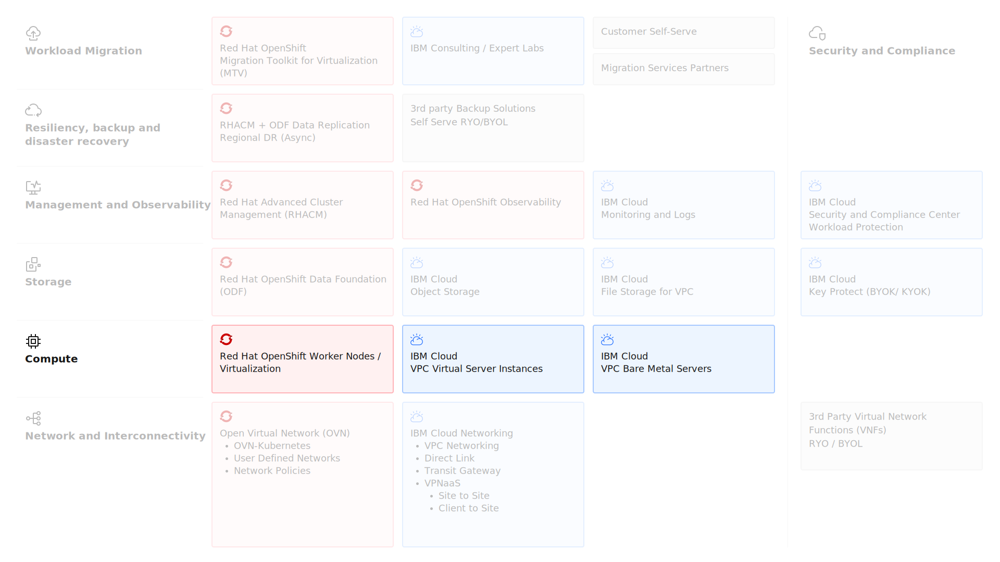

---

copyright:
  years: 2025
lastupdated: "2025-12-19"

keywords: ROKS, OpenShift Data Foundation, ODF, File Storage, Block Storage, Encryption

subcollection: virtualization-solutions

---

{{site.data.keyword.attribute-definition-list}}

# Compute Design for OpenShift Virtualization
{: #virt-sol-openshift-compute-design}

IBM Cloud VPC provides a comprehensive portfolio of compute options designed to support diverse workloads, from traditional applications to modern cloud-native solutions. These offerings deliver flexibility, scalability, and enterprise-grade security, enabling organizations to deploy workloads across virtualized, containerized, and bare metal environments.

Key IBM Cloud VPC compute options:

- Virtual Servers for VPC
- Bare Metal Servers for VPC

IBM Cloud VPC compute solutions empower businesses to select the optimal infrastructure for their needs—whether optimizing cost, achieving high performance, or enabling hybrid and multicloud strategies.

The key compute architecture elements are shown in the following diagram.

{: caption="Red Hat OpenShift Virtualization on IBM Cloud Compute" caption-side="bottom"}

## Red Hat OpenShift Worker Nodes
{: #virt-sol-openshift-compute-design-workers}

{{site.data.keyword.openshiftshort}} (ROKS) is a managed Kubernetes service on IBM Cloud that allows you to create OpenShift clusters where you can deploy and manage virtualized and containerized applications. Combined with an intuitive user experience, built-in security and isolation, and advanced tools to secure, manage, and monitor your cluster workloads, you can rapidly deliver highly available and secure containerized applications.

A ROKS cluster consists of a managed control plane and one or more Worker Pools. A Worker Pool consists of two or more compute hosts called Worker Nodes. Worker Pools contain Worker Nodes of the same profile of CPU, memory, operating system, attached storage, and other properties. The Worker Nodes are managed by the Kubernetes control plane, which centrally controls and monitors all Kubernetes resources in the cluster. The Kubernetes scheduler decides which worker node to deploy resources on, accounting for deployment requirements and available capacity in the cluster.

After cluster creation, you can add more worker nodes to a pool by resizing it or by adding additional worker pools. Clusters that have a worker pool in only one zone are called single zone clusters. For high availability, you can create multizone clusters with worker pools spanning multiple availability zones. While multizone clusters can be created they are not recommended for virtualization workloads because of the storage latency introduced by this design.

IBM Cloud Bare Metal Servers for VPC are recommended in the worker pool to run your production virtualized workloads as Red Hat only supports bare metal worker nodes for production virtualized workloads. The bare metal nodes should be provisioned with local NVMe drives so they can be consumed by OpenShift Data Foundation (ODF) as backing storage, providing the software-defined storage resources required for VM persistent volumes.

For more information, refer to [IBM Cloud Docs - OpenShift Overview](https://cloud.ibm.com/docs/openshift?topic=openshift-overview).

## IBM Cloud Virtual Servers for VPC
{: #virt-sol-openshift-compute-design-vsi}

IBM Cloud Virtual Servers for VPC provide secure, isolated virtual machines deployed within a Virtual Private Cloud environment. These instances deliver enterprise-grade compute for production workloads, and development and test environments requiring flexible resource allocation and comprehensive infrastructure control.

The following tables lists the key features for IBM Cloud Virtual Servers for VPC.

| Feature | Description |
| -------------- | -------------- |
| Customizable profiles | Balanced, compute-optimized, memory-optimized, GPU, and very high memory configurations |
| Flexible tenancy | Shared tenancy infrastructure with optional dedicated host placement for compliance requirements |
| Advanced networking | Integration with VPC Security Groups, Network ACLs, Load Balancers, and VPN connectivity |
| Persistent storage | IBM Cloud Block Storage and File Storage for VPC with configurable IOPS and encryption |
| Operating system flexibility | IBM-provided stock images or bring-your-own custom images |
| Scalability | Vertical scaling through profile changes and horizontal scaling through instance groups with auto-scaling |
{: caption="IBM Cloud Virtual Servers for VPC key features" caption-side="bottom"}

For more information on VSI profiles supported by ROKS, see [IBM Cloud Docs - Worker Nodes VPC flavors](https://cloud.ibm.com/docs/openshift?topic=openshift-vpc-flavors).

## IBM Cloud Bare Metal Servers for VPC
{: #virt-sol-openshift-compute-design-bms}

IBM Cloud Bare Metal Servers for VPC provide single-tenant, dedicated physical servers for your workloads, delivering maximum performance, security, and control. These servers are required for production deployments of Red Hat OpenShift Virtualization on IBM Cloud.

The following tables lists the key features for IBM Cloud Bare Metal Servers for VPC.

| Feature | Description |
| -------------- | -------------- |
| Single-tenant isolation | Dedicated physical hardware with no resource sharing |
| High-performance NVMe storage | Local NVMe drives for OpenShift Data Foundation deployments |
| Consistent performance | Predictable, bare-metal performance without virtualization overhead |
| Large memory configurations | Support for memory-intensive virtualization workloads |
| Network performance | High-bandwidth, low-latency networking for VM traffic |
{: caption="IBM Cloud Bare Metal Servers for VPC key features" caption-side="bottom"}

Bare Metal worker nodes supported by ROKS varies by region and Availability Zone and can be checked at [IBM Cloud Docs - Worker Nodes VPC flavors](https://cloud.ibm.com/docs/openshift?topic=openshift-vpc-flavors).

The following table shows the typical specifications for a bare metal profile.

| Instance profile | Cores | GiB RAM | Storage |
| -------------- | -------------- | -------------- | -------------- |
| cx2.metal.96x192 | 48 | 192 | - |
| cx2d.metal.96x192 | 48 | 192 | 8x3.2TB SSD NVMe drives |
| bx2.metal.96x384 | 48 | 384 | - |
| bx2d.metal.96x384 | 48 | 384 | 8x3.2TB SSD NVMe drives |
| mx2.metal.96x768 | 48 | 768 | - |
| mx2d.metal.96x768 | 48 | 768 |  8x3.2TB SSD NVMe drives |
{: caption="Typical bare metal profile specifications" caption-side="bottom"}

All bare metal servers have 100Gbps bonded network speed, 960GB SSD boot disks in RAID 1, do not support GPUs and run Red Hat CoreOS.
