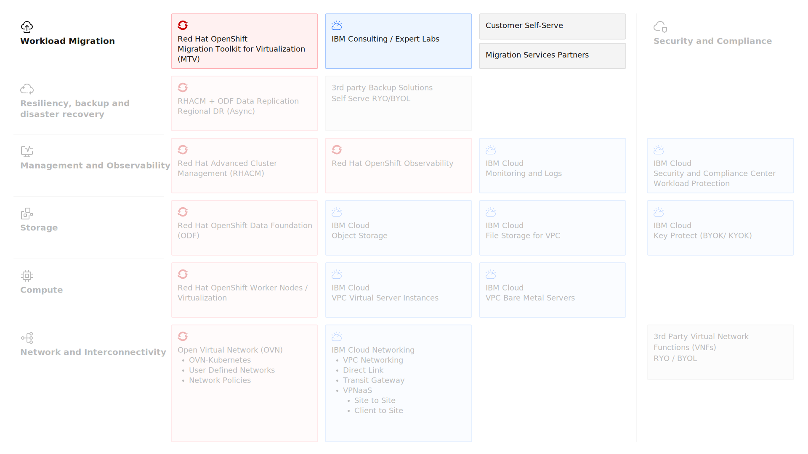
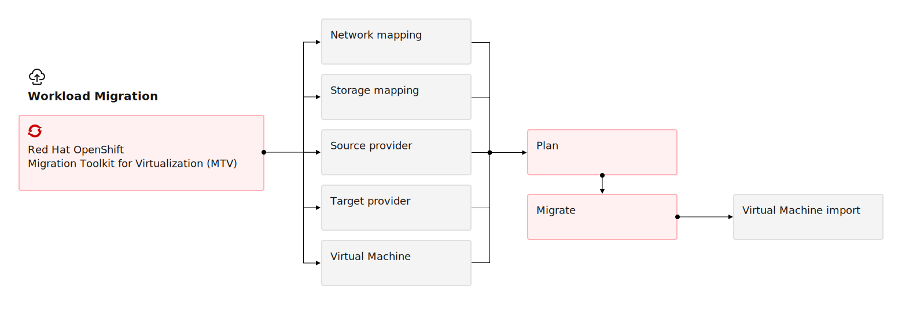

---

copyright:
  years: 2025
lastupdated: "2026-01-05"

keywords:

subcollection: virtualization-solutions

---

{{site.data.keyword.attribute-definition-list}}

# Migration Workloads to Red Hat OpenShift Virtualiztaion
{: #virt-sol-openshift-migration-design}

For migrations, customers can self-serve or they can use offerings and services from either IBM Consulting, Red Hat Consulting or other IBM Cloud’s migration services partners. To migrate virtual machines from an external provider such as VMware vSphere, Red Hat OpenStack Platform (RHOSP), Red Hat Virtualization, or another OpenShift Container Platform cluster, you can use the Migration Toolkit for Virtualization (MTV). Open Virtual Appliance (OVA) files created by VMware vSphere can also be migrated using the same tool. For self-serve customers supporting documentation and assets will be provided.

The key compute architecture elements are shown in the following diagram.

{: caption="Red Hat OpenShift Virtualization on IBM Cloud Migration" caption-side="bottom"}

## Red Hat OpenShift Migration Toolkit for Virtualization (MTV)
{: #virt-sol-openshift-migration-design-mtv}

**The Migration Toolkit for Virtualization (MTV)** on OpenShift Container Platform helps migrate virtual machines from traditional hypervisors like VMware vSphere, Red Hat Virtualization, or OpenStack into OpenShift Virtualization, enabling consolidation of virtual machines and containers on a single Kubernetes-native platform.

MTV provides a web UI and API for discovery, planning, and execution of migrations, leveraging persistent volume cloning or streaming for disk data, while maintaining virtual machine configuration and networking. It integrates with OpenShift Virtualization to run migrated virtual machines alongside containers, using Kubernetes-native storage and networking constructs.

For VMware migrations, the Migration Toolkit for Virtualization (MTV) integrates with vCenter to discover virtual machines and inventory data, map virtual machineware resources (clusters, networks, datastores) to OpenShift equivalents, and automate bulk or selective migrations. It supports disk data transfer via warm or cold migration, preserves virtual machine configuration (CPU, memory, NICs), and converts VMware constructs into Kubernetes-native resources for seamless execution in OpenShift Virtualization.

### Red Hat OpenShift Migration Types
{: #virt-sol-openshift-migration-design-migration-type}

Migration Toolkit for Virtualization (MTV) supports two types of migration:

   - **Cold migration** is the default migration type where the source’s virtual machines are shutdown while the data is copied.
   - **Warm migration** copies most of the data during the precopy stage. Then the virtual machines are shut down and the remaining data is copied during the cutover stage.

Comparing the migration speeds of cold and warm migrations, you can observe single disk transfer and disk conversion are approximately the same for the warm and cold migrations. The benefit of warm migration is that the transfer of the snapshot happens in the background while the virtual machine is powered on. The default snapshot time is taken every 60 minutes. If virtual machines change substantially, more data needs to be transferred than in cold migration when the virtual machine is powered off. The cutover time, meaning the shutdown of the virtual machine and last snapshot transfer, depends on how much the virtual machine has changed since the last snapshot.

#### Red Hat OpenShift warm migration precopy process
{: #virt-sol-openshift-warm-precopy-migration}

The virtual machine is not shutdo during the precopy stage.

1. Create an initial snapshot of running virtual machine disks.
1. Copy first snapshot to target (full disk transfer, largest amount of data copied- Takes More Time)
1. The virtual machine disks are copied incrementally using changed block tracking (CBT) snapshots
1. Copy deltas - Changed data ( copying only data which has changed since last snapshot- Takes Less Time):
      1. Create a new snapshot
      1. Copy the delta between previous snapshot and the new snapshot
      1. Schedule the next snapshot (configurable, by default 1 hour after last snapshot finished)

A virtual machine can support up to 28 CBT snapshots. If that limit is exceeded, a warm import retry limit reached error message is displayed. If the virtual machine has preexisting CBT snapshots, it will reach this limit sooner.
{: note}

#### Red Hat OpenShift warm migration cutover process
{: #virt-sol-openshift-warm-cutover-migration}

The virtual machines are shut down during the cutover stage and the remaining data is migrated. Data stored in RAM is not migrated.

1. Scheduled time to finalize warm migration
1. You can start the cutover stage manually in the MTV console.
1. Continue in the same way as cold migration
   1. Guest conversion
   1. Optionally starting target virtual machine

### Red Hat OpenShift Migration Workflow
{: #virt-sol-openshift-migration-design-migration-workflow}

The Migration Toolkit for Virtualization (MTV) is provided as an Red Hat OpenShift Operator.

{: caption="Red Hat OpenShift Virtualization Migration Workflow" caption-side="bottom"}

MTV creates and manages the following custom resources (CRs) and services. The following table lists each MTV option with description.

| Option | Description |
| -------------- | -------------- |
| `NetworkMapping` | Maps the networks of the source and target providers. |
| `StorageMapping` | Maps the storage of the source and target providers. |
| `Provider` | Stores attributes that enable MTV to connect to and interact with the source and target providers. (VMware or Red Hat) |
| `Plan` | Contains a list of virtual machines with the same migration parameters and associated network and storage mappings. |
| `Migration` | Executes a migration plan. |
{: caption="MTV options and descriptions" caption-side="bottom"}

MTV does not do network migration. It must be planned and designed separately. MTV assumes that networks and network attachment definitions (NAD) exist when the `migration` happens and when you configure the Network and Storage maps.
{: important}

### VMware Migration requirements
{: #virt-sol-openshift-migration-design-migration-vmware}

If you migrate from a VMware environment to OpenShift, you must meet the following requirements before you migrate.

VMware environment requirements

- VMware vSphere must be version 6.5 or later.
- If you are migrating more than 10 virtual machines from an ESXi host in the same migration plan, you must increase the NFC service memory of the host.

Virtual machine requirements

- VMware Tools is installed.
- ISO/CDROM disks are unmounted.
- Each NIC must contain no more than one IPv4 and/or one IPv6 address.
- virtual machine name contains only:
    - lowercase letters (a-z), numbers (0-9), or hyphens (-), up to a maximum of 253 characters.
    - The first and last characters must be alphanumeric.
    - The name must not contain uppercase letters, spaces, periods (.), or special characters.
- virtual machine name does not duplicate the name of a virtual machine in the OpenShift Virtualization environment.
- Operating system is certified and supported.

## Migration partners
{: #virt-sol-openshift-migration-design-partners}

IBM Cloud is working with several migration partners. Customers can do migration with self-serve and extensive documentation will be available to support customers on their efforts.

IBM Consulting, RedHat Consulting and IBM business partners can help, if customers require either resources or skills during their migration efforts.
