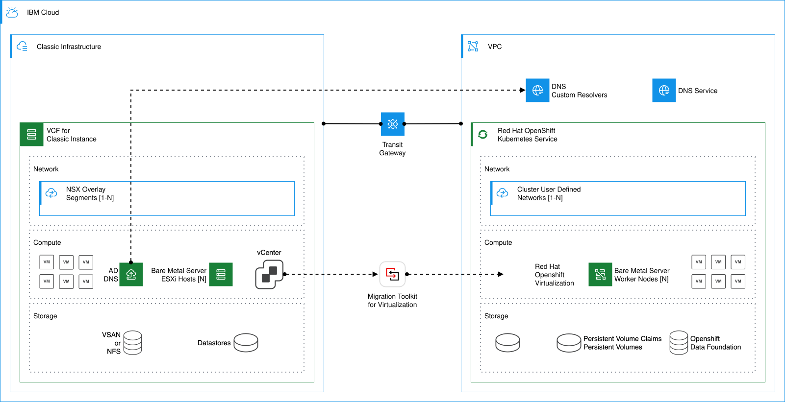

---

copyright:
  years: 2025
lastupdated: "2026-10-06"

keywords: OpenShift virtualization migration infrastructure, IBM Cloud MTV migration design, VMware to OpenShift network design, MTV DNS infrastructure IBM Cloud, Transit Gateway OpenShift migration, VMware vSphere to ROKS migration, network connectivity MTV IBM Cloud, OpenShift migration infrastructure design, DNS resolution migration OpenShift, MTV infrastructure IBM Cloud VPC

subcollection: virtualization-solutions

---

{{site.data.keyword.attribute-definition-list}}

# {{site.data.keyword.redhat_openshift_notm}} Virtualization migration infrastructure design
{: #virt-sol-openshift-migration-design-infrastructure}

Design network and DNS infrastructure to connect VMware source environments to {{site.data.keyword.redhat_openshift_notm}} Virtualization on {{site.data.keyword.cloud_notm}} by using MTV for VM migration.
{: shortdesc}

When you migrate workloads with the Migration Toolkit for Virtualization (MTV), you need a reliable, high-bandwidth connectivity between the source environment (for example, vCenter/ESXi or Red Hat Virtualization (RHV)) and {{site.data.keyword.redhat_openshift_notm}} worker nodes on the target cluster. It helps ensure uninterrupted data transfer. If firewalls are in place, the necessary ports for vCenter and ESXi communication must be opened. In addition to the basic network connectivity, DNS resolution is required between the environments.

## Infrastructure design for migrating from Classic infrastructure
{: #virt-sol-openshift-migration-design-classic}

When you migrate from {{site.data.keyword.vmwaresolutions_full}} to {{site.data.keyword.openshiftlong_notm}}, customers can use {{site.data.keyword.tg_full}} to establish private connectivity between the VMware (source) platform and a new target {{site.data.keyword.openshiftlong_notm}} Virtualization environment. The following example presents a high-level overview of the infrastructure design for a migration. In the VPC hosting {{site.data.keyword.openshiftlong_notm}}, {{site.data.keyword.dns_full_notm}} and DNS Custom Resolvers can be used for this purpose.

{: caption="Migration Infrastructure Design from Classic to {{site.data.keyword.openshiftlong_notm}} on VPC" caption-side="bottom"}
