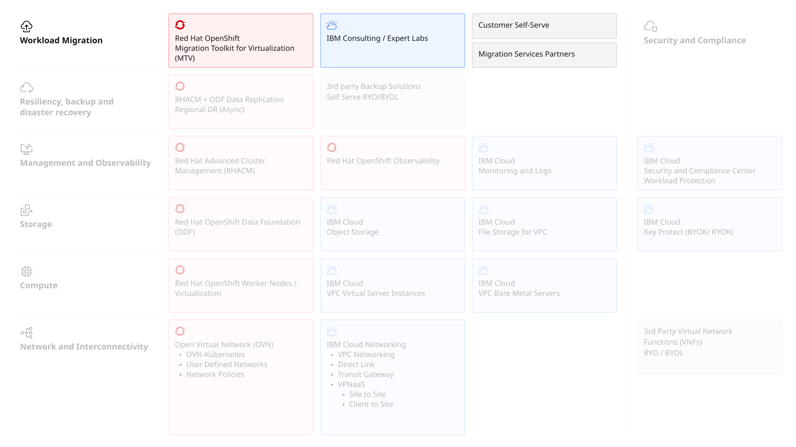

---

copyright:
  years: 2025
lastupdated: "2026-10-06"

keywords: OpenShift virtualization migration IBM Cloud, migrate VMware to OpenShift, Migration Toolkit for Virtualization, MTV OpenShift IBM Cloud, VMware vSphere to OpenShift migration, IBM Cloud ROKS migration, OVA file migration OpenShift, RHOSP to OpenShift IBM Cloud, virtual machine migration OpenShift, VMware to OpenShift Virtualization IBM Cloud

subcollection: virtualization-solutions

---

{{site.data.keyword.attribute-definition-list}}

# {{site.data.keyword.redhat_openshift_notm}} Virtualization: Migrating VMware workloads
{: #virt-sol-openshift-migration-design}

Migrate VMs to {{site.data.keyword.redhat_openshift_notm}} Virtualization on {{site.data.keyword.cloud_notm}} using the Migration Toolkit for Virtualization (MTV) or IBM Consulting services.
{: shortdesc}

For migrations, customers can self-serve or they can use offerings and services from either IBM Consulting, Red Hat Consulting or other {{site.data.keyword.cloud_notm}}'s migration services partners. To migrate virtual machines from an external provider such as VMware vSphere, Red Hat OpenStack Platform (RHOSP), Red Hat Virtualization, or another {{site.data.keyword.redhat_openshift_notm}} Container Platform (OCP) cluster, you can use the Migration Toolkit for Virtualization (MTV). Open Virtual Appliance (OVA) files created by VMware vSphere can also be migrated using the same tool.

The key migration architecture elements are shown in the following diagram.

{: caption="Red Hat OpenShift Virtualization on IBM Cloud Migration" caption-side="bottom"}
