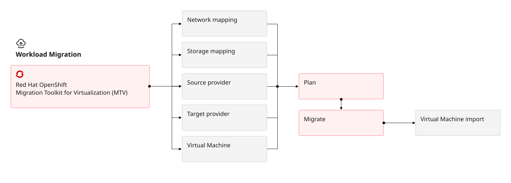

---

copyright:
  years: 2025, 2026
lastupdated: "2026-10-06"

keywords: OpenShift migration workflow IBM Cloud, MTV custom resources migration, MTV NetworkMapping StorageMapping, OpenShift Operator migration workflow, migration plan MTV IBM Cloud, vCenter migration workflow OpenShift, network attachment definitions MTV, MTV Provider custom resource, IBM Cloud VMware to OpenShift workflow, MTV migration plan creation IBM Cloud

subcollection: virtualization-solutions

---

{{site.data.keyword.attribute-definition-list}}

# {{site.data.keyword.redhat_openshift_notm}} Virtualization: VMware migration workflow
{: #virt-sol-openshift-migration-design-migration-workflow}

Understand how the MTV Operator manages Provider, Plan, and Migration custom resources to execute VMware VM migrations to {{site.data.keyword.redhat_openshift_notm}} Virtualization on {{site.data.keyword.cloud_notm}}.
{: shortdesc}

The Migration Toolkit for Virtualization (MTV) is provided as a {{site.data.keyword.redhat_openshift_notm}} Operator.

{: caption="Red Hat OpenShift Virtualization Migration Workflow" caption-side="bottom"}

MTV creates and manages the following custom resources (CRs) and services. The following table lists each MTV option with description.

| Option | Description |
| -------------- | -------------- |
| `NetworkMapping` | Maps the networks of the source and target providers. |
| `StorageMapping` | Maps the storage of the source and target providers. |
| `Provider` | Stores attributes that enable MTV to connect to and interact with the source and target providers. (VMware or Red Hat) |
| `Plan` | Contains a list of virtual machines with the same migration parameters and associated network and storage mappings. |
| `Migration` | Executes a migration plan. |
{: caption="MTV options and descriptions" caption-side="bottom"}

MTV can migrate workloads between mapped source and destination networks, network architecture and connectivity planning needs to be done before the migration workflow begins. For guidance on mapping vSphere network concepts to OpenShift equivalents, see [OVN networking in OpenShift for vSphere administrators](/docs/virtualization-solutions?topic=virtualization-solutions-virt-sol-network-options-overview).
{: important}
