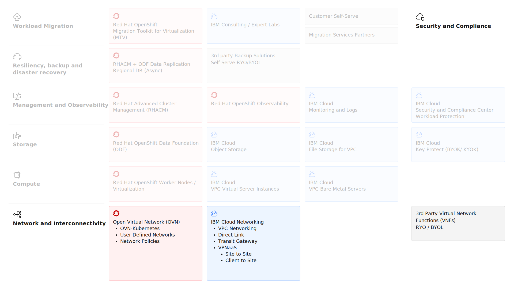

---
copyright:
  years: 2025
lastupdated: "2026-01-21"

keywords: ROKS, network, layer2, localnet

subcollection: virtualization-solutions

---

{{site.data.keyword.attribute-definition-list}}

# Network Design for OpenShift Virtualization
{: #virt-sol-openshift-network-design}

The network design in Red Hat OpenShift Virtualization on VPC has three distinct layers:

* IBM Cloud VPC networking
* Red Hat OpenShift networking
* OVN networking

The key network architecture elements are shown in the following diagram.

{: caption="Red Hat OpenShift Virtualization on IBM Cloud Network" caption-side="bottom"}

## IBM Cloud VPC Networking
{: #virt-sol-openshift-network-design-vpc}

IBM Cloud VPC is a secure, isolated, and highly configurable networking environment that enables organizations to deploy and manage cloud resources with fine-grained control. It provides the foundation for modern workloads, including virtual servers, containers, and bare metal deployments, while ensuring network segmentation, security, and scalability.

You need to create a VPC to provision a ROKS cluster.

### Default private networking with subnets
{: #virt-sol-openshift-network-design-vpc-subnets}

You need to create a VPC subnet in at least one Availability Zone to provision a ROKS cluster. For more information, see [Default private networking with subnets](/docs/virtualization-solutions?topic=virtualization-solutions-virt-sol-openshift-network-design#virt-sol-openshift-network-design-vpc-subnets).


### Load-balancers
{: #virt-sol-openshift-network-design-vpc-lb}

A Red Hat OpenShift Ingress controller is deployed to your Red Hat OpenShift Kubernetes Service (ROKS) cluster that functions as the ingress endpoint for external network traffic. In a ROKS cluster, a VPC Application Load Balancer is automatically created per cluster to expose the Ingress controller. For more information, see [Load-balancers](/docs/virtualization-solutions?topic=virtualization-solutions-virt-sol-openshift-network-design#virt-sol-openshift-network-design-vpc-lb).

ROKS does the following:

1. DNS service resolves the route subdomain to the VPC load balancer hostname
2. The VPC load balancer resolves the VPC hostname to an available external IP address of an Ingress controller service that was reported as healthy
3. The VPC load balancer sends the request to an Ingress controller service
4. The Ingress controller forwards the request to the private IP address of the app pod over the private network

### Virtual Private Endpoints
{: #virt-sol-openshift-network-design-vpc-vpe}

See [Virtual Private Endpoints](/docs/virtualization-solutions?topic=virtualization-solutions-virt-sol-openshift-network-design#virt-sol-openshift-network-design-vpc-vpe).

VPEs in ROKS environments are primarily used to enable **private connectivity between the OpenShift cluster and IBM Cloud platform services** without traffic traversing the public internet.

The following tables lists all the virtual private endpoints that are automatically provisioned by IBM Cloud for essential cluster operations.

| Virtual private endpoint | Managed by | Description
| -------------- | -------------- | -------------- |
| iks-api | Kubernetes Service API | - Private access to the IBM Cloud Kubernetes Service API  \n - Cluster management operations (kubectl, oc commands)  \n - Worker node to control plane communication  \n - IBM Cloud CLI operations (`ibmcloud ks` commands)  \n - Enables private-only cluster configurations |
| iks-riaas | VPC Infrastructure Services | - Private access to VPC Infrastructure APIs  \n - Worker node provisioning and lifecycle management  \n - Storage volume attachment and management  \n - VPC networking operations (load balancers, security groups)  \n - Infrastructure resource management  \n - Used by IBM Cloud cluster autoscaler, Storage CSI drivers for volume operations, Load balancer provisioning services, Worker node lifecycle controllers |
| iks-registry | Container Registry | - Private access to IBM Cloud Container Registry  \n - Pull container images without public internet  \n - Access to public and private registry namespaces  \n - Eliminates public egress charges for image pulls |
| iks-<cluster_id> | Specific Cluster Instance | - Private endpoint specific to your cluster instance  \n - Direct cluster API access  \n - Used for private-only cluster configurations  \n - Alternative to regional API endpoint  \n - Used by Tools requiring direct cluster access, Service-to-service communication within VPC, Private cluster access patterns |
| iks-cos-config | Cloud Object Storage (Config) | - Private access to IBM Cloud Object Storage configuration API  \n - Bucket management and configuration operations  \n - IAM policy and access control management  \n - Service credential operations |
| iks-cos | Cloud Object Storage (Data) | - Private access to IBM Cloud Object Storage S3 API  \n - Object storage data plane operations (PUT/GET/DELETE)  \n - Backup and restore data transfer  \n - Application data storage access |
{: caption="Virtual private endpoints provisioned for cluster operations." caption-side="bottom"}

## Red Hat OpenShift Virtualization Networking
{: #virt-sol-openshift-network-design-openshift}

Red Hat OpenShift Virtualization leverages OpenShift's networking capabilities to provide flexible, software-defined networking for virtual machines running alongside containerized workloads. Though these the same concepts, it is important to understand the difference for VM networking and pod networking. Each VM runs within a `virt-launcher` pod, which is always connected to the default pod network.

```bash
┌─────────────────────┐
│    Worker Node      │
│  ┌───────────────┐  │
│  │ virt-launcher │  │  ← Kubernetes Pod Security Context
│  │     pod       │  │
│  │  ┌─────────┐  │  │
│  │  │   VM    │  │  │  ← KVM/QEMU Hypervisor Isolation
│  │  │ (QEMU)  │  │  │
│  │  └─────────┘  │  │
│  └───────────────┘  │
└─────────────────────┘
```

Depending how you provision and setup your VMs, the VM can share the same pod network (or it can be connected to different networks using `multus`).  

The following describes the default pod networking in OpenShift, which can be modified with OVN-Kubernetes networking:

* **Pod Network (Cluster Network):**
    * Each pod receives a private IP address from the cluster network CIDR
    * Provides pod-to-pod communication across nodes
    * Pods communicate directly using their private IPs within the cluster
    * Network policies control pod-to-pod traffic at layer 3/4
    * Flat network model - all pods can communicate by default
    * No NAT between pods (direct pod-to-pod communication)
    * Network policies provide segmentation and security
    * DNS-based service discovery within cluster
    * When a VM is running inside the virt-launcher pod the VMs IP is NAT'ed with the virt-launcher pod's IP

* **IP Masquerading (SNAT):**
    * When pods initiate outbound connections to external networks, source IP is masqueraded
    * The source IP address of the request packet is changed to the IP address of the worker node where the pod runs
    * This is necessary because pod IPs are not routable outside the cluster
    * Return traffic is de-masqueraded back to the original pod IP
    * External services see requests coming from worker node IPs, not pod IPs

### ClusterIP Service
{: #virt-sol-openshift-network-design-openshift-clusterip}

Services provide stable endpoints and load balancing for pods. They abstract pod IPs and provide consistent access points for applications. The ClusterIP Service:

* Creates a virtual IP (ClusterIP) accessible only within the cluster
* Default service type if not specified
* Internal load balancing across backend pods
* Uses kube-proxy or OVN-Kubernetes for traffic distribution
* Use Cases:
    * Internal microservices communication
    * Backend services not requiring external access
    * Database services accessed only by cluster workloads
    * Inter-pod service discovery

### NodePort Service
{: #virt-sol-openshift-network-design-openshift-nodeport}

Services provide stable endpoints and load balancing for pods. They abstract pod IPs and provide consistent access points for applications. The NodePort Service:

* Exposes service on a static port (30000-32767 range) on each worker node
* Makes service accessible via `<NodeIP>:<NodePort>`
* Automatically creates ClusterIP service as well
* Traffic to any node's NodePort is forwarded to the service
* Traffic Flow:
    1. External client connects to `<WorkerNodeIP>:<NodePort>`
    2. Node forwards traffic to ClusterIP service
    3. Service load balances to backend pods
    4. Response follows reverse path with SNAT
* Use Cases:
    * Development and testing environments
    * Quick external access without load balancer
    * Integration with external load balancers
    * Custom load balancing solutions

### LoadBalancer Service
{: #virt-sol-openshift-network-design-openshift-loadbalancer}

On IBM Cloud ROKS, the LoadBalancer service type automatically provisions a VPC Network Load Balancer or Application Load Balancer:

* Provisions external load balancer automatically
* Assigns external IP or hostname to the service
* Creates NodePort and ClusterIP services automatically
* Provides layer 4 load balancing to service backends
* Traffic Flow in VPC:
    1. External client connects to VPC load balancer IP/hostname
    2. VPC load balancer distributes to worker node NodePorts
    3. Node forwards to service ClusterIP
    4. Service load balances to backend pods
* Use Cases:
    * Production applications requiring dedicated external access
    * Non-HTTP protocols (TCP/UDP services)
    * Applications needing stable external IPs
    * Services bypassing Ingress/Route layer

### OpenShift Routes
{: #virt-sol-openshift-network-design-openshift-routes}

OpenShift Routes expose services to external traffic by mapping FQDNs to backend services, making applications accessible outside of the cluster. Key features:

* Layer 7 routing - HTTP/HTTPS traffic with hostname-based routing
* Automatic DNS - Routes use cluster subdomain: `<route-name>-<namespace>`.apps.`<cluster-domain>`
* Unsecured Routes (HTTP)
* TLS termination:
    * Edge-Terminated Routes (TLS at Router)
    * Passthrough Routes (TLS at Pod)
    * Re-encrypt Routes (TLS at Router and Pod)
* HAProxy-based - Implemented by OpenShift Ingress Controller (router)
* Traffic management - Path-based routing, traffic splitting, session affinity

## Open Virtual Networking (OVN)
{: #virt-sol-openshift-network-design-ovn}

The **OVN-Kubernetes** CNI (Container Network Interface) plugin is the recommended networking option for OpenShift Virtualization, supporting VM networking use cases alongside traditional pod networking. OVN-Kubernetes is based on OVN and uses Open vSwitch (OVS) on every worker node. It supports multi-tenancy, NetworkPolicies, and hybrid VM/pod networking. Red Hat OpenShift on IBM Cloud VPC supports OVN-Kubernetes as the default networking plugin.

In OpenShift with OVN, three networking topologies provide secondary network connectivity to pods and VMs:

* **Layer 2** - Software-defined L2 broadcast domains using Geneve encapsulation
* **Layer 3** - Routed network segments with custom IP subnets. A layer 3 network has a separate CIDR per node.
* **Localnet** - Direct access to underlying physical network VLANs

In Red Hat OpenShift Virtualization on IBM Cloud, **OVN layer 2** and **OVN localnet** are the two primary topologies used with User-Defined Networks (UDN).

* **OVN layer 2** provides overlay networking similar to NSX overlay segments, using Geneve encapsulation to create software-defined L2 broadcast domains across the cluster. These networks are isolated from the VPC subnets and require a gateway pod/VM connected to an OVN Localnet to provide ingress/egress to the VPC subnet and a VPC route.
* **OVN Localnet** provides VLAN access to the underlying VPC network and are similar to NSX VLAN-backed segments. In IBM Cloud VPC, this enables VMs and pods to connect directly to VPC subnets using Virtual Network Interface (VNI) and VLAN attachments.

The following diagram presents an overview of the VM networking with OVN and `multus`. By default, Kubernetes (and OpenShift) assigns a single network interface to each pod using a primary CNI plugin (like OVN-Kubernetes). Multus in OpenShift is a CNI plugin that enables multiple network interfaces for pods and therefore also for virtualized VMs.

{: caption="OVN Networking with multus" caption-side="bottom"}

Note that initially, only OVN layer 2 networking will be available.
{: important}


## OVN User-Defined Networks
{: #virt-sol-openshift-network-design-udn}

[OpenShift Virtualization]{: tag-red}

A **User-Defined Network (UDN)** in OpenShift is a custom network provided by OVN-Kubernetes. A UDN **replaces the default cluster network** (also known as the default **pod network**). UDNs allow you to create networks with their own IP subnets, gateways, and routing domains, independent of the primary pod network. They're commonly used when workloads require:

* **Network isolation** from other applications in the cluster
* **Custom IP address ranges** or overlapping subnets
* **Direct control over east-west traffic** between selected namespaces or workloads
* **Integration with virtual machines** (OpenShift Virtualization) requiring multiple network interfaces
* **Dedicated network segments** for security or compliance requirements

Unlike the default pod network, UDNs are **explicitly attached to namespaces**. Each UDN creates an additional logical switch in OVN. When a UDN is labeled as the namespace's **primary** user-defined network, all pods/VMs in that namespace use it as their main network instead of the cluster default.

**Cluster User-Defined Network (CUDN)** expands the UDN concept by providing a **cluster-scoped** resource that does not belong to any specific namespace. A CUDN is created and associated with one or more namespaces. Unlike namespace-scoped `NetworkAttachmentDefinition` (NAD) resources that require one per namespace, a CUDN automatically creates NADs in namespaces when those namespaces are added to the CUDN definition.

UDNs provide flexible networking options based on scope, attachment method, and topology:

* **Network Scope:**
    * **Namespace-scoped UDN** - Network definition limited to a single namespace, requiring separate NetworkAttachmentDefinitions per namespace
    * **Cluster-scoped CUDN** - Network definition available cluster-wide, automatically creating NetworkAttachmentDefinitions in selected namespaces
* **Attachment Method:**
    * **Primary network** - Acts as the default network for all pods/VMs in the namespace, replacing the cluster default network
    * **Secondary network** - Attached via Multus CNI to provide additional network interfaces to pods/VMs alongside the primary network
* **Network Topology:**
    * **Layer 2** - Software-defined L2 broadcast domain using Geneve encapsulation, enabling ARP-based discovery and MAC-to-MAC communication
    * **Layer 3** - Routed network segments with custom IP subnets and gateways
    * **Localnet** - Direct VLAN access to underlying VPC subnets using Virtual Network Interface (VNI) attachments

These characteristics can be combined to create customized networking solutions. For example, a cluster-scoped CUDN using localnet topology can provide multiple namespaces with direct VPC subnet access as either a primary or secondary network.

### OVN Layer 2 Networks
{: #virt-sol-openshift-network-design-udn-layer2}

An **OVN layer 2** network is a software-defined layer 2 broadcast domain, similar to an NSX overlay segment or traditional VLAN, but implemented entirely within OVN using Geneve encapsulation over the cluster's existing network infrastructure. A layer 2 network allows pods and VMs to communicate as if they were on the same Ethernet segment, with support for ARP discovery, broadcast, multicast, and direct MAC-to-MAC communication.

An OpenShift cluster has a primary cluster network where pods/VMs receive IPs from the default cluster CIDR, routed via OVN. A secondary layer 2 network is one you define via a `ClusterUserDefinedNetwork` (CUDN) or namespace-scoped UDN. A **secondary layer 2 network** is any additional network you create beyond the default pod network.

Key characteristics of layer 2 networks:

* Provide L2 broadcast domains created by OVN with IPAM, MAC assignment, and connectivity
* No built-in DNS resolution for pod names on secondary networks
* Traffic from the **primary layer 2 network** is source NATted when egressing the VM, but also routed access to the layer 2 network can be configured using `FRR-K8s` and VPC routes 
* **Secondary layer 2 networks** are isolated by default with no direct internet access unless explicitly configured
* Suitable for VM-to-VM communication within the cluster and multicast-dependent applications

### OVN Localnet Networks
{: #virt-sol-openshift-network-design-udn-localnet}

An **OVN localnet** network provides VMs and pods with direct VLAN access to the underlying VPC network infrastructure. In IBM Cloud VPC, this enables VMs and pods to connect to VPC subnets using Virtual Network Interface (VNI) and VLAN attachments.

With VLAN attachments, VMs running on OpenShift Virtualization can be attached directly to VPC subnets, similar to VPC Virtual Server Instances or VPC Bare Metal Servers. This approach allows you to leverage existing VPC subnet design for new or migrated VMs, providing consistent networking across traditional VPC workloads and OpenShift Virtualization workloads.

Localnet on VPC networking requires that each VM NIC attached to a VPC subnet needs:

* A Virtual Network Interface (VNI) resource that defines:
    * An IP address reserved from the VPC subnet
    * One or more security groups that control inbound and outbound traffic to the VNI
* A bare metal server VLAN attachment that defines:
    * Floating capability, whether the attachment can move between worker nodes. Needs to be enabled for the VM to be Live Motion'ed to another worker node
    * A VLAN ID, the VLAN tag used to associate the PCI interface on the worker nodes. Typically there is a one-to-one mapping between VLAN ID and VPC subnet.

Key characteristics of localnet networks:

* When designing security group rules for localnet networks, consider that some network switching occurs within OVS on the worker node and never reaches IBM Cloud VPC infrastructure. Security group rules can only be applied to traffic that traverses the VPC network fabric. Traffic between VMs on the same worker node may bypass VPC security controls.
* Use cases for localnet:
    * Migrated VMs requiring existing VPC subnet IP addresses
    * Integration with existing VPC security groups and network policies
    * Direct connectivity to other VPC resources (VSIs, bare metal servers, databases)
    * Compliance requirements for network segmentation using VPC subnets
    * Hybrid architectures requiring consistent IP addressing across VPC and OpenShift Virtualization
