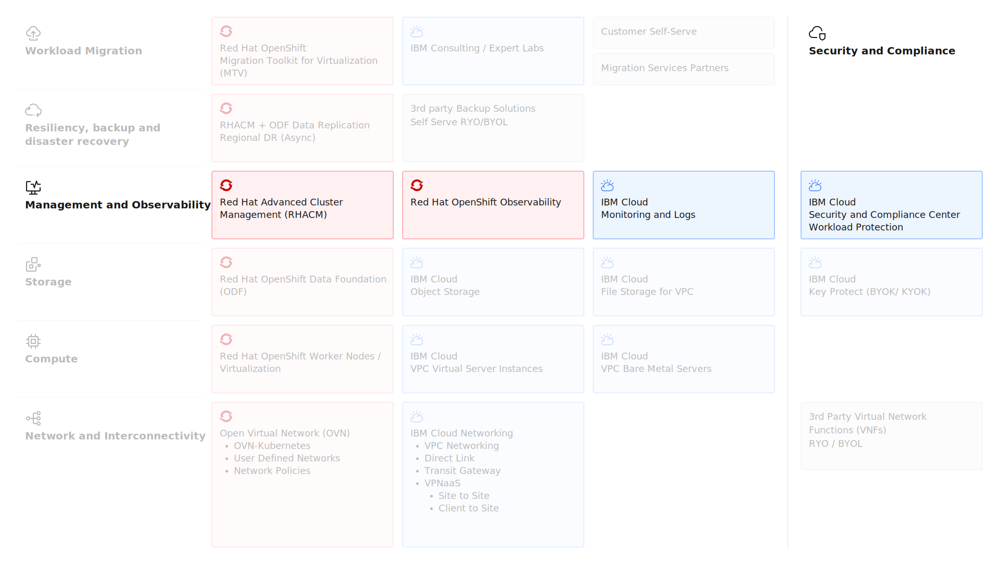

---

copyright:
  years: 2025
lastupdated: "2025-12-17"

keywords: ROKS, RHACM, IBM Cloud Logs, IBM Cloud Monitoring, Workload Protection

subcollection: virtualization-solutions

---

{{site.data.keyword.attribute-definition-list}}

# Observability Design for OpenShift Virtualization
{: #virt-sol-openshift-openshift-observability-design-overview}

Observability in IBM Cloud provides the visibility and insights needed to monitor, troubleshoot, and optimize applications and infrastructure across hybrid and multicloud environments. It goes beyond traditional monitoring by offering end-to-end visibility into metrics, logs, and traces, enabling proactive detection of issues and faster root-cause analysis.

IBM Cloud observability solutions include IBM Cloud Monitoring and IBM Cloud Logs, which together deliver a comprehensive view of system health and performance. These services help organizations ensure application reliability, security compliance, and operational efficiency by providing real-time dashboards, alerting, and deep analytics.

For Red Hat OpenShift environments, native observability capabilities through Red Hat OpenShift Observability and Red Hat Advanced Cluster Management provide additional cluster-level monitoring, logging, and distributed tracing capabilities.

The key observability architecture elements are shown in the following diagram.

{: caption="Red Hat OpenShift Virtualization on IBM Cloud Observability" caption-side="bottom"}

## Red Hat Advanced Cluster Management (RHACM)
{: #virt-sol-openshift-observability-design-rhacm}

Red Hat Advanced Cluster Management (RHACM) is a centralized management platform that simplifies the lifecycle management of Red Hat OpenShift clusters and the workloads running on them, including virtual machines deployed through OpenShift Virtualization. RHACM provides a unified control plane for provisioning, monitoring, and managing clusters across hybrid and multicloud environments.

Red Hat Advanced Cluster Management delivers end-to-end management visibility and control for OpenShift environments, enabling organizations to:

* Manage cluster creation and lifecycle operations
* Deploy and manage application workloads across multiple clusters
* Enforce security policies and compliance requirements
* Monitor cluster health and performance from a centralized console

RHACM is particularly valuable for hybrid and multicloud OpenShift deployments and is a critical component for building disaster recovery solutions across OpenShift clusters.

The following table details the RHACM architecture and core capabilities.

| Architecture Component | Description |
| -------------- | -------------- |
| Hub cluster | The central controller running Red Hat Advanced Cluster Management. The hub cluster hosts the management console, RHACM components, and APIs. From the hub cluster, you can search resources across all managed clusters, view topology, and execute management operations. |
| Managed cluster | Any OpenShift cluster managed by the hub cluster. The connection between hub and managed clusters is established through the klusterlet agent installed on each managed cluster. The managed cluster receives and applies requests from the hub cluster, enabling centralized management of cluster lifecycle, application lifecycle, governance, and observability. |
{: caption="RHACM architecture components" caption-side="bottom"}
{: summary="This table provides details the RHACM architecture components."}
{: #architecture-rhacm}
{: tab-title="RHACM architecture"}
{: tab-group="RHACM"}

| Core capabilities | Description |
| -------------- | -------------- |
| Cluster lifecycle management | Defines the processes for creating, importing, managing, and decommissioning Kubernetes clusters across various infrastructure providers including public clouds, private clouds, and on-premises data centers. This functionality is provided by the multicluster engine for Kubernetes operator, which is installed automatically with RHACM.|
| Application lifecycle management | Provides tools and processes to manage application resources across managed clusters, including deployment, updates, and configuration management using GitOps workflows. |
| Governance and risk management | Enables definition and enforcement of security and compliance policies across all managed clusters. Using dynamic policy templates, you can manage policies and compliance requirements from a central interface, with automated remediation capabilities for policy violations. |
| Observability | Collects and reports the status, health, and performance metrics of managed OpenShift clusters to the hub cluster. Data is visualized through integrated Grafana dashboards, and custom alerts can be configured to notify administrators of cluster issues or policy violations. |
{: caption="RHACM core capabilities" caption-side="bottom"}
{: summary="This table provides details the RHACM core capabilities."}
{: #core-rhacm}
{: tab-title="RHACM core capabilities"}
{: tab-group="RHACM"}

## Red Hat OpenShift Observability
{: #virt-sol-openshift-observability-design-red-hat-observability}

Red Hat OpenShift Observability provides real-time visibility, monitoring, and analysis of system metrics, logs, traces, and events to help diagnose and troubleshoot issues before they impact applications. OpenShift Container Platform offers a comprehensive observability stack that combines open-source tools into a unified solution for collecting, storing, analyzing, and visualizing operational data.

The following table details the Red Hat OpenShift Observability components.

| Observability Component | Description |
| -------------- | -------------- |
|Monitoring | The monitoring stack is deployed by default in every OpenShift Container Platform installation and managed by the Cluster Monitoring Operator (CMO). Components include Prometheus for metrics collection and storage, Alertmanager for alert routing and notification, Thanos Querier for multi-cluster metric queries, and Grafana for visualization. The CMO also deploys the Telemeter Client, which sends telemetry data to Red Hat for Remote Health Monitoring. |
| Logging | Enables collection, visualization, forwarding, and storage of log data to troubleshoot issues, identify performance bottlenecks, and detect security threats. The LokiStack deployment can be configured to produce customized alerts and recorded metrics, providing flexible log aggregation and query capabilities. |
| Distributed tracing | Collects and visualizes extensive request data flowing through distributed systems and microservices architectures. Distributed tracing supports transaction monitoring, service analysis, network profiling, performance optimization, root cause identification, and troubleshooting in cloud-native environments. |
| Red Hat build of OpenTelemetry | Provides standardized instrumentation for generating, collecting, and exporting telemetry data including traces, metrics, and logs. OpenTelemetry supports integration with open-source backends like Tempo or Prometheus, as well as commercial observability platforms. It offers a vendor-neutral approach to application instrumentation with a single set of APIs and conventions. |
| Network Observability | Enables monitoring of network traffic within OpenShift Container Platform clusters by creating network flow records with the Network Observability Operator. View and analyze stored network flow information in the OpenShift console for troubleshooting connectivity issues, identifying traffic patterns, and optimizing network performance. |
| Power monitoring | Monitors power consumption of workloads and identifies the most power-intensive namespaces running in a cluster. The Power Monitoring Operator provides key power consumption metrics measured at the container level, including CPU and DRAM power usage, enabling energy-efficient workload optimization and sustainability reporting. |
{: caption="Red Hat OpenShift Observability components" caption-side="bottom"}

## IBM Cloud Security and Compliance Center Workload Protection
{: #virt-sol-openshift-observability-design-scc-wpp}

IBM Cloud Security and Compliance Center Workload Protection provides comprehensive security monitoring and threat detection for workloads running on IBM Cloud, including virtual machines on VPC and OpenShift Virtualization environments.

The Workload Protection agent discovers and prioritizes software vulnerabilities, detects and responds to runtime threats, and manages configurations, permissions, and compliance requirements for hosted virtual machines and containerized workloads.

See [Getting started with IBM Cloud Security and Compliance Center Workload Protection](https://cloud.ibm.com/docs/workload-protection?topic=workload-protection-getting-started)

### Deployment and Capabilities
{: #virt-sol-openshift-observability-design-scc-wpp-deployment}

To enable Workload Protection, provision an instance of the IBM Cloud Security and Compliance Center Workload Protection service in IBM Cloud. After provisioning, deploy the agent to collect security and compliance data across your infrastructure.

In OpenShift Virtualization environments, the Workload Protection agent can be deployed at multiple levels:

* **OpenShift cluster level** - Monitor container and pod security across the cluster
* **Virtual machine level** - Deploy agents within VM operating systems for guest-level monitoring

The agent provides the following capabilities:

* **Vulnerability scanning** - Identify security vulnerabilities in images, packages, and applications
* **Intrusion detection** - Detect runtime threats and anomalous behavior
* **Posture management** - Validate security configurations and compliance policies
* **Incident response** - Investigate and respond to security events with forensic data
* **Compliance validation** - Assess compliance against regulatory frameworks and industry standards

This unified approach enables organizations to accelerate hybrid cloud adoption while addressing security and regulatory compliance requirements across cloud, on-premises, virtual machines, containers, and Kubernetes environments.

See [Managing the Workload Protection agent in Red Hat OpenShift by using a HELM chart](https://cloud.ibm.com/docs/workload-protection?topic=workload-protection-agent-deploy-openshift-helm), [Protecting Linux hosts](https://cloud.ibm.com/docs/workload-protection?topic=workload-protection-protecting-linux-hosts) and [Managing the Workload Protection agent on Windows Servers](https://cloud.ibm.com/docs/workload-protection?topic=workload-protection-agent-deploy-windows)

## IBM Cloud Monitoring and Logs
{: #virt-sol-openshift-observability-design-mon-and-logs}

IBM Cloud Monitoring and IBM Cloud Logs provide cloud-native observability for applications and infrastructure running on IBM Cloud, including virtual machines on VPC and OpenShift Virtualization.

| Service | Description | Agent deployment metrics collection | OpenShift virtualization integration |
| -------------- | -------------- | -------------- | -------------- |
| IBM Cloud Monitoring | IBM Cloud Monitoring is a cloud-native, container-intelligence management system that provides operational visibility into the performance and health of applications, services, and platforms. It offers administrators, DevOps teams, and developers full-stack telemetry with advanced features for monitoring, troubleshooting, alerting, and custom dashboard creation. | To monitor infrastructure, networks, and applications, deploy Monitoring agents on supported hosts. The agent type depends on the host platform and determines which metrics are automatically collected. When a Monitoring agent is configured, default metrics are collected automatically, including metadata for labeling, segmentation, and filtering. No additional instrumentation is required to gain insights from automatically collected metrics. | In OpenShift Virtualization environments, deploy Monitoring agents within virtual machine operating systems to collect guest-level metrics. This provides deeper visibility into VM performance, resource utilization, and application behavior, complementing the cluster-level metrics collected by OpenShift Observability. |
| IBM Cloud Logs | IBM Cloud Logs is an observability service designed to help organizations monitor, troubleshoot, analyze, and alert on application and infrastructure performance in real time and over extended periods. By collecting and analyzing logs from cloud-native applications, servers, databases, and IT systems, IBM Cloud Logs provides actionable insights into system behavior. | IBM Cloud Logs is an observability service designed to help organizations monitor, troubleshoot, analyze, and alert on application and infrastructure performance in real time and over extended periods. By collecting and analyzing logs from cloud-native applications, servers, databases, and IT systems, IBM Cloud Logs provides actionable insights into system behavior.  \n IBM Cloud Logs supports log collection from:  \n - IBM Cloud services and resources  \n - On-premises infrastructure  \n - Third-party cloud providers  \n - Security and audit logs generated in IBM Cloud  \n The Logging agent, based on the open-source Fluent Bit log processor, collects and sends infrastructure and application logs to IBM Cloud Logs instances. The agent supports multiple data sources and log formats, providing flexible log collection across diverse environments. | Deploy Logging agents within virtual machine operating systems to collect guest-level logs, including application logs, system logs, and security events. This provides comprehensive log visibility across both the OpenShift cluster infrastructure and the workloads running within virtual machines, enhancing troubleshooting and security monitoring capabilities. |
{: caption="IBM Cloud Monitoring and IBM Cloud Logs details" caption-side="bottom"}

For more information on IBM Cloud Monitoring, see [Getting started with IBM Cloud Monitoring](https://cloud.ibm.com/docs/monitoring?topic=monitoring-getting-started), [Monitoring a Red Hat OpenShift cluster](https://cloud.ibm.com/docs/monitoring?topic=monitoring-openshift_cluster), [Monitoring a Windows environment](https://cloud.ibm.com/docs/monitoring?topic=monitoring-windows) and [Monitoring an Ubuntu Linux VPC server instance](https://cloud.ibm.com/docs/monitoring?topic=monitoring-ubuntu).

For more informaiton on IBM Cloud Logs, see [Getting started with IBM Cloud Logs](https://cloud.ibm.com/docs/cloud-logs?topic=cloud-logs-getting-started), [The Logging agent](https://cloud.ibm.com/docs/cloud-logs?topic=cloud-logs-agent-about), [Send IBM Cloud Kubernetes Service log data to IBM Cloud Logs](https://cloud.ibm.com/docs/cloud-logs?topic=cloud-logs-kube2logs), [Logging agent for orchestrated environments](https://cloud.ibm.com/docs/cloud-logs?topic=cloud-logs-agent-about#agent-about-orchestrated) and [Logging agent for non-orchestrated environments](https://cloud.ibm.com/docs/cloud-logs?topic=cloud-logs-agent-about#agent-about-std)

Be aware that for IBM Cloud OpenShift clusters, IBM Cloud Linux VSI and IBM Cloud Windows VSI	both Service ID API key and Trusted Profiles authentication methods are supported by the agent with the IBM Cloud Logs service.

### Combined Observability Benefits
{: #virt-sol-openshift-observability-design-combined-benefits}

IBM Cloud uses a single unified agent that can collect both security data (for Workload Protection) and metrics data (for Cloud Monitoring). Key points:

* Multiple instances of the agent cannot be deployed on the same host, but by creating a connection between instances, a single agent can collect both security and metrics data
* You can connect only one Monitoring instance to one Workload Protection instance, and both instances must be in the same region

When you deploy the unified agent, it includes multiple components:

* For Monitoring (Metrics):
    * Agent: Collects metrics from containers, pods, nodes, and Kubernetes resources
    * Prometheus integration: Custom metrics collection
    * Cluster metadata: Automatic tagging with cluster name and context
* For Workload Protection (Security):
    * Node Analyzer: Includes host scanner and KSPM (Kubernetes Security Posture Management) analyzer
    * Host Scanner: Detects vulnerabilities and identifies resolution priority based on available fixed versions and severity
    * KSPM Analyzer: Kubernetes Security Posture Management for compliance and configuration analysis
    * Cluster Shield: Security runtime component

Deploying both the unified agent (for IBM Cloud Monitoring and Workload Protection) and the IBM Cloud Logs agent in VPC VSIs provides comprehensive observability:

* **Full-stack visibility** - Monitor from infrastructure through application layers
* **Correlated insights** - Correlate metrics and logs for faster root cause analysis
* **Unified dashboards** - View metrics and logs in integrated IBM Cloud console
* **Custom alerting** - Configure alerts based on metric thresholds and log patterns
* **Long-term retention** - Store historical data for trend analysis and compliance
* **Centralized management** - Manage observability across hybrid and multicloud environments from a single platform
* **Vulnerability scanning** - Identify security vulnerabilities in images, packages, and applications
* **Intrusion detection** - Detect runtime threats and anomalous behavior
* **Posture management** - Validate security configurations and compliance policies
* **Incident response** - Investigate and respond to security events with forensic data
* **Compliance validation** - Assess compliance against regulatory frameworks and industry standards
