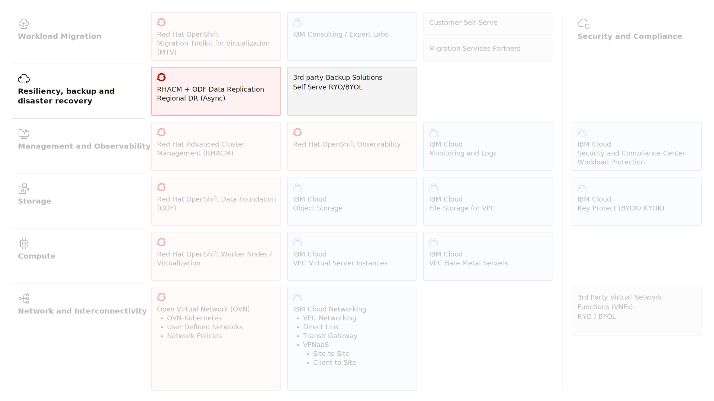

---

copyright:
  years: 2025
lastupdated: "2025-12-15"

keywords: ROKS, OpenShift Data Foundation, ODF, File Storage, Block Storage, Encryption, backup, disaster recovery

subcollection: virtualization-solutions

---

{{site.data.keyword.attribute-definition-list}}

# Resiliency Design
{: #virt-sol-openshift-resiliency-design}

See the [Resiliency in IBM Cloud](https://cloud.ibm.com/docs/resiliency?topic=resiliency-resiliency-overview) Solution Guide which is general guide on resiliency in IBM Cloud. The guide focuses on the perspective of IBM clients, their solution planners, architects, and builders and the resilient solutions that they create on the IBM Cloud platform. This guide focuses on specific information for Red Hat OpenShift on VPC.

The key backup and restore architecture elements are shown in the following diagram.

{: caption="Red Hat OpenShift Virtualization on IBM Cloud Backup and Restore" caption-side="bottom"}

## Regional Disaster Recovery
{: #virt-sol-openshift-resiliency-design-rhacm}

OpenShift Virtualization utlizes Red Hat Advanced Cluster Management (RHACM) and ODF Regional Disaster Recovery together for regional disaster recovery.

Red Hat Advanced Cluster Management (RHACM) enables disaster recovery solutions for OpenShift Data Foundation clusters. RHACM provides multi-cluster management and application lifecycle orchestration, serving as the control plane in a multi-cluster environment.

ODF Regional Disaster Recovery on Red Hat OpenShift provides asynchronous data replication capabilities between two ROKS clusters located in different IBM Cloud regions, ensuring business continuity during regional outages.

ODF Regional Disaster Recovery combines Red Hat Advanced Cluster Management and OpenShift Data Foundation components to provide application and data mobility across Red Hat OpenShift Container Platform clusters. OpenShift Data Foundation provides storage provisioning and management for stateful applications in OpenShift Container Platform clusters.  ODF is backed by Ceph as the storage provider, with lifecycle management provided by Rook in the ODF component stack. Ceph-CSI handles provisioning and management of Persistent Volumes for stateful applications.

OpenShift DR provides orchestrators to configure and manage stateful applications across peer OpenShift clusters managed by RHACM. It offers cloud-native interfaces to orchestrate the lifecycle of an application's state on Persistent Volumes, including:

   * Protecting an application and its state relationship across OpenShift clusters
   * Failing over an application and its state to a peer cluster
   * Relocating an application and its state to the previously deployed cluster

OpenShift API for Data Protection (OADP) provides backup and restore capabilities for non-PVC cluster resources and application metadata. OADP is Red Hat's operator for Velero, the open-source Kubernetes backup tool.

### Architecture Components
{: #virt-sol-openshift-resiliency-design-rhacm-components}

The following table details the architecture components of each solution.

| Architecture Component | Description |
| -------------- | -------------- |
| Red Hat Advanced Cluster Management (RHACM) Hub | Components running on the multi-cluster control plane|
| Managed clusters | Components running on the clusters being managed |
{: caption="Red Hat Advanced Cluster Management (RHACM) architecture components" caption-side="bottom"}
{: summary="This table provides architecture components for Red Hat Advanced Cluster Management (RHACM)."}
{: #openshift-rhacm}
{: tab-title="Red Hat Advanced Cluster Management (RHACM)"}
{: tab-group="resilency-architecture-components"}

| Architecture Component | Description |
| -------------- | -------------- |
| OpenShift Data Foundation | - Enable RBD block pools for mirroring across OpenShift Data Foundation instances. \n - Mirror specific images within RBD block pools. \n - Provide csi-addons to manage per Persistent Volume Claim (PVC) mirroring|
| OpenShift DR | - ODF Multicluster Orchestrator - Installed on the multi-cluster control plane (RHACM Hub) to orchestrate configuration and peering of OpenShift Data Foundation clusters for Metro and Regional DR relationships. n\ - OpenShift DR Hub Operator - Automatically installed as part of ODF Multicluster Orchestrator to orchestrate failover or relocation of DR-enabled applications. \n - OpenShift DR Cluster Operator - Automatically installed on each managed cluster in a Metro or Regional DR relationship to manage the lifecycle of all PVCs for an application |
| OpenShift API for Data Protection (OADP) | Handles the protection of. \n - Kubernetes objects and custom resources (deployments, services, routes, ConfigMaps, secrets). \n - Cluster-scoped resources and namespaced resources. \n - Application metadata and configuration. \n - Resource relationships and dependencies |
{: caption="ODF Regional Disaster Recovery architecture components" caption-side="bottom"}
{: summary="This table provides architecture components for ODF Regional Disaster Recovery."}
{: #openshift-odf}
{: tab-title="ODF Regional Disaster Recovery"}
{: tab-group="resilency-architecture-components"}

OADP works in conjunction with OpenShift DR to provide comprehensive data protection. While OpenShift DR handles PVC replication and application mobility between clusters, OADP ensures that all supporting Kubernetes resources and configurations are backed up and can be restored. OADP backs up data to S3-compatible object storage such as IBM Cloud Object Storage or NooBaa Multi-Cloud Gateway.  NooBaa Multi-Cloud Gateway is included with OpenShift Data Foundation, and can leverage ODF storage or external object storage, enabling both cluster-local recovery and cross-cluster disaster recovery scenarios.

See [Red Hat OpenShift on VPC multiregion DR](https://cloud.ibm.com/docs/pattern-openshift-vpc-dr-multiregion?topic=pattern-openshift-vpc-dr-multiregion-overview) deployment guide.

## IBM Cloud Backup and Recovery
{: #virt-sol-openshift-resiliency-design-bar}

**IBM Cloud Backup and Recovery** is a provider managed backup service for file, folder and database servers (MS SQL Server and SAP HANA) in VPC environments running on IBM Cloud. This service lets you define backup schedules to routinely protect data sources using a secure, agent-based, application-consistent backup service. Backup infrastructure is managed by IBM. The service is comprised of:

Key capabilities:

* Agent-based backup for virtual server instances
* Support for file-level and folder-level backups
* Integration with IBM Cloud Object Storage for long-term retention
* Scheduled and on-demand backup operations
* Centralized management through IBM Cloud console:
    * Scheduled backups - Customize backup plans to run at daily, weekly or custom intervals
    * Policy-based backup - Use policies to define how and when the objects and files in a source are protected based on your use case. Define parameters such as the data to be protected, backup frequency, and how long to retain the backup copy
    * Security - Take advantage of granular role-based access control to stop unauthorized actors from modifying or deleting data
    * Application-consistent backup - Capture backups of your application data in a consistent state, allowing for clean restoration to a specific point in time without data corruption or loss.

### IBM Cloud Backup and Recovery Architecture Components
{: #virt-sol-openshift-resiliency-ibm-cloud-architecture}

The following table details the architecture components the IBM Cloud Backup and Recovery solution.

| Architecture Component | Description |
| -------------- | -------------- |
| IBM Cloud Backup and Recovery service | Managed by IBM, once provisioned via the IBM Cloud catalog, you access via a web browser to manage your backup policies, download the agents and restore. |
| VPE Gateway | To improve performance it is recommended to use a VPE gateway to access the service instead of the native connection. To create one or more VPE gateways use the IBM Cloud catalog to order a VPC gateway and configure it to use the Backup and Recovery service. |
| Data Source Connector | Installed via the IBM Cloud Catalog which install a VSI in your VPC. Install one or more (at least two recommended for HA) data connectors and increase as need to increase backup throughput. Data source connectors are used to establish connectivity between your source VSI and the service. The data source connectors also interacts with the service's IBM Cloud Object Service bucket where the backups are located. This bucket is managed by the provider and is not contained within your account.|
| Agent | An agent is IBM Cloud Backup and Recovery software installed on the VSI that interacts locally with the operating system and source data being protected. The agent communicates with the Data Source Connector and Backup and Recovery instance during backup and recovery operations. Windows and Linux agents are currently available, with support for additional agent types planned for the future. |
{: caption="IBM Cloud Backup and Recovery architecture components" caption-side="bottom"}

For more information, see [Getting started with Backup and Recovery](https://cloud.ibm.com/docs/backup-recovery?topic=backup-recovery-getting-started-backup-recovery)

## Veeam Kasten K10
{: #virt-sol-openshift-resiliency-design-kasten}

Veeam Kasten K10 delivers secure, Kubernetes-native data protection and application mobility at scale across a wide range of distributions and platforms, including OpenShift environments. Kasten provides unified backup and recovery for virtual machines migrating to and running on OpenShift Virtualization, enabling consistent protection for VM data alongside containerized workloads through a single policy engine. Kasten K10 is available from the IBM Cloud catalog tile with a BYOL model. Key features:

* **Policy-driven automation** - Scalable and consistent protection across environments
* **Application-level consistency** - Deep database integrations for transactional consistency
* **Application mobility** - Seamless migration of data across clouds and environments
* **Immutable backups** - Ransomware protection through immutable backup storage
* **Automated disaster recovery** - Simplified DR orchestration and testing
* **Granular restore capabilities** - File-level, application-level, and namespace-level restore options

**Integration with Veeam Backup and Replication (VBR):**

Kasten K10 can be integrated with Veeam Backup and Replication (VBR), providing additional recovery granularity beyond normal pod?VM restore functionality:

* Granular VM file recovery without full VM restore
* Integration with Veeam Explorers for application-specific recovery (SQL Server, Exchange, Active Directory)
* Use of Veeam repositories as destinations for persistent volume snapshot data in compatible environments

## Red Hat OpenShift API for Data Protection (OADP)
{: #virt-sol-openshift-resiliency-design-oadp}

Red Hat OpenShift API for Data Protection (OADP) is an operator that provides backup and restore capabilities for OpenShift cluster resources and application data. OADP is based on the open-source Velero project and extends it with Red Hat support, additional features, and seamless integration with OpenShift environments.

OADP enables comprehensive protection for OpenShift workloads, including containerized applications, virtual machines running on OpenShift Virtualization, and cluster configuration resources. It provides a unified backup solution for both application metadata and persistent data.

OADP consists of the following:

* **OADP Operator** - Manages the lifecycle of backup and restore operations within OpenShift clusters. The operator deploys and configures Velero and associated components.
* **Velero** - The core backup engine that handles resource discovery, backup creation, and restore operations. Velero interacts with the Kubernetes API to capture cluster resources and coordinates with storage providers.
* **Restic or Kopia** - File-level backup tools used for backing up persistent volume data. OADP supports both Restic (legacy) and Kopia (newer, more performant option) as data movers for PVC backup. Subsequent backups using Restic or Kopia only capture changed data, reducing storage consumption and backup time.
* **Container Storage Interface (CSI) Snapshots** - OADP can leverage CSI snapshot capabilities for efficient, storage-native snapshots of persistent volumes when supported by the underlying storage provider.
* **Object Storage Backend** - OADP requires S3-compatible object storage for storing backups. Supported backends include:
    * IBM Cloud Object Storage
    * NooBaa Multi-Cloud Gateway (included with OpenShift Data Foundation, which can use ODF's underlying Ceph storage or act as a gateway to external object storage)

OADP provides comprehensive backup capabilities for OpenShift environments:

* **Cluster Resource Backup:**
    * Kubernetes objects and custom resources (Deployments, Services, Routes, ConfigMaps, Secrets)
    * OpenShift-specific resources (BuildConfigs, ImageStreams, DeploymentConfigs)
    * Custom Resource Definitions (CRDs) and custom resources
    * Role-Based Access Control (RBAC) configurations
    * Network policies and security context constraints
* **Persistent Volume Backup:**
    * File-system based backup using Restic or Kopia
    * CSI snapshot-based backup for supported storage providers
    * Volume snapshots with incremental backup capabilities
    * Support for ReadWriteOnce (RWO) and ReadWriteMany (RWX) volumes
* **OpenShift Virtualization Support:**
    * Virtual machine definitions (VirtualMachine, VirtualMachineInstance resources)
    * VM disk data (DataVolumes, PVCs used by VMs)
    * VM snapshots and configurations
    * Network attachment definitions for VMs
    * VM-specific ConfigMaps and Secrets
* **Namespace and Application-Level Backups:**
    * Backup entire namespaces with all contained resources
    * Selective resource backup using label selectors
    * Application-consistent backups with pre-backup and post-backup hooks
    * Ordered backup of resources with dependencies

## Third-Party Backup Solutions
{: #virt-sol-openshift-resiliency-design-3rd-party}

Various third-party backup solutions provide alternatives for OpenShift VM backup, available as self-managed with bring-your-own-license (BYOL) models. Additional third-party backup solutions that may be compatible with OpenShift Virtualization include:

* **Commvault** - Enterprise backup and recovery with application-aware capabilities
* **Rubrik** - Cloud data management and ransomware protection
* **Veritas NetBackup** - Enterprise data protection across hybrid environments
* **Cohesity** - Data management platform with backup, DR, and archival capabilities
* **Veeam** - Enterprise backup and recovery with application-aware capabilities and ransomware protection

These solutions may support both agent-based backup for virtual machines and Kubernetes-native backup for OpenShift workloads, providing flexibility based on organizational requirements and existing tool investments.

<!--- Caution on the third party information - we don't include third party information in our content. This list is fine, but if you want to provide any further details, it must be a link to the third party documentation. If we don't support it, we don't document it. >
