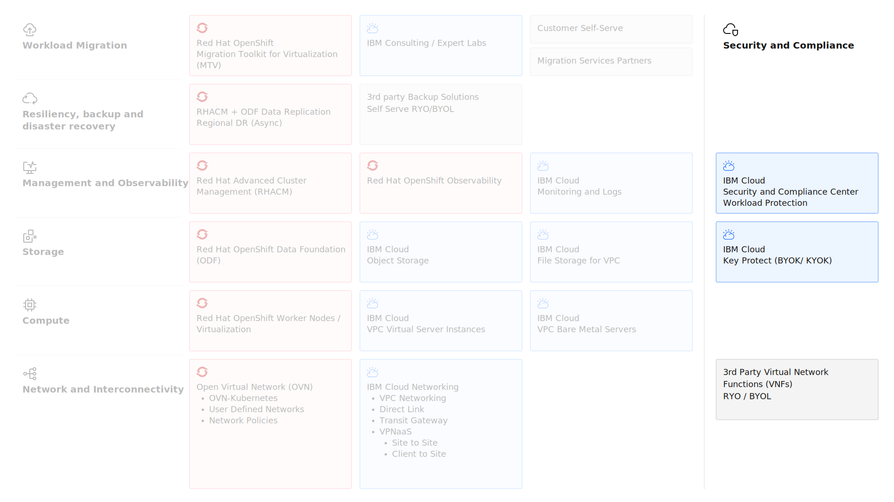

---

copyright:
  years: 2025, 2026
lastupdated: "2026-01-12"

keywords: Security

subcollection: virtualization-solutions

---

# Security design for Red Hat OpenShift Virtualization
{: #virt-sol-openshift-security-design-overview}

Security is a foundational component of any cloud architecture that includes identity and access management, data protection, network security, and compliance. {{site.data.keyword.cloud}} provides a comprehensive security framework for both Virtual Servers for VPC and Red Hat OpenShift on {{site.data.keyword.cloud_notm}} (ROKS) environments. This security implements defense-in-depth strategies across multiple layers of the infrastructure stack.
{: shortdesc}

The key security architecture elements are shown in the following diagram.

{: caption="Red Hat OpenShift Virtualization on {{site.data.keyword.cloud_notm}} Security" caption-side="bottom"}

For workload migration and deployment, robust security capabilities are essential to maintain confidentiality, integrity, and availability while regulatory and compliance requirements are met. {{site.data.keyword.cloud_notm}} security services integrate with default platform capabilities to provide end-to-end protection for virtualization and container workloads.

## Shared responsibility
{: #virt-sol-openshift-security-design-shared-responsibility}

{{site.data.keyword.cloud_notm}} uses a shared responsibility model that defines which security and compliance responsibilities are managed by {{site.data.keyword.cloud_notm}} and which ones are yours. Understanding this model is critical to implement effective security controls. For more information, see [Shared responsibilities for using IBM Cloud products](https://cloud.ibm.com/docs/overview?topic=overview-shared-responsibilities) and [Infrastructure-as-a-service](https://cloud.ibm.com/docs/overview?topic=overview-shared-responsibilities#iaas-services-responsibilities).

{{site.data.keyword.cloud_notm}} compliance results from a platform and services that are built on best-in-industry security standards, including GDPR, HIPAA, ISO 9001, ISO 27001, ISO 27017, ISO 27018, PCI, SOC2, and others. See [Understanding compliance in IBM Cloud](https://cloud.ibm.com/docs/overview?topic=overview-compliance).

## Identity and access management
{: #virt-sol-openshift-security-design-iam}

{{site.data.keyword.cloud_notm}} Identity and Access Management (IAM) provides centralized access control for {{site.data.keyword.cloud_notm}} resources to manage users, service IDs, access groups, and policies across the {{site.data.keyword.cloud_notm}} platform.

For Red Hat OpenShift on {{site.data.keyword.cloud_notm}}, IAM integrates with Kubernetes Role-Based Access Control (RBAC).

The following table details the features of both IAM and RBAC.

| IAM features | Description |
| -------------- | -------------- |
| Users and services IDs | - IBMid authentication for human users \n - Service IDs for applications and automation \n - API keys for programmatic access \n - Multifactor authentication (MFA) support |
| Access groups | - Logical grouping of users and service IDs  \n - Centralized policy management \n - Dynamic membership based on identity attributes \n - Simplified access governance at scale |
| IAM policies | - Resource-level access control \n - Platform roles for infrastructure management \n - Service roles for workload operations \n - Attribute-based access control (ABAC) |
{: caption="Identity and Access Management features" caption-side="bottom"}
{: summary="This table provides all the features for Identity and Access Management."}
{: #vpc-iam}
{: tab-title="IBM Cloud IAM"}
{: tab-group="Identity-Access-Management"}

| Red Hat OpenShift RBAC features | Description |
| -------------- | -------------- |
| Platform access | - IAM platform roles determine cluster infrastructure actions \n - Administrator, Editor, Operator, and Viewer roles \n - Cluster creation, deletion, and configuration management \n - Worker node and networking operations |
| Service access | - IAM service roles map to Kubernetes RBAC policies \n - Manager, Writer, and Reader roles \n - Namespace-level and cluster-level access \n - Custom role definitions for specific workloads |
| Identity provider integration | - IBMid as the default identity provider \n - Integration with enterprise LDAP and SAML providers \n - OAuth authentication flow \n - Service account tokens for automation |
{: caption="RBAC integration with IAM" caption-side="bottom"}
{: summary="This table provides information about RBAC integration with IAM."}
{: #openshift-rbac}
{: tab-title="OpenShift RBAC Integration"}
{: tab-group="Identity-Access-Management"}

## Data encryption
{: #virt-sol-openshift-security-design-encryption}

{{site.data.keyword.cloud_notm}} provides comprehensive encryption capabilities to protect data at rest and in transit across VPC and Red Hat OpenShift environments.

The following table details each encryption service and the encryption capabilities available with that service.

| Service | Description |
| -------------- | -------------- |
| VPC block storage encryption | - Provider-managed encryption by default (IBM-managed keys). \n - Customer-managed encryption by using IBM Key Protect or Hyper Protect Crypto Services \n - AES-256 encryption standard \n - Encryption of virtual server boot volumes and data volumes. |
| Red Hat OpenShift Cluster Encryption | - etcd data and worker disks encrypted by IBM-managed LUKS encryption keys. \n - Integration with IBM Key Protect allows bring your own root of trust encryption keys that wrap the LUKS key that is used to encrypt etcd storage and worker disks. \n - Kubernetes secrets encryption at rest. \n - Persistent volume encryption through storage providers. |
| IBM Key Protect | - Bring-your-own-key (BYOK) model with keys that are protected by FIPS 140-2 Level 2 cloud HSM. \n - Centralized key lifecycle management. \n - Key rotation and versioning. \n - Provides audit logs for key operations. \n Integration with VPC and Red Hat OpenShift services |
| IBM Hyper Protect Crypto Services | - Keep-your-own-key (KYOK) model that uses FIPS 140-2 Level 4 cloud HSM. \n - Customer-controlled Hardware Security Module (HSM). \n - Exclusive customer control over encryption keys. \n - Enhanced compliance for regulated industries. |
{: caption="Encryption-at-rest encryption capabilities" caption-side="bottom"}
{: summary="This table provides all the encryption-at-rest encryption capabilities."}
{: #vpc-encryption-at-rest}
{: tab-title="Encryption-at-rest"}
{: tab-group="Encryption"}

| Service | Description |
| -------------- | -------------- |
| Network encryption | - End-to-end encryption is possible when you use secure endpoints, such as HTTPS servers on port 443 or by using TLS/SSL for application layer security. \n - VPN gateway encryption by using IPsec. \n - Direct Link with MACsec encryption for private connectivity. |
| Red Hat OpenShift network encryption | - TLS encryption for Red Hat OpenShift API server communication.  \n - Encrypted control plane to worker node communication. |
{: caption="Encryption-in-transit encryption capabilities" caption-side="bottom"}
{: summary="This table provides all the encryption-in-transit encryption capabilities."}
{: #openshift-encryption-in-transit}
{: tab-title="Encryption-in-transit"}
{: tab-group="Encryption"}

## Network security
{: #virt-sol-openshift-security-design-network}

{{site.data.keyword.cloud_notm}} VPC provides multiple layers of network security controls to protect workloads and control traffic flow.

Red Hat OpenShift provides network policies and security context constraints (SCCs)

| VPC security control | Description | Key features |
| -------------- | -------------- | -------------- |
| Security Groups | Security Groups are stateful firewall controls that protect virtual servers, with stateful rules where responses are automatically allowed when a request is permitted. | - Instance-level (network interface) security \n - Stateful traffic filtering \ - Attached to bare metal servers, virtual server NICs, or load balancers \n - Ingress (inbound) and egress (outbound) rules \n - Support for protocol, port, and source and destination specification |
| Access control lists (ACLs) | ACLs control traffic to and from subnets, acting as built-in virtual firewalls at the subnet level. | - Subnet-level security  \n - Stateless traffic filtering - if you want to permit traffic both ways on a target you must set up two rules. \n - All resources in a subnet with an associated ACL follow ACL rules. \ - Rules evaluated in numerical order (priority-based). \n - Allow and deny rules for granular control. \n - Use ACLs for broad subnet-level controls. \n Combine ACLs with security groups for defense-in-depth. \n - Implement explicit deny rules for known malicious traffic. \n - Order rules efficiently (most specific first). \n - Document ACL rule purposes and maintenance procedures |
{: caption="VPC network security controls" caption-side="bottom"}
{: summary="This table provides tne list of all the VPC security controls."}
{: #vpc-security-controls}
{: tab-title="VPC security controls"}
{: tab-group="network-security"}

| Red Hat OpenShift | Description |
| -------------- | -------------- |
| Network policies | - Kubernetes NetworkPolicy resources for pod-to-pod traffic control  \n - Namespace isolation and segmentation. \n - Application-level micro-segmentation. \n - Ingress and egress rule definition |
| Security contexts constraints (SCCs) | - Control pod security capabilities and permissions. \n - Restrict privileged container execution. \n - Define allowed volume types and host access. \n - Enforce security best practices for workload deployment |
{: caption="OpenShift network security" caption-side="bottom"}
{: summary="This table provides tne list of all the OpenShift security controls."}
{: #openshift-security-controls}
{: tab-title="OpenShift security controls"}
{: tab-group="network-security"}

## Compliance and governance
{: #virt-sol-openshift-security-design-compliance}

{{site.data.keyword.cloud_notm}} provides comprehensive compliance capabilities and certifications to meet regulatory requirements across industries.

### IBM Cloud Compliance Certifications
{: #virt-sol-openshift-security-design-certifications}

Red Hat OpenShift on {{site.data.keyword.cloud_notm}} includes automatic compliance with HIPAA, PCI, SOC2, and ISO standards, including the following industry certifications.

- ISO 27001, 27017, 27018 (Information Security Management)
- SOC 1, SOC 2, SOC 3 (Service Organization Controls)
- PCI DSS (Payment Card Industry Data Security Standard)
- HIPAA (Health Insurance Portability and Accountability Act)
- FedRAMP (Federal Risk and Authorization Management Program)
- GDPR (General Data Protection Regulation) compliance support

### IBM Cloud Security and Compliance Center Workload Protection (SSC WP)
{: #virt-sol-openshift-security-design-scc}

| Feature | Description |
| -------------- | -------------- |
| Posture management | - Continuous security posture assessment. \n - Configuration compliance scanning. \n - Drift detection from security baselines. \n Remediation guidance and automation |
| Compliance monitoring | * Regulatory compliance validation. \n - Custom control framework definition. \n - Evidence collection for audits. \n - Compliance dashboards and reporting |
| Workload protection | - Runtime threat detection. \n - Vulnerability scanning for VMs and containers. \n - File integrity monitoring. \n - Compliance scanning for CIS benchmarks and other frameworks |
{: caption="IBM Cloud Security and Compliance Center Workload Protection" caption-side="bottom"}

### Activity Tracking and Logging
{: #virt-sol-openshift-security-design-logging}

| Feature | Description |
| -------------- | -------------- |
| IBM Cloud Activity Tracker | - Audit logging for all {{site.data.keyword.cloud_notm}} API calls \n - User activity tracking and attribution \n - Resource lifecycle event logging |
| VPC Flow Logs | - Network traffic capture and analysis  \n - Troubleshooting connectivity issues \n - Security incident investigation \n - Compliance evidence collection |
| Red Hat OpenShift Audit Logs | - Kubernetes API server audit logs \n - User and service account activity tracking \n - RBAC policy enforcement logging. \n - Integration with {{site.data.keyword.cloud_notm}} Logging |
{: caption="Activity Tracking and Logging" caption-side="bottom"}
