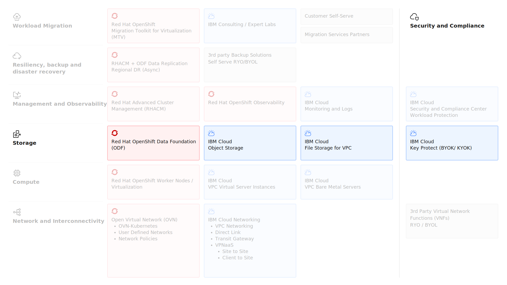

---

copyright:
  years: 2025, 2026
lastupdated: "2026-02-09"

keywords: ROKS, OpenShift Data Foundation, ODF, File Storage, Block Storage, Encryption

subcollection: virtualization-solutions

---

{{site.data.keyword.attribute-definition-list}}

# Storage design for Red Hat OpenShift Virtualization
{: #virt-sol-openshift-storage-design-overview}

IBM Cloud offers a range of storage solutions that are designed to meet diverse workload requirements, from high-performance computing to long-term archival. Block storage and file storage options provide flexibility, scalability, and enterprise-grade security for hybrid and multicloud environments.
{: shortdesc}

The key storage architecture elements are shown in the following diagram.

{: caption="Red Hat OpenShift Virtualization on IBM Cloud Storage" caption-side="bottom"}

## Storage options
{: #virt-sol-openshift-storage-options}

Red Hat OpenShift Virtualization uses Kubernetes PersistentVolumes (PVs) and PersistentVolumeClaims (PVCs) to manage storage. It supports multiple storage backends that include block storage (not available with bare metal servers), file storage, and local storage (only available with bare metal servers).

Red Hat OpenShift on IBM Cloud offers integrated add-ons for Red Hat OpenShift Data Foundation (ODF), block and file storage by using IBM Cloud resources.

### Red Hat OpenShift Data Foundation (ODF)
{: #virt-sol-openshift-storage-odf-summary}

Red Hat OpenShift Data Foundation (ODF) provides persistent, software-defined storage for containerized applications. It delivers highly available and scalable storage by combining object, block, and file storage under a unified platform. ODF offers features such as snapshots, replication, and scalable storage management and are integrated with the Red Hat OpenShift console and APIs. This integration help you manage storage across diverse workloads.

The primary storage option for Red Hat OpenShift Virtualization is Red Hat OpenShift Data Foundation. This highly available storage solution consists of several open source operators and technologies such as Ceph, NooBaa, and Rook. These operators are used to provision and manage file, block, and object storage for your clusters by using storage classes.

ODF abstracts your underlying storage, and you can use ODF to create file, block, or object storage claims from the same underlying raw block storage. In virtualization, ODF uses local NVMe disks on bare metal servers to create a performant virtualized storage layer, where your application data is replicated in multiples of 3 (typically) for high availability by default. ODF with Red Hat OpenShift Virtualization is especially critical if you want to use disaster recovery (DR) capabilities for your VM workloads.

For more information about ODF, see [Understanding OpenShift Data Foundation](/docs/openshift?topic=openshift-ocs-storage-prep).

ODF supports the following layers of encryption:

- Cluster encryption - encrypts data at rest across the entire storage cluster.
- In-transit encryption - secures data as it moves between nodes, pods, and clients.
- Storage volume encryption - provides encryption for individual PersistentVolumes or storage volumes.

For more information about setting up storage volume encryption in ROKS, see [Setting up encryption by using Hyper Protect Crypto Services](/docs/openshift?topic=openshift-deploy-odf-classic&interface=ui#odf-create-hscrypto-classic).

### IBM Cloud Object Storage
{: #virt-sol-openshift-storage-cos-summary}

You can use {{site.data.keyword.cos_full_notm}} with backup solutions, or other object storage needs. {{site.data.keyword.cos_full_notm}} allows backup data to be stored outside of the ODF cluster in case a disaster occurs.

{{site.data.keyword.cos_full_notm}} is managed by IBM Cloud, while object storage built in the ODF clusters is a self-managed on ROKS worker nodes. Depending on the use case, you can use both {{site.data.keyword.cos_full_notm}} and ROKS.

### File Storage for VPC
{: #virt-sol-openshift-storage-file-summary}

You can use File Storage for VPC, which is a network-attached storage with NFS support.

IBM Cloud File Storage for VPC is a persistent, fast, and flexible network-attached, NFS-based storage option. You can add IBM Cloud File Storage to your applications by using persistent volumes claims (PVCs). You can choose between predefined storage classes that provide the required capacity in GB and IOPS.

* All file shares are provisioned with zonal availability.
* All classes support cross-zone mounting.

Data on a file share is encrypted at rest with IBM-managed encryption by default. You can optionally use your own root keys to protect your file shares with customer-managed keys. For more information, see [About File Storage for VPC](/docs/vpc?topic=vpc-file-storage-vpc-about) and [About File Storage for VPC > Securing your data](/docs/vpc?topic=vpc-file-storage-vpc-about&interface=ui#fs-data-security).

For NFS-based file share needs, you can also use the NFS storage that is built into the ODF clusters. The key differences here are that File Storage for VPC is managed by IBM Cloud, while NFS storage is built in the ODF clusters and is on self-managed on ROKS managed worker nodes. The IOPS and GB settings are independent of your clusters. Depending on the use case, you can use both of these options.

For Red Hat OpenShift Virtualization workloads that use VPC File storage, keep the following considerations in mind:

- Snapshots aren't supported.
- Each Persistent Volume Claim (PVC) that was created with this provisioner provisions an NFS share and a mount target in your VPC.
- A PVC can be mounted as a volume in multiple pods or virtual servers. However, it can't be shared across multiple virtual servers.
- For virtual servers, one virtual server disk equals one PVC, which means that one NFS share per virtual server disk.

To deploy the File storage shares for VPC add-on on your ROKS cluster, see [Enabling the IBM Cloud File Storage for VPC cluster add-on](/docs/openshift?topic=openshift-storage-file-vpc-install).

The add-on automatically installs the PersistentVolume provisioner `vpc.file.csi.ibm.io` and creates a set of StorageClasses that are named `ibmc-vpc-file-*`. Each option offers different IOPS tiers and varying reclaim and binding policies. For the full list of available StorageClasses and detailed explanations of their parameters, see [Storage class reference](/docs/openshift?topic=openshift-storage-file-vpc-sc-ref).

### Block Storage for VPC
{: #virt-sol-openshift-storage-block-summary}

Block storage for VPC is available for only virtual server worker nodes.
{: note}

This add-on provisions hypervisor-mounted, high-performance, block-level data storage for your virtual server worker nodes by using Kubernetes persistent volume claims (PVCs). PVCs are used to store virtual server disks on IBM Cloud Block Storage volumes.

Data on a block volume is encrypted at rest with IBM-managed encryption by default. You can optionally use your own root keys to protect your file shares with customer-managed keys.
For more information see, [About Block Storage for VPC](/docs/vpc?topic=vpc-block-storage-about) and [About Block Storage for VPC > Securing your data](/docs/vpc?topic=vpc-block-storage-about#bs-data-security).

## Next steps
{: #virt-sol-openshift-storage-design-next-steps}

Now that you understand the storage design options for Red Hat OpenShift Virtualization, explore these related topics:

- **Security**: Review [encryption and data protection](/docs/virtualization-solutions?topic=virtualization-solutions-virt-sol-openshift-security-design-overview) for storage
- **Resiliency**: Learn about [backup and disaster recovery strategies](/docs/virtualization-solutions?topic=virtualization-solutions-virt-sol-openshift-resiliency-design) for ODF
- **Compute**: Explore [compute design options](/docs/virtualization-solutions?topic=virtualization-solutions-virt-sol-openshift-compute-design) and storage requirements
- **Reference architecture**: Review the complete [Red Hat OpenShift Virtualization reference architecture](/docs/virtualization-solutions?topic=virtualization-solutions-virt-sol-rove-architecture)
