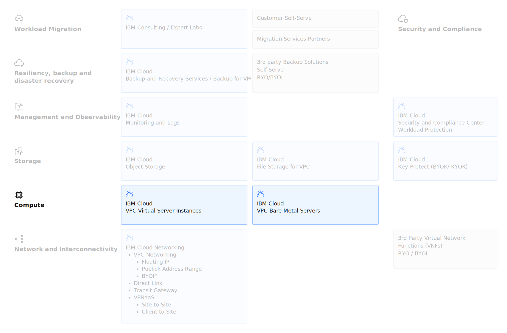

---

copyright:
  years: 2025
lastupdated: "2025-12-04"

keywords: VSI, File Storage, Block Storage, Encryption

subcollection: virtualization-solutions

---

{{site.data.keyword.attribute-definition-list}}

# Compute Design
{: #virt-sol-vpc-compute-design-overview}

IBM Cloud VPC provides a comprehensive portfolio of compute options designed to support diverse workloads, from traditional applications to modern cloud-native solutions. These offerings deliver flexibility, scalability, and enterprise-grade security, enabling organizations to deploy workloads across virtualized, containerized, and bare metal environments.

Key IBM Cloud VPC compute options:

1. Virtual Servers for VPC
2. Bare Metal Servers for VPC

IBM Cloud VPC compute solutions empower businesses to choose the right infrastructure for their needs—whether optimizing cost, achieving high performance, or enabling hybrid and multicloud strategies.

The key compute architecture elements are shown in the following diagram.

{: caption="IBM Cloud VPC VSI Compute" caption-side="bottom"}

## IBM Cloud Virtual Servers for VPC
{: #virt-sol-vpc-compute-design-virtual-servers}

[VPC VSI]{: tag-blue}

IBM Cloud Virtual Servers for VPC provide secure, isolated virtual machines deployed within a Virtual Private Cloud environment. These instances deliver enterprise-grade compute for production workloads, and development and test environments requiring flexible resource allocation and comprehensive infrastructure control. Key features include the following:

* **Customizable profiles:** Balanced, compute-optimized, memory-optimized, GPU, and very high memory configurations
* **Flexible tenancy:** Shared tenancy infrastructure with optional dedicated host placement for compliance requirements
* **Advanced networking:** Integration with VPC Security Groups, Network ACLs, Load Balancers, and VPN connectivity
* **Persistent storage:** IBM Cloud Block Storage and File Storage for VPC with configurable IOPS and encryption
* **Operating system flexibility:** IBM-provided stock images or bring-your-own custom images
* **Scalability:** Vertical scaling through profile changes and horizontal scaling through instance groups with auto-scaling

For more information on VSI profiles, see [IBM Cloud Docs - VPC Instance Profiles](https://cloud.ibm.com/docs/vpc?topic=vpc-profiles).
