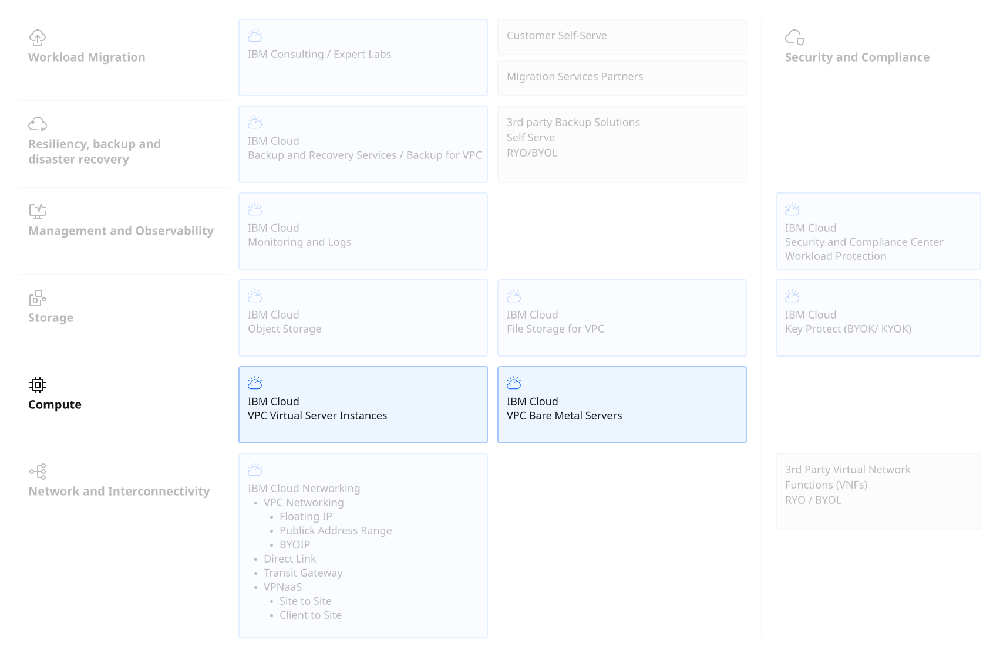

---

copyright:
  years: 2025, 2026
lastupdated: "2026-10-06"

keywords: VPC virtual server profiles IBM Cloud, IBM Cloud instance profiles VPC, balanced compute profiles IBM Cloud VPC, memory-optimized instances IBM Cloud, compute-optimized VPC IBM Cloud, GPU instances IBM Cloud VPC, dedicated host IBM Cloud VPC, auto-scaling instance groups IBM Cloud, VPC compute design IBM Cloud, IBM Cloud bare metal VPC compute

subcollection: virtualization-solutions

---

{{site.data.keyword.attribute-definition-list}}

# Designing compute for {{site.data.keyword.cloud_notm}} VPC virtual servers
{: #virt-sol-vpc-compute-design-overview}

Explore {{site.data.keyword.cloud_notm}} VPC compute options including virtual servers, bare metal servers, dedicated hosts, GPU instances, and auto-scaling groups.
{: shortdesc}

{{site.data.keyword.cloud_notm}} VPC provides a comprehensive portfolio of compute options designed to support diverse workloads, from traditional applications to modern cloud-native solutions. These offerings deliver flexibility, scalability, and enterprise-grade security, enabling organizations to deploy workloads across virtualized, containerized, and bare metal environments.

The following are the key {{site.data.keyword.cloud_notm}} VPC compute options:

- Virtual Servers for VPC
- Bare Metal Servers for VPC

{{site.data.keyword.cloud_notm}} VPC compute solutions empower businesses to choose the right infrastructure for their needs—whether optimizing cost, achieving high performance, or enabling hybrid and multicloud strategies.

The key compute architecture elements are shown in the following diagram.

{: caption="IBM Cloud VPC VSI Compute" caption-side="bottom"}

## {{site.data.keyword.cloud_notm}} Virtual Servers for VPC
{: #virt-sol-vpc-compute-design-virtual-servers}

{{site.data.keyword.cloud_notm}} Virtual Servers for VPC provide secure, isolated virtual machines deployed within a Virtual Private Cloud environment. These instances deliver enterprise-grade compute for production workloads, and development and test environments requiring flexible resource allocation and comprehensive infrastructure control.

The following tables lists the key features for {{site.data.keyword.cloud_notm}} Virtual Servers for VPC.

| Feature | Description |
| -------------- | -------------- |
| Customizable profiles | Balanced, compute-optimized, memory-optimized, GPU, and very high memory configurations |
| Flexible tenancy | Shared tenancy infrastructure with optional dedicated host placement for compliance requirements |
| Advanced networking | Integration with VPC Security Groups, Network access control lists (ACLs), Load Balancers, and virtual private network (VPN) connectivity |
| Persistent storage | {{site.data.keyword.cloud_notm}} Block Storage and File Storage for VPC with configurable input/output operations per second (IOPS) and encryption |
| Operating system flexibility | IBM-provided stock images or bring-your-own custom images |
| Scalability | Vertical scaling through profile changes and horizontal scaling through instance groups with auto-scaling |
{: caption="{{site.data.keyword.cloud_notm}} Virtual Servers for VPC key features" caption-side="bottom"}

For more information on virtual server instance profiles, see [{{site.data.keyword.cloud_notm}} Docs - VPC Instance Profiles](/docs/vpc?topic=vpc-profiles).

## Next steps
{: #virt-sol-vpc-compute-design-next-steps}

Now that you understand the compute design options for VPC virtual servers, explore these related topics and practical tutorials:

- **Networking**: Review [networking design considerations](/docs/virtualization-solutions?topic=virtualization-solutions-virt-sol-network-design) for VPC connectivity and security
- **Storage**: Explore [storage design options](/docs/virtualization-solutions?topic=virtualization-solutions-virt-sol-storage-design-overview) for persistent data
- **Resiliency & Backup**: Review [resiliency design](/docs/virtualization-solutions?topic=virtualization-solutions-virt-sol-vpc-resiliency-design-overview) and follow the tutorial on [Configuring Veeam Backup & Replication for VPC VSIs](/docs/virtualization-solutions?topic=virtualization-solutions-veeam-vbr-vpc-vsi-configuration)
- **Migration**: Review [migration strategies](/docs/virtualization-solutions?topic=virtualization-solutions-virt-sol-vpc-migration-design-migration) and complete the [Migrating VMware to VPC virtual servers tutorial](/docs/virtualization-solutions?topic=virtualization-solutions-migration-tutorial) or [RackWare RMM migration tutorial](/docs/virtualization-solutions?topic=virtualization-solutions-rackware-vcf-classic-2-vpc-vsi-tutorial)
