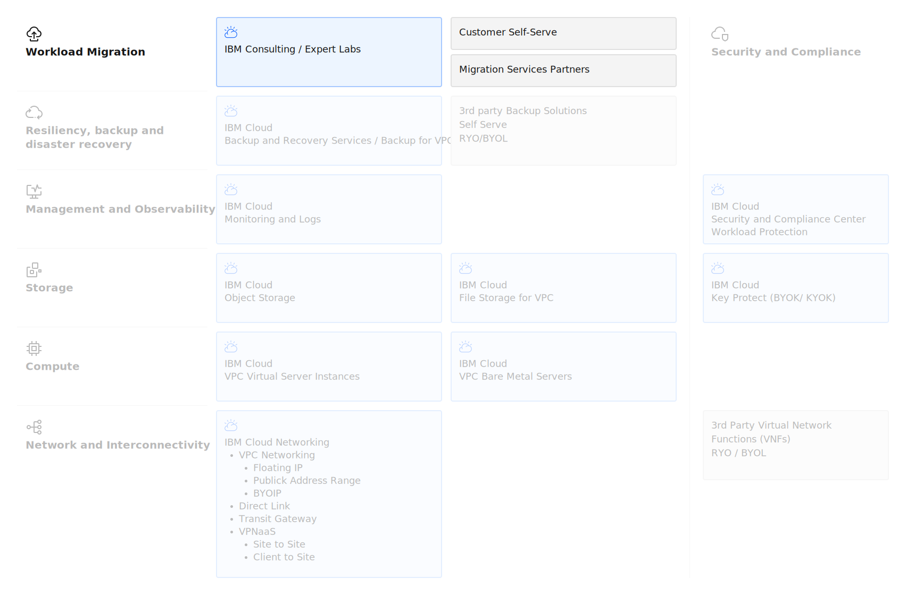

---

copyright:
  years: 2025, 2026
lastupdated: "2026-02-09"

keywords: VSI, Migration, virtual server migration, vmware virtual server migration, vmware migration

subcollection: virtualization-solutions

---

{{site.data.keyword.attribute-definition-list}}

# VMware to VPC virtual servers migration overview
{: #virt-sol-vpc-migration-design-migration}

For the VMware to Virtual Servers on VPC migration, you have three migration options: a service provider, RackWare RMM, and DIY.
{: shordesc}

- A service provider such as WanClouds or PrimaryIO can manage your migration. For more information, see the documentation for your chosen service.
- RackWare RMM - for more information about using Rackware RMM to migrate, see [Migrating from IBM Cloud VMware VCF-Automated to VPC VSI with RackWare RMM Technical Guide](/docs/virtualization-solutions?topic=virtualization-solutions-virt-sol-vpc-migration-design-rmm-guide).
- DIY migrations are migration methods that don't use a service provider or RackWare RMM. You use techniques that work best for you.

The following diagram shows the key compute architecture elements.

{: caption="VPC virtual server virtualization on IBM Cloud Migration" caption-side="bottom"}

The following guide is organized into general principals, DIY migration, and RackWare RMM.

## General migration principles
{: #virt-sol-vpc-migration-design-migration-principles}

To learn more about the general migration principles, see the following links.

* [Pre-migration design decisions](/docs/virtualization-solutions?topic=virtualization-solutions-virt-sol-vpc-migration-design-premigration)
* [Wave planning and execution design](/docs/virtualization-solutions?topic=virtualization-solutions-virt-sol-vpc-migration-design-wave)
* [Post-migration validation and optimization](/docs/virtualization-solutions?topic=virtualization-solutions-virt-sol-vpc-migration-design-post)
* [Risk mitigation and rollback strategies](/docs/virtualization-solutions?topic=virtualization-solutions-virt-sol-vpc-migration-design-risk)

## DIY migration
{: #virt-sol-vpc-migration-design-migration-diy}

For more information about DIY migration, see the following links.

* [Image import (template-based migration)](/docs/virtualization-solutions?topic=virtualization-solutions-virt-sol-vpc-migration-design-method1)
* [Copying direct volume (multi-disk method)](/docs/virtualization-solutions?topic=virtualization-solutions-virt-sol-vpc-migration-design-method2)
* [Live network transfer (recommended for scale)](/docs/virtualization-solutions?topic=virtualization-solutions-virt-sol-vpc-migration-design-method3)
* [VDDK Direct Extraction (vCenter only)](/docs/virtualization-solutions?topic=virtualization-solutions-virt-sol-vpc-migration-design-method4)
* [Linux migration considerations](/docs/virtualization-solutions?topic=virtualization-solutions-virt-sol-vpc-migration-design-linux)
* [Windows migration considerations](/docs/virtualization-solutions?topic=virtualization-solutions-virt-sol-vpc-migration-design-windows)

## RackWare RMM
{: #virt-sol-vpc-migration-design-migration-rackware}

For more information about RackWare RMM, see the following links.

* [Migrating from IBM Cloud VMware VCF-automated to VPC virtual servers with RackWare RMM technical guide](/docs/virtualization-solutions?topic=virtualization-solutions-virt-sol-vpc-migration-design-rmm-guide)
* [Migrating from IBM Cloud VMware VCF-automated to VPC virtual servers with RackWare RMM tutorial](/docs/virtualization-solutions?topic=virtualization-solutions-virt-sol-vpc-migration-design-rmm-tutorial)

## DIY migration methods comparison
{: #virt-sol-vpc-migration-design-migration-diy-overview}

The following table provides a comparison of the four DIY migration methods available for migrating VMware virtual machines to VPC virtual server instances. Each method has distinct advantages and is suited for different migration scenarios. Review these options to determine which approach best fits your workload requirements, technical constraints, and migration scale.

Review the following table for summaries of each migration method.

| Migration method | Description |
| ---------------- | ----------- |
| Image import     | Best for single-disk virtual machines, template reuse scenarios, and simple migrations. For more information, see [Method 1: Image import (template-based migration)](/docs/virtualization-solutions?topic=virtualization-solutions-virt-sol-vpc-migration-design-method1). |
| Copy direct volume | Best for multi-disk virtual servers that need to avoid image proliferation and scenarios that require precise control of volume configuration. For more information, see [Method 2: Copying direct volume (multi-disk method)](/docs/virtualization-solutions?topic=virtualization-solutions-virt-sol-vpc-migration-design-method2). |
| Live network transfer | Best for large-scale migrations, when you need to minimize downtime, or scenarios when it is not practical to export a virtual server. For more information, see [Method 3: Live Network Transfer (Recommended for Scale)](/docs/virtualization-solutions?topic=virtualization-solutions-virt-sol-vpc-migration-design-method3). |
|  VMware VDDK direct extraction (vCenter only) | This option is a single-command migration process for vCenter environments. For more information, see [Method 4: VDDK Direct Extraction (vCenter only)](/docs/virtualization-solutions?topic=virtualization-solutions-virt-sol-vpc-migration-design-method4). |
{: caption="Migration methods overview" caption-side="bottom"}

### Linux and Windows migration considerations
{: #virt-sol-vpc-migration-design-migration-diy-considerations}

See the following migration considerations for Windows and Linux virtual servers.

* [Linux migration considerations](/docs/virtualization-solutions?topic=virtualization-solutions-virt-sol-vpc-migration-design-linux)
* [Windows migration considerations](/docs/virtualization-solutions?topic=virtualization-solutions-virt-sol-vpc-migration-design-windows)

## RackWare Migration Manager (RMM) migration overview
{: #virt-sol-vpc-migration-design-migration-rmm}

RackWare Migration Manager (RMM) is a commercial migration platform that is available from the IBM Cloud catalog. RMM automates VMware workload migrations to IBM Cloud VPC virtual server instances. Unlike the previous manual migration methods, RackWare offers a migration experience with a graphical interface and centralized orchestration. For more information, see [RackWare and IBM Cloud](https://www.rackwareinc.com/solutions/cloud-environments/rackware-and-ibm){: external}.

### How Rackware RMM works
{: #virt-sol-vpc-migration-design-migration-rmm-how}

RMM operates by using a lightweight agentless architecture. You deploy the RackWare Management Server as a virtual server instance in your target VPC environment that serves as the orchestration hub for all migration activities. The platform discovers your source virtual machines, and provides a web-based interface for selecting and configuring migrations.

The platform runs block-level replication of your virtual server disks and transfers data directly to the VPC volumes. During this process, RMM automatically formats conversions (virtual machineDK to raw), drivers injection (by installing VirtIO drivers for Windows and Linux), and OS-level modifications that are needed for the target cloud environment.

RMM automatically provisions the target virtual server instances and their boot and data volumes based on the source virtual servers. RMM supports delta sync to help minimize cutover windows by initializing full sync while the source virtual server runs. Then, followed by incremental syncs of changed blocks and a brief cutover window for the final sync and switchover.

RMM supports bridge servers that enable NAT for the source virtual servers that helps with the retention of IP address ranges that are in both the source and target.

### Rackware RMM BYOL
{: #virt-sol-vpc-migration-design-migration-rmm-availability}

RackWare RMM is available as a BYOL (Bring Your Own License) offering in the IBM Cloud catalog. You provision the RackWare Management Server as a virtual server instance in your VPC, and licensing is handled directly with RackWare based on the number of workloads you plan to migrate. IBM has a partnership with RackWare, and the solution is validated and supported for VMware to VPC migrations. You can find RackWare in the catalog under Migration tools or by searching for "RackWare".

The deployment process involves the following actions.

* Provisioning the RackWare appliance in your VPC
* Configuring network connectivity (typically through Transit Gateway) between your VMware environment and VPC
* Configuring and running migrations from the RackWare web interface

RackWare provides [documentation](https://www.rackwareinc.com/solutions/cloud-environments/rackware-and-ibm){: external} and supports specific to IBM Cloud VPC target environments.

### Use cases for Rackware RMM
{: #virt-sol-vpc-migration-design-migration-rmm-suitability}

RMM is best for organizations that have the following situations.

- You need to migrate more than 50 virtual servers. The centralized orchestration, batching capabilities, and automation significantly reduce the migration effort compared to manual methods. A process that might take 2-3 hours per virtual server manually, can reduce to 30-60 minutes by using RMM.
- You need to minimize downtime for production workloads with strict availability requirements. An RMM migration with delta sync runs most of the data transfer while the main applications stay running. This process helps reduce cutover windows from hours to minutes.
- Cloud expertise is limited. RackWare manages complex operations such as driver injection, operating system preparation, and cloud-specific configurations.
- You need workflow automation. Use cases that have compliance requirements or standardized change management, RMM provides workflow automation, audit logging, and repeatability, which can be difficult with manual migration methods.
- Support is important. Unlike the open source tools (libguestfs, virt-v2v), RackWare provides enterprise support, regular updates, and validated configurations for IBM Cloud VPC.

RMM might not be the best tool for the following situations.

- Small migrations of 10 or fewer virtual servers. The licensing cost and setup time might not justify the automation benefits for small migrations.
- Highly customized or nonstandard virtual servers. While RMM handles most operating system configurations, virtual servers that have specialized configurations, custom kernels, or unusual storage layouts might require manual intervention.
- Budget-constrained projects.
- Organizations that lack VPC expertise. Using RackWare automates many VPC tasks that your team might benefit from hands-on learning. To build long-term VPC expertise, start with manual migrations.

### Integrate RMM with manual methods
{: #virt-sol-vpc-migration-design-migration-rmm-integration}

RMM and manual methods are not mutually exclusive. The following example is a common migration pattern.

1. Manually start a pilot wave (Methods 2 or 3) to learn VPC concepts and validate your target architecture.
2. Document issues, timing, and lessons learned.
3. Deploy RackWare for subsequent waves that use your pilot experience to optimize your RackWare configuration.
4. Reserve manual methods for special circumstances or problematic virtual servers.

This hybrid approach balances learning, cost, and automation benefits across your migration project.
