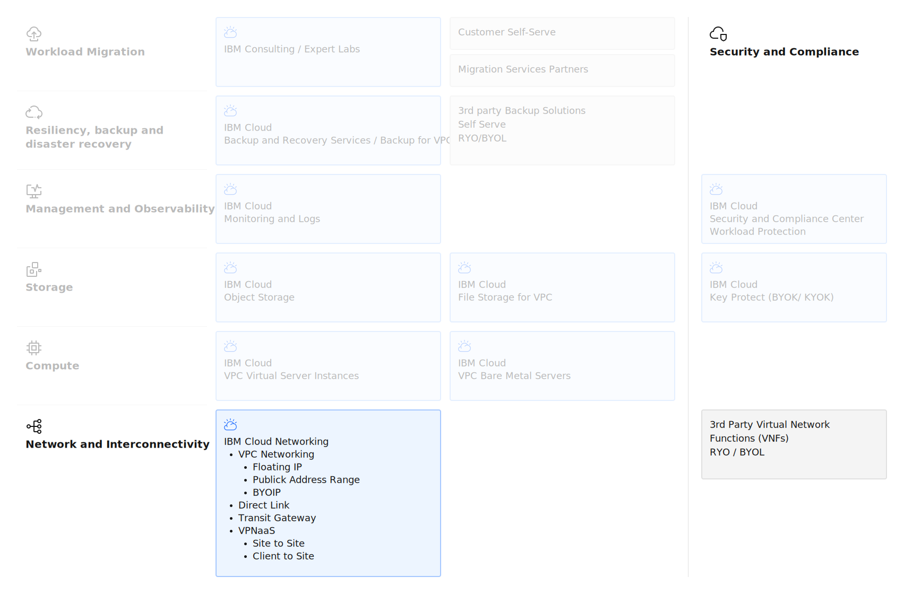

---
copyright:
  years: 2025, 2026
lastupdated: "2026-02-09"

keywords: ROKS, VPC, subnets

subcollection: virtualization-solutions

---

{{site.data.keyword.attribute-definition-list}}

# Network Design for VPC virtual servers
{: #virt-sol-network-design}

Networking is the backbone of any cloud architecture and plays a critical role in enabling secure, reliable, and high-performance connectivity for workloads. In IBM Cloud, networking services provide the foundation for virtualization, container orchestration, and hybrid cloud integration, ensuring that applications and data can move seamlessly across environments.

For workload migration and deployment, robust networking capabilities are essential to maintain application availability, security, and compliance. IBM Cloud offers advanced networking features such as Virtual Private Cloud (VPC), subnets, security groups, load balancing, and Direct Link for private connectivity to on-premises environments. These services enable organizations to design architectures that support scalable deployments, multi-zone resilience, and secure interconnectivity across hybrid and multicloud landscapes.

By leveraging IBM Cloud networking, businesses can confidently deploy and migrate workloads while maintaining performance and governance, paving the way for modernization and innovation.

The key network architecture elements are shown in the following diagram.

{: caption="IBM Cloud VPC VSI Network" caption-side="bottom"}

## IBM Cloud VPC Networking
{: #virt-sol-network-design-vpc-networking}

IBM Cloud VPC is a secure, isolated, and highly configurable networking environment that enables organizations to deploy and manage cloud resources with fine-grained control. It provides the foundation for modern workloads, including virtual servers, containers, and bare metal deployments, while ensuring network segmentation, security, and scalability.

### Default private networking with subnets
{: #virt-sol-network-design-vpc-networking-subnets}

VPCs span a region and contain subnets that span individual zones within that region. These subnets use ranges of private IP addresses, with the option to bring your own public IP range. Subnets within a VPC are private by default and can communicate with each other without configuring additional routes. As a result, all resources within a VPC can communicate with one another by default subject to security groups and access control lists. Virtual server instances are attached to one or more subnets.

See the architecture diagram in [About networking for VPC](/docs/vpc?topic=vpc-about-networking-for-vpc) for a visual representation of VPC networking concepts. For additional information and design considerations, see [Setting IP ranges](/docs/vpc?topic=vpc-choosing-ip-ranges-for-your-vpc).

### Load-balancers
{: #virt-sol-network-design-vpc-networking-lb}

IBM Cloud provides two families of load balancers for VPC: Application Load Balancer (ALB) and Network Load Balancer (NLB), each designed for different use cases and operating at different layers of the OSI model.

**Application Load Balancer (ALB)**
Application Load Balancer provides layer 7 and layer 4 load balancing on IBM Cloud, but ALBs are primarily intended for layer 7, web-based workloads. ALBs support public and private configurations with Secure Sockets Layer (SSL) offloading capabilities. Key features:

* Layer 7 (application) and Layer 4 (transport) load balancing
* SSL/TLS termination and offloading
* Content-based routing and URL-based routing
* HTTP/HTTPS protocol support
* Cookie-based session affinity
* Configured in active-active mode with high availability achieved using Domain Name Service (DNS), where the VIP of each compute resource is registered to the assigned DNS
* Support for virtual server instances, bare metal server instances, and Power System Virtual Server instances connected over Direct Link as back-end pool members
* Multi-zone deployment capability
* Integration with instance groups for auto-scaling

Choose Application Load Balancer when:

* SSL/TLS termination is required
* HTTP/HTTPS workloads need content-based routing
* Layer 7 features such as URL routing or header-based routing are needed
* Multi-zone high availability with DNS-based failover is acceptable

**Network Load Balancer (NLB)**
Network Load Balancer provides only layer 4 load balancing on IBM Cloud and does not support SSL offloading  NLB uses Direct Server Return (DSR), where information processed by backend targets is sent directly back to the client, minimizing latency and optimizing throughput performance. Key features:

* Layer 4 (transport) load balancing
* TCP and UDP protocol support
* Single, highly available virtual IP (VIP) that can be used directly, instead of through an assigned fully qualified domain name (FQDN)
* Direct Server Return (DSR) for high-performance data transfer
* Lower latency compared to ALB
* Higher throughput for large data transfers
* Supports public, private, Private Path, and private-type with routing mode enabled configurations

Choose Network Load Balancer when:

* Maximum throughput and lowest latency are critical
* Non-HTTP protocols (TCP/UDP) are required
* Direct Server Return benefits the architecture

### Virtual Private Endpoints
{: #virt-sol-network-design-vpc-networking-vpe}

IBM Cloud Virtual Private Endpoint (VPE) for VPC enables you to access supported IBM Cloud services remotely by using the IP addresses of your choice, which are allocated from a subnet within your VPC.

VPEs are virtual IP interfaces that are bound to an endpoint gateway created on a per-service or service-instance basis. The endpoint gateway is a virtualized function that scales horizontally, is redundant and highly available, and spans all availability zones of your VPC. Key characteristics:

* Endpoint gateways enable communications from virtual server instances within your VPC and IBM Cloud service on the private backbone
* Private IP addresses allocated from customer-defined VPC subnets
* No public internet connectivity required
* Horizontal scaling and high availability across availability zones
* Integration with VPC security groups and network ACLs
* DNS resolution support for service endpoints

### External connectivity
{: #virt-sol-network-design-vpc-networking-external}

External connectivity can be achieved with public gateways, floating IPs, and VPN gateways.

**Public gateways** span an entire subnet and enable all compute instances attached to that subnet to initiate outbound connections to the internet.

**Floating IPs** are associated with a single compute instance and support both initiating connections to and receiving connections from the internet.

**VPN for VPC** provides secure site-to-site connectivity from a VPC to another private network. See [About site-to-site VPN gateways](/docs/vpc?topic=vpc-using-vpn) for additional details.

**Client VPN for VPC** offers client-to-site servers, which allow remote clients on the internet to connect securely to VPN servers and access VPC resources. See [VPNs for VPC overview](/docs/vpc?topic=vpc-vpn-overview) for more information.

### Security
{: #virt-sol-network-design-vpc-networking-security}

Network security in VPC is controlled through security groups and access control lists (ACLs).

**Access control lists (ACLs)** manage traffic at the subnet level using stateless rules. ACLs can control external connectivity established via a public gateway on a subnet.

**Security groups** manage traffic at the instance level using stateful rules. Security groups control external connectivity established via floating IPs attached to virtual server instances.

See [Security in your VPC](/docs/vpc?topic=vpc-security-in-your-vpc) for additional details.

### Interconnectivity
{: #virt-sol-network-design-vpc-networking-interconnectivity}

**IBM Cloud Direct Link** and **VPN for VPC** enable secure connectivity between a VPC and on-premises networks. Direct Link provides dedicated, low-latency private connections, while VPN offers encrypted connectivity over the internet.

**IBM Cloud Transit Gateway** interconnects VPCs with each other, PowerVS Workspaces and with IBM Cloud Classic infrastructure, providing a hub for routing traffic across multiple cloud environments. Transit Gateway simplifies network topology management in hybrid and multicloud architectures.

For guidance on selecting the appropriate connectivity option, see [Interconnecting your VPC using IBM Cloud offerings](/docs/vpc?topic=vpc-interconnectivity) and [Getting started with IBM Cloud Transit Gateway](/docs/transit-gateway?topic=transit-gateway-getting-started).

## Next steps
{: #virt-sol-network-design-next-steps}

Now that you understand the networking design for VPC virtual servers, explore these related topics:

- **Security**: Review [security design considerations](/docs/virtualization-solutions?topic=virtualization-solutions-virt-sol-vpc-security-design-overview) including security groups and ACLs
- **Compute**: Explore [compute design options](/docs/virtualization-solutions?topic=virtualization-solutions-virt-sol-vpc-compute-design-overview) for virtual server instances
- **Storage**: Learn about [storage design patterns](/docs/virtualization-solutions?topic=virtualization-solutions-virt-sol-storage-design-overview) for VPC workloads
- **Observability**: Understand [observability solutions](/docs/virtualization-solutions?topic=virtualization-solutions-virt-sol-vpc-observability-design-overview) for monitoring network performance
