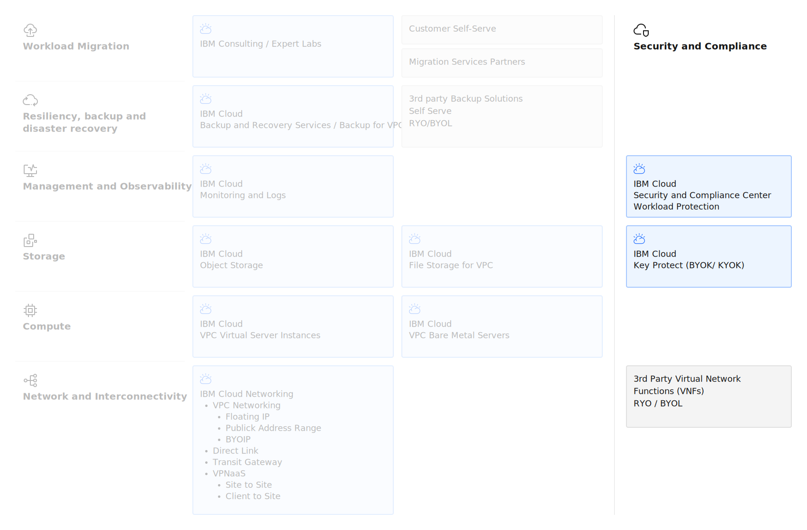

---

copyright:
  years: 2025
lastupdated: "2025-12-04"

keywords:

subcollection: virtualization-solutions

---

# Security Design
{: #virt-sol-vpc-security-design-overview}

Security is a foundational component of any cloud architecture, encompassing identity and access management, data protection, network security, and compliance. IBM Cloud provides a comprehensive security framework for both VPC Virtual Server Instances, implementing defense-in-depth strategies across multiple layers of the infrastructure stack.
{: shortdesc}

The key security architecture elements are shown in the following diagram.

{: caption="IBM Cloud VPC VSI Security" caption-side="bottom"}

For workload migration and deployment, robust security capabilities are essential to maintain confidentiality, integrity, and availability while meeting regulatory and compliance requirements. IBM Cloud's security services integrate with native platform capabilities to provide end-to-end protection for virtualization and container workloads.

## Shared Responsibility Model
{: #virt-sol-vpc-security-design-shared-responsibility}

[VPC VSI]{: tag-blue}

IBM Cloud uses a shared responsibility model that defines which security and compliance responsibilities are managed by IBM Cloud and which ones lie with customers . Understanding this model is critical for implementing effective security controls. See [Shared responsibilities for using IBM Cloud products](https://cloud.ibm.com/docs/overview?topic=overview-shared-responsibilities) and [Infrastructure-as-a-service](https://cloud.ibm.com/docs/overview?topic=overview-shared-responsibilities#iaas-services-responsibilities)

IBM Cloud provides a secure cloud platform that you can trust. IBM Cloud compliance results from a platform and services that are built on best-in-industry security standards, including GDPR, HIPAA, ISO 9001, ISO 27001, ISO 27017, ISO 27018, PCI, SOC2, and others. See [Understanding compliance in IBM Cloud](https://cloud.ibm.com/docs/overview?topic=overview-compliance)

## Identity and Access Management
{: #virt-sol-vpc-security-design-iam}

[VPC VSI]{: tag-blue}

IBM Cloud Identity and Access Management (IAM) provides centralized access control for IBM Cloud resources, enabling organizations to manage users, service IDs, access groups, and policies across the entire IBM Cloud platform.

### IAM Components
{: #virt-sol-vpc-security-design-iam-components}

**Users and Service IDs:**
* IBMid authentication for human users
* Service IDs for applications and automation
* API keys for programmatic access
* Multi-factor authentication (MFA) support

**Access Groups:**
* Logical grouping of users and service IDs
* Centralized policy management
* Dynamic membership based on identity attributes
* Simplified access governance at scale

**IAM Policies:**
* Resource-level access control
* Platform roles for infrastructure management
* Service roles for workload operations
* Attribute-based access control (ABAC)

## Data Encryption
{: #virt-sol-vpc-security-design-encryption}

[VPC VSI]{: tag-blue}

IBM Cloud provides comprehensive encryption capabilities to protect data at rest and in transit across VPC environments.

### Encryption at Rest
{: #virt-sol-vpc-security-design-encryption-rest}

**VPC Block Storage Encryption:**
* Provider-managed encryption by default (IBM-managed keys)
* Customer-managed encryption using IBM Key Protect or Hyper Protect Crypto Services
* AES-256 encryption standard
* Encryption of boot volumes and data volumes

**IBM Key Protect:**
* Bring-your-own-key (BYOK) model with keys protected by FIPS 140-2 Level 2 cloud HSM 
* Centralized key lifecycle management
* Key rotation and versioning
* Audit logging for key operations
* Integration with VPC and OpenShift services

**IBM Hyper Protect Crypto Services:**
* Keep-your-own-key (KYOK) model utilizing FIPS 140-2 Level 4 cloud HSM  (the only cloud vendor to offer this level)
* Customer-controlled Hardware Security Module (HSM)
* Exclusive customer control over encryption keys
* Enhanced compliance for regulated industries

### Encryption in Transit
{: #virt-sol-vpc-security-design-encryption-transit}

[VPC VSI]{: tag-blue}

**VPC Network Encryption:**
* End-to-end encryption is possible when using secure endpoints, such as HTTPS servers on port 443, with floating IPs attached to instances 
* VPN gateway encryption using IPsec
* TLS/SSL for application layer security
* Direct Link with MACsec encryption for private connectivity

## Network Security
{: #virt-sol-vpc-security-design-network}

[VPC VSI]{: tag-blue}

IBM Cloud VPC provides multiple layers of network security controls to protect workloads and control traffic flow.

### VPC Security Groups
{: #virt-sol-vpc-security-design-security-groups}

Security Groups are stateful firewall controls that protect virtual instances on IBM Cloud VPC, with stateful rules where responses are automatically allowed when a request is permitted .

**Key Characteristics:**
* Instance-level (network interface) security
* Stateful traffic filtering
* Attached to virtual server instance NICs or load balancers
* Ingress (inbound) and egress (outbound) rules
* Support for protocol, port, and source/destination specification

### VPC Access Control Lists (ACLs)
{: #virt-sol-vpc-security-design-acls}

ACLs control traffic to and from subnets, acting as built-in virtual firewalls at the subnet level .

**Key Characteristics:**
* Subnet-level security
* Stateless traffic filtering - if you want to permit traffic both ways on a target you must set up two rules 
* All resources in a subnet with an associated ACL follow ACL rules
* Rules evaluated in numerical order (priority-based)
* Allow and deny rules for granular control
* Use ACLs for broad subnet-level controls
* Combine ACLs with security groups for defense-in-depth
* Implement explicit deny rules for known malicious traffic
* Order rules efficiently (most specific first)
* Document ACL rule purposes and maintenance procedures

## Compliance and Governance
{: #virt-sol-vpc-security-design-compliance}

[VPC VSI]{: tag-blue}

IBM Cloud provides comprehensive compliance capabilities and certifications to meet regulatory requirements across industries.

### IBM Cloud Security and Compliance Center Workload Protection
{: #virt-sol-vpc-security-design-scc}

**Posture Management:**
* Continuous security posture assessment
* Configuration compliance scanning
* Drift detection from security baselines
* Remediation guidance and automation

**Compliance Monitoring:**
* Regulatory compliance validation
* Custom control framework definition
* Evidence collection for audits
* Compliance dashboards and reporting

**Workload Protection:**
* Runtime threat detection
* Vulnerability scanning for VMs and containers
* File integrity monitoring
* Compliance scanning for CIS benchmarks and other frameworks

### Activity Tracking and Logging
{: #virt-sol-vpc-security-design-logging}

**IBM Cloud Activity Tracker:**
* Audit logging for all IBM Cloud API calls
* User activity tracking and attribution
* Resource lifecycle event logging

**VPC Flow Logs:**
* Network traffic capture and analysis
* Troubleshooting connectivity issues
* Security incident investigation
* Compliance evidence collection

**OpenShift Audit Logs:**
* Kubernetes API server audit logging
* User and service account activity tracking
* RBAC policy enforcement logging
* Integration with IBM Cloud Logging
