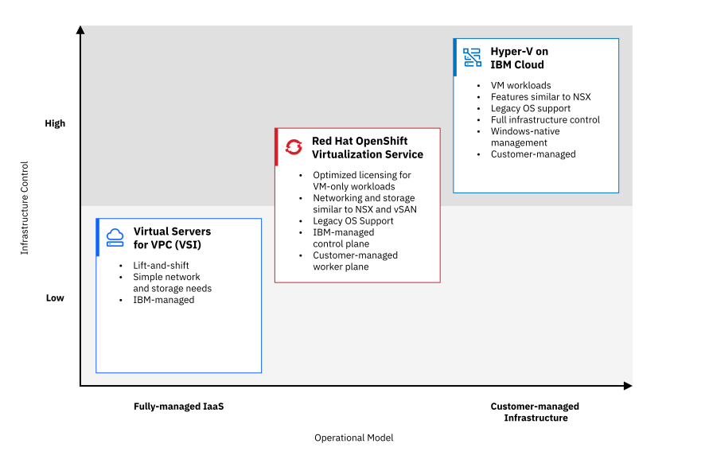

---

copyright:
  years: 2026
lastupdated: "2026-07-30"

keywords: VMware migration, IBM Cloud, VPC, Red Hat OpenShift Virtualization, Hyper-V, workload migration

subcollection: virtualization-solutions

content-type: overview

---

{{site.data.keyword.attribute-definition-list}}

# Migrating VMware workloads to IBM Cloud virtualization platforms
{: #vmware-migration-guide}

Evaluate migration paths, compare target platforms, and find the technical resources that you need to plan and run your VMware&reg; workload migration to {{site.data.keyword.cloud}}.
{: shortdesc}

## Before you begin
{: #vmware-migration-guide-before-you-begin}

Before you select a target platform, assess your existing VMware environment. The following questions help you identify the migration approach that best fits your needs:

| Areas to assess | Questions to consider |
| ----- | ----- |
| **VM inventory** | How many virtual machines (VMs) are you migrating, and what operating systems do they run? |
| **NSX usage** | Are you using NSX features, such as Distributed Firewall (DFW), microsegmentation, or logical switches? |
| **Storage** | Are you using vSAN, Network File System (NFS), or block storage? |
| **Containerization** | Do you have containerized workloads, or are you planning to modernize soon? |
| **Compliance** | Do you have regulatory requirements that mandate dedicated hardware or specific certifications? |
| **Skills** | What platform skills does your team currently have (VMware, Kubernetes, Windows&reg; Server)? |
| **Licensing** | Do you have existing Windows Server licenses you want to bring to the cloud with The Bring Your Own License (BYOL) model? |
{: caption="Questions to consider when assessing your VMware environment" caption-side="bottom"}

Use your answers to select the platform that best fits your needs.

## Choosing the right platform
{: #vmware-migration-guide-platform-selection}

### At a glance
{: #vmware-migration-guide-at-a-glance}

Three primary target platforms are available: Virtual Server Instance for {{site.data.keyword.vpc_full}} (VSI for VPC), {{site.data.keyword.redhat_openshift_full}} Virtualization Service (ROVS), and Microsoft&trade; Hyper-V on {{site.data.keyword.vpc_full}}. Each platform supports a different level of infrastructure control.

The following diagram shows the position of each platform on the spectrum from a fully managed infrastructure as a service (IaaS) to a customer-managed infrastructure.

{: caption="Target platforms on the infrastructure management spectrum" caption-side="bottom"}

| **When to choose VSI for VPC** |
| --- |
| - You need a straightforward lift-and-shift migration. \n - Your workloads have simple networking and storage requirements. \n - You prefer a fully managed IaaS experience. \n - You want predictable, VM-level cost optimization. \n - You are migrating from VMware Cloud Foundation (VCF) as a Service or a self-managed VMware environment with basic requirements. \n - You need dedicated hardware for regulatory and security compliance. In this case, use the VSI dedicated host offering. |
{: caption="When to choose VSI for VPC" caption-side="bottom"}
{: #platformselect-vsi}
{: tab-title="VSI for VPC"}
{: tab-group="PlatformSelect"}
{: class="comparison-tab-table"}
{: row-headers}

| **When to choose {{site.data.keyword.redhat_openshift_notm}} Virtualization** |
| --- |
| - You have complex VMware environments with advanced networking (similar to NSX features) or high-performance hyperconverged storage (vSAN) requirements. \n - You need bare metal performance. Hardware is dedicated by default on ROVS. \n - You want a {{site.data.keyword.redhat_openshift_notm}} or Kubernetes-based management plane for your VMs. \n - You plan to modernize VM workloads over time. \n - You need dedicated hardware for regulatory and security compliance. Hardware is dedicated by default. \n - You are running legacy or unsupported operating systems. \n - You have Kubernetes skills or want to develop them. |
{: caption="When to choose {{site.data.keyword.redhat_openshift_notm}} Virtualization" caption-side="bottom"}
{: #platformselect-rovs}
{: tab-title="{{site.data.keyword.redhat_openshift_notm}} Virtualization"}
{: tab-group="PlatformSelect"}
{: class="comparison-tab-table"}
{: row-headers}

| **When to choose Hyper-V on VPC Bare Metal** |
| --- |
| - You have complex VMware environments with advanced networking or high-performance hyperconverged storage with Storage Spaces Direct (S2D) requirements. \n - You need bare metal performance. Hardware is dedicated by default on Hyper-V on VPC Bare Metal. \n - You prefer Windows-native management tools (Hyper-V Manager, Windows Admin Center, PowerShell). \n - You require Windows-native features such as failover clustering and Cluster Shared Volumes. \n - You have Hyper-V or Windows Server skills and want to use them in the cloud. \n - You have existing Windows Server licenses that you want to bring to the cloud (BYOL model). \n - You need dedicated hardware for regulatory and security compliance. Hardware is dedicated by default. \n - You are running legacy or unsupported operating systems. |
{: caption="When to choose Hyper-V on VPC Bare Metal" caption-side="bottom"}
{: #platformselect-hyperv}
{: tab-title="Hyper-V on VPC Bare Metal"}
{: tab-group="PlatformSelect"}
{: class="comparison-tab-table"}
{: row-headers}

## Detailed platform comparison
{: #vmware-migration-guide-detailed-comparison}

### High-level guidance
{: #vmware-migration-guide-high-level-guidance}

| Criteria | VSI for VPC | {{site.data.keyword.redhat_openshift_notm}} Virtualization Service | Hyper-V on VPC Bare Metal |
| --- | --- | --- | --- |
| Best migration fit | As-is VM migration with simple network and storage requirements, and the ease of a managed platform | Organizations needing bare metal performance, a hybrid solution, or consolidation onto a {{site.data.keyword.redhat_openshift_notm}}-managed platform with a blend of managed and self-managed capabilities | Environments requiring bare metal performance, failover clustering, and Windows-native management tools with complete management control (customer-managed) |
| Operational model | {{site.data.keyword.IBM}}-managed infrastructure as a service (IaaS), VM-based | Customer-managed bare metal infrastructure as a service (IaaS); \n Kubernetes-based VM management (KubeVirt) | Customer-managed bare metal infrastructure as a service (IaaS); \n Windows Server-based VM management (Hyper-V) |
| Scalability | Elastic, on-demand VM scaling with granular per-VM CPU or RAM or storage-sizing | Scale by adding bare metal hosts; Kubernetes schedules VMs across the cluster | Scale by adding bare metal nodes to the failover cluster; manual cluster expansion |
| Cost model | Per-VM billing with granular CPU or RAM, or storage or network-sizing | Per-host bare metal billing with consistent monthly cost | Per-host bare metal billing; BYOL for Windows Server Datacenter |
{: caption="High-level platform guidance" caption-side="bottom"}

### Key differentiators
{: #vmware-migration-guide-key-differentiators}

| Feature | VSI for VPC | {{site.data.keyword.redhat_openshift_notm}} Virtualization Service | Hyper-V on VPC Bare Metal |
| --- | --- | --- | --- |
| Management model | {{site.data.keyword.IBM_notm}}-managed. You can provision and manage VMs through the {{site.data.keyword.cloud_notm}} portal or CLI. | Customer-managed. You manage VMs through the {{site.data.keyword.redhat_openshift_notm}} or KubeVirt control plane. | Customer-managed. You manage VMs through Windows Server tools (Hyper-V Manager, Windows Admin Center, PowerShell). |
| Unified platform | {{site.data.keyword.cloud_notm}} portal and CLI provide a single management interface for VMs, networking, and storage | A single {{site.data.keyword.redhat_openshift_notm}} control plane manages VMs across bare metal hosts, which reduces operational sprawl | Windows Server tools (Hyper-V Manager, Windows Admin Center, PowerShell) manage VMs, clustering, and storage across bare metal hosts |
| VMware displacement | Suitable for simple VMware workloads, straightforward lift-and-shift of VMs with basic networking and storage needs | Suitable for complex VMware environments and consolidation of VMs onto {{site.data.keyword.redhat_openshift_notm}}-managed bare metal, for teams that are responding to Broadcom licensing changes | Suitable for complex VMware environments, consolidation of VMs onto Windows-managed bare metal, for teams who prefer Windows-native tools |
| Cost efficiency | Per-VM billing, pay only for the resources that each VM uses | Per-host bare metal billing, share host capacity across multiple VMs to reduce per-workload usage | Per-host bare metal billing, share host capacity across multiple VMs to reduce per-workload usage |
| Licensing options | No hypervisor license required ({{site.data.keyword.IBM_notm}}-managed); guest OS licensing varies by image (included or BYOL) | No separate hypervisor license, {{site.data.keyword.redhat_openshift_notm}} subscription covers the platform; guest OS licensing is BYOL | Windows Server Datacenter BYOL required; Windows guest OS licensing is included through the DC license; other guest OS licensing is BYOL |
| High availability | VPC-native high availability (HA) features | {{site.data.keyword.redhat_openshift_notm}}-native high availability (HA) with live migration | Failover clustering with Cluster Shared Volumes (CSV) and live migration |
| Guest OS support | Modern stock images, custom images, catalog images, snapshots, and existing volumes | Broad support for legacy and unsupported operating systems (such as older Windows Server or Red Hat Enterprise Linux (RHEL) 6) | Broad support for Windows and Linux&reg; guest VMs, including legacy and unsupported operating systems |
{: caption="Key platform differentiators" caption-side="bottom"}

## Technical considerations
{: #vmware-migration-guide-technical-considerations}

Before you migrate, review the following technical constraints for your chosen platform. Some VMware features do not replicate directly and might require alternative solutions.

### Networking
{: #vmware-migration-guide-networking}

| Aspect | VSI for VPC | {{site.data.keyword.redhat_openshift_notm}} Virtualization Service | Hyper-V on VPC Bare Metal |
| --- | --- | --- | --- |
| Similar features to NSX | VPC-native networking only. VPC does not directly replicate complex NSX features such as distributed firewalling (DFW) and microsegmentation. | Bare metal hosts connect to VPC SDN. VMs can connect directly to VPC SDN, or use an OVN-based overlay network with routing to the SDN. Basic capabilities similar to NSX (such as microsegmentation) can be achieved. | Bare metal hosts connect to VPC SDN. VMs can connect directly to VPC SDN, or use a Hyper-V virtual switch overlay network with routing to the SDN. Basic capabilities similar to NSX (such as microsegmentation) can be achieved. |
| Network model | Native VPC SDN. VMs attach directly to VPC subnets | Bare metal hosts on VPC SDN. VMs connect directly to SDN or through an OVN overlay with SDN routing | Bare metal hosts on VPC SDN. VMs connect directly to SDN or through a Hyper-V virtual switch overlay with SDN routing and VLAN support |
{: caption="Platform-wise networking considerations" caption-side="bottom"}

### Storage
{: #vmware-migration-guide-storage}

| Aspect | VSI for VPC | {{site.data.keyword.redhat_openshift_notm}} Virtualization Service | Hyper-V on VPC Bare Metal |
| --- | --- | --- | --- |
| Storage options | VPC block storage and file storage | {{site.data.keyword.redhat_openshift_notm}} Data Foundation hyperconverged storage that uses bare metal NVMe drives, and VPC file storage. VPC block storage is not currently supported. | Storage Spaces Direct (S2D) hyperconverged storage that uses bare metal NVMe drives. VPC file storage is supported only for guest-mounted storage. VPC block storage is not currently supported. |
| Backup | [Virtualization Solutions backup documentation](/docs/virtualization-solutions) | [Virtualization Solutions backup documentation](/docs/virtualization-solutions) \n Third-party backup solutions are also supported. | [Virtualization Solutions backup documentation](/docs/virtualization-solutions) \n Windows Server Backup and third-party solutions are also supported. |
{: caption="Platform-wise storage considerations" caption-side="bottom"}

### Operations
{: #vmware-migration-guide-operations}

| Aspect | VSI for VPC | {{site.data.keyword.redhat_openshift_notm}} Virtualization Service | Hyper-V on VPC Bare Metal |
| --- | --- | --- | --- |
| Management | {{site.data.keyword.IBM_notm}}-managed infrastructure | Customer-managed infrastructure with Kubernetes | Customer-managed infrastructure with Windows Server and Hyper-V tools |
| Skills required | Traditional VM and IaaS skills | Kubernetes and {{site.data.keyword.redhat_openshift_notm}} skills | Windows Server, Hyper-V, PowerShell, and failover clustering |
| Control level | Less control with a fully managed experience | More control with customer-managed infrastructure | Full control over bare metal and Windows infrastructure |
| Complexity | Minimum | High | Medium to high. Requires Windows Server and Hyper-V expertise |
{: caption="Platform-wise operational considerations" caption-side="bottom"}

### Compliance
{: #vmware-migration-guide-compliance}

The following three platforms support the same core compliance programs: Virtual Server Instance for {{site.data.keyword.vpc_full}} (VSI for VPC), {{site.data.keyword.redhat_openshift_full}} Virtualization Service (ROVS), and Microsoft Hyper-V on {{site.data.keyword.vpc_full}}.

#### Shared compliance posture (all three platforms)
{: #vmware-migration-guide-shared-compliance}

Global programs
:   CSA STAR Level 1 & 2, ISO 20000, ISO 20243, ISO 27001, ISO 27017, ISO 27018, ISO 27701, SOC 1, SOC 2, SOC 3.

Industry programs
:   FS Validated, HIPAA, HITRUST V9.6.2, PCI DSS.

Regional programs
:   BSI C5, DORA, ENS, G-Cloud, GDPR, IRAP, ISMAP, NIS Directive, PINAKES, Protected B.

## Migration process
{: #vmware-migration-guide-migration-process}

For each platform, the following table lists the migration process steps and links to resources to help you with setup and workload migration.

| Step | Related link |
| --- | ---- |
| Getting started | [Getting started with VPC](/docs/vpc?topic=vpc-getting-started) |
| Migration overview | [VMware to VPC virtual servers migration overview](/docs/virtualization-solutions?topic=virtualization-solutions-virt-sol-vpc-migration-design-migration) |
| Migration design | [Migration design overview](/docs/virtualization-solutions?topic=virtualization-solutions-virt-sol-vpc-migration-design-design-overview) |
| Workload migration | [Workload migration](/docs/virtualization-solutions?topic=virtualization-solutions-virt-sol-vpc-migration-design-premigration) |
| More resources | - [VPC product tutorials](/docs/vpc?group=vpc-product-tutorials)  \n - [How-to guides](/docs/vpc?topic=vpc-set-up-environment&interface=cli)  \n - [Product overview](https://www.ibm.com/products/virtual-servers){: external}  \n - [Reference architecture - Virtual Servers for VPC](/docs/virtualization-solutions?topic=virtualization-solutions-virt-sol-vpc-vsi-architecture) |
{: caption="Migration process steps for VSI for VPC" caption-side="bottom"}
{: #migration-vsi}
{: tab-title="VSI for VPC"}
{: tab-group="Migration"}
{: class="comparison-tab-table"}
{: row-headers}

| Step | Related link |
| --- | ---- |
| Getting started | [Getting started with {{site.data.keyword.redhat_openshift_notm}}](/docs/openshift?topic=openshift-getting-started) |
| Infrastructure design | [{{site.data.keyword.redhat_openshift_notm}} migration infrastructure design](/docs/virtualization-solutions?topic=virtualization-solutions-virt-sol-openshift-migration-design-infrastructure) |
| Migration toolkit | [{{site.data.keyword.redhat_openshift_notm}} Migration Toolkit for Virtualization (MTV)](/docs/virtualization-solutions?topic=virtualization-solutions-virt-sol-openshift-migration-design-mtv) |
| VMware requirements | [VMware migration requirements](/docs/virtualization-solutions?topic=virtualization-solutions-virt-sol-openshift-migration-design-migration-vmware) |
| More resources | - [Learning path for administrators](/docs/openshift?topic=openshift-learning-path-admin)  \n - [Learning path for developers](/docs/openshift?topic=openshift-learning-path-dev)  \n - [Product overview](https://www.ibm.com/products/openshift){: external}  \n - [Reference architecture - {{site.data.keyword.redhat_openshift_notm}} Virtualization Service](/docs/virtualization-solutions?topic=virtualization-solutions-virt-sol-rove-architecture) |
{: caption="Migration process steps for {{site.data.keyword.redhat_openshift_notm}} Virtualization Service" caption-side="bottom"}
{: #migration-rovs}
{: tab-title="{{site.data.keyword.redhat_openshift_notm}} Virtualization Service"}
{: tab-group="Migration"}
{: class="comparison-tab-table"}
{: row-headers}

| Step | Related link |
| --- | ---- |
| Architecture overview | [Hyper-V on {{site.data.keyword.cloud_notm}} VPC architecture overview](/docs/virtualization-solutions?topic=virtualization-solutions-virt-sol-hyperv-on-vpc-architecture) |
| Deployment tutorial | [Deploying and configuring a Hyper-V cluster on {{site.data.keyword.cloud_notm}} VPC](/docs/virtualization-solutions?topic=virtualization-solutions-virt-sol-hyperv-on-vpc-tutorial) |
| More resources | - [Hyper-V on {{site.data.keyword.cloud_notm}} VPC architecture overview](/docs/virtualization-solutions?topic=virtualization-solutions-virt-sol-hyperv-on-vpc-architecture)  \n - [Deploying and configuring a Hyper-V cluster on {{site.data.keyword.cloud_notm}} VPC](/docs/virtualization-solutions?topic=virtualization-solutions-virt-sol-hyperv-on-vpc-tutorial) |
{: caption="Migration process steps for Hyper-V on VPC Bare Metal" caption-side="bottom"}
{: #migration-hyperv}
{: tab-title="Hyper-V on VPC Bare Metal"}
{: tab-group="Migration"}
{: class="comparison-tab-table"}
{: row-headers}

## Summary and next steps
{: #vmware-migration-guide-next-steps}

1. Review [Choosing the right platform](#vmware-migration-guide-platform-selection) to identify the platform that best aligns with your requirements.
2. Evaluate the [detailed platform comparison](#vmware-migration-guide-detailed-comparison) to understand key differences and technical constraints.
3. Contact your {{site.data.keyword.cloud_notm}} Customer Success Manager (CSM) or {{site.data.keyword.cloud_notm}} Seller for detailed planning, migration support, technical consultation, or to set up a proof of concept.

## Related links
{: #vmware-migration-guide-related-links}

- [FAQ for End of Marketing for VMware on {{site.data.keyword.cloud_notm}}](/docs/vmwaresolutions?topic=vmwaresolutions-faq-eos-vms)
- [{{site.data.keyword.cloud_notm}} Virtualization Solutions documentation](/docs/virtualization-solutions)
- [Getting started with Virtual Private Cloud](/docs/vpc?topic=vpc-getting-started)
- [Getting started with {{site.data.keyword.redhat_openshift_notm}} on {{site.data.keyword.cloud_notm}}](/docs/openshift?topic=openshift-getting-started)
