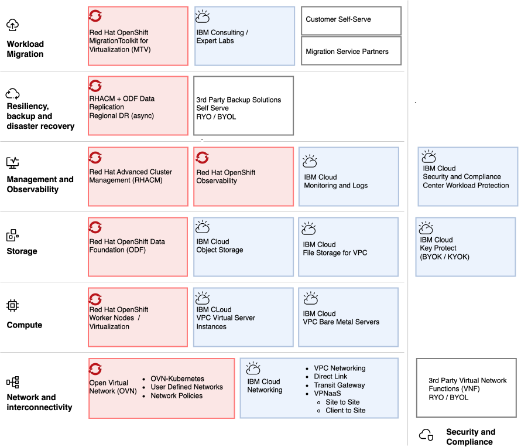

---

copyright:
  years: 2025, 2026
lastupdated: "2026-10-06"

keywords: OpenShift virtualization reference architecture IBM Cloud, KubeVirt IBM Cloud VPC, Red Hat OpenShift Virtualization ROKS, Kubernetes virtual machines IBM Cloud, OpenShift VM workloads VPC, VMware to OpenShift migration architecture, OpenShift Data Foundation IBM Cloud, ROKS virtualization architecture, container virtualization IBM Cloud VPC, OpenShift bare metal virtualization IBM Cloud

subcollection: virtualization-solutions # Use deployable-reference-architectures, or the subcollection value from your toc.yaml file if docs-only.
authors:
- name: Bryan Buckland, Neil Taylor, Sami Kuronen

production: false

---

{{site.data.keyword.attribute-definition-list}}

# {{site.data.keyword.redhat_openshift_notm}} Virtualization on {{site.data.keyword.cloud_notm}} VPC: Architecture
{: #virt-sol-rove-architecture}

Deploy VMs alongside containers on {{site.data.keyword.redhat_openshift_notm}} Virtualization on {{site.data.keyword.cloud_notm}} VPC, using ODF storage and RHACM for multi-cluster management.
{: shortdesc}

{{site.data.keyword.redhat_openshift_notm}} Virtualization servers run on bare metal servers within {{site.data.keyword.cloud_notm}} VPC, which helps provide high performance, security, and network isolation.

**{{site.data.keyword.redhat_openshift_notm}} Data Foundation (ODF)** is software-defined storage that provides highly available, scalable, block, file, and object storage from local NVMe drives that are in the bare metal servers. ODF offers features such as encryption at rest and in transit, snapshots, and disaster recovery replication.

**Red Hat Advanced Cluster Management (RHACM)** provides a centralized control plane for multi-cluster and hybrid management to manage {{site.data.keyword.redhat_openshift_notm}} clusters across on-premises data centers, private clouds, and other public cloud environments. You can deploy RHACM into an {{site.data.keyword.cloud_notm}} {{site.data.keyword.redhat_openshift_notm}} Kubernetes Service cluster that serves as the hub for orchestrating and governing {{site.data.keyword.redhat_openshift_notm}} deployments across hybrid and multi-cloud landscapes.

## {{site.data.keyword.redhat_openshift_notm}} Virtualization on {{site.data.keyword.cloud_notm}} architecture overview
{: #virt-sol-rove-architecture-diagram}

The following diagram shows the high-level reference architecture for {{site.data.keyword.redhat_openshift_notm}} Virtualization on {{site.data.keyword.cloud_notm}}.

{: caption="Red Hat OpenShift Virtualization on IBM Cloud Architecture" caption-side="bottom"}

## Components
{: #virt-sol-rove-components}

The following table outlines the products or services that are used in the architecture for each component.

| Component | Architecture components | Description |
| -------------- | -------------- | -------------- |
| [**Workload migration**](/docs/virtualization-solutions?topic=virtualization-solutions-virt-sol-openshift-migration-design) | {{site.data.keyword.redhat_openshift_notm}} Migration toolkit for Virtualization (MTV) | A set of tools to migrate virtual servers from providers such as {{site.data.keyword.redhat_openshift_notm}} and VMware. |
| | IBM Consulting and expert labs | Professional services organizations that provide {{site.data.keyword.redhat_openshift_notm}} services. |
| | Self-service and migration partners | Professional services from migration partners such as WanClouds and Primary IO. |
| [**Security**](/docs/virtualization-solutions?topic=virtualization-solutions-virt-sol-openshift-security-design-overview) | 3rd party Virtual network functions | 3rd party firewalls |
| | {{site.data.keyword.cloud_notm}} Key Protect | IBM Key Protect for IBM Cloud® service helps you provision and store encrypted keys for apps across {{site.data.keyword.cloud_notm}} services, so you can see and manage data encryption and the entire key lifecycle from one central location. |
| | {{site.data.keyword.cloud_notm}} Security and Compliance Center Workload Protection | {{site.data.keyword.cloud_notm}} Security and Compliance Center Workload Protection to find and prioritize software vulnerabilities, detect and respond to threats, and manage configurations, permissions, and compliance. |
| [**Resiliency**](/docs/virtualization-solutions?topic=virtualization-solutions-virt-sol-openshift-resiliency-design) | Red Hat Advanced Cluster Management (RHACM), {{site.data.keyword.redhat_openshift_notm}} API for Data Protection (OADP), and {{site.data.keyword.redhat_openshift_notm}} Data Foundation (ODF) | RHACM, OADP, and ODF are combined to provide disaster recovery replication of persistent volumes and required cluster resources. |
| | 3rd-party backup options | Self-managed backup options with {{site.data.keyword.redhat_openshift_notm}} Virtualization such as Veeam Kasten K10. |
| [**Observability**](/docs/virtualization-solutions?topic=virtualization-solutions-virt-sol-openshift-openshift-observability-design-overview) | Red Hat Advanced Cluster Management (RHACM) | Visibility and control over a hybrid cloud from a single console. |
| | {{site.data.keyword.redhat_openshift_notm}} Observability | Information about the performance and health of {{site.data.keyword.redhat_openshift_notm}} Cluster. |
| | {{site.data.keyword.cloud_notm}} Security and compliance workload protection | Agents that are deployed within virtual servers that provide vulnerability, posture, and compliance scans. |
| | {{site.data.keyword.cloud_notm}} Monitoring and logs | Agents that are deployed within virtual servers that send logs and metrics to {{site.data.keyword.cloud_notm}} logging and monitoring services. |
| [**Storage**](/docs/virtualization-solutions?topic=virtualization-solutions-virt-sol-openshift-storage-design-overview) | {{site.data.keyword.redhat_openshift_notm}} Data Foundation (ODF) | Software-defined storage that provides block, file, and object storage. |
| | {{site.data.keyword.cloud_notm}} Object Storage | Designed for unstructured data such as backup, archiving, big data analytics, and application data storage. |
| | {{site.data.keyword.cloud_notm}} File Storage | Persistent, fast, and flexible network-attached, Network File System (NFS)-based File Storage for VPC |
| | {{site.data.keyword.cloud_notm}} Key Protect | Provision and store encrypted keys that are used on {{site.data.keyword.redhat_openshift_notm}} Kubernetes Service worker nodes and storage. |
| [**Compute**](/docs/virtualization-solutions?topic=virtualization-solutions-virt-sol-openshift-compute-design) | {{site.data.keyword.redhat_openshift_notm}} Kubernetes Service worker nodes | Worker nodes can be bare metal or virtual servers. A bare metal is needed to use {{site.data.keyword.redhat_openshift_notm}} Virtualization. |
| | Bare metal and virtual servers | Bare metal servers are recommended to host {{site.data.keyword.redhat_openshift_notm}} Virtualization. Red Hat supports only bare metal servers for production workloads. \n  You can use virtual servers for container-based workloads. |
| [**Networking**](/docs/virtualization-solutions?topic=virtualization-solutions-virt-sol-openshift-network-design) | Open Virtual Networking (OVN), OVN-Kubernetes | Software-defined networking that is used by {{site.data.keyword.redhat_openshift_notm}}. For vSphere administrators, see [OVN networking in OpenShift for vSphere administrators](/docs/virtualization-solutions?topic=virtualization-solutions-virt-sol-network-options-overview). |
| | Cluster (CUDN) and user-defined networks (UDN) | CUDNs create a network across multiple namespaces. \n A UDN creates a network within a namespace. |
| | {{site.data.keyword.cloud_notm}} networking | VPC networking, Direct Link, Transit gateways, and virtual private networks (VPNs) |
| | Virtual Network Functions (VNFs) | Virtual firewalls that run on virtual servers. |
{: caption="Reference Architecture OpenShift Components" caption-side="bottom"}

## Next steps
{: #virt-sol-rove-next-steps}

Now that you understand the {{site.data.keyword.redhat_openshift_notm}} Virtualization architecture, explore the following resources:

- **Plan your deployment**: Review the [design considerations](/docs/virtualization-solutions?topic=virtualization-solutions-virt-sol-openshift-compute-design) for compute, networking, storage, and security
- **Migrate workloads**: Follow the [Migration Toolkit for Virtualization tutorial](/docs/virtualization-solutions?topic=virtualization-solutions-vsphere-openshift-migration) to migrate from VMware
- **Implement backup**: Set up [backup solutions with Veeam Kasten](/docs/virtualization-solutions?topic=virtualization-solutions-virt-sol-openshift-backup)
- **Get started**: Deploy your first [Red Hat OpenShift Virtualization Service cluster on {{site.data.keyword.cloud_notm}}](https://cloud.ibm.com/containers/cluster-management/rovs/create){: external}
