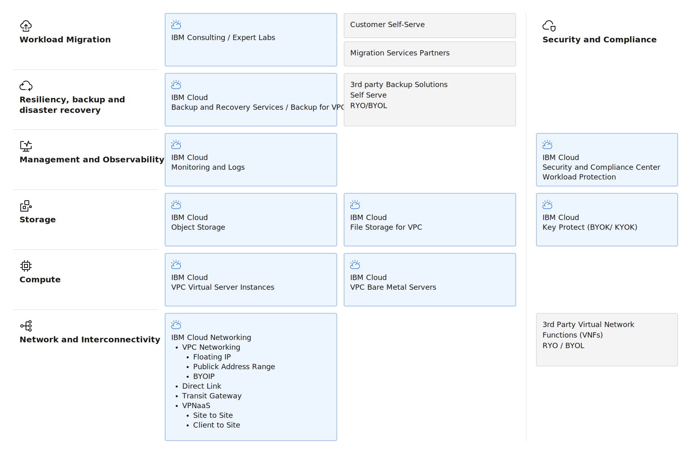

---

copyright:
  years: 2025, 2026
lastupdated: "2026-01-14"

keywords:

subcollection: virtualization-solutions

authors:
- name: Bryan Buckland, Neil Taylor, Sami Kuronen

production: false

---

{{site.data.keyword.attribute-definition-list}}

# Virtual Servers for VPC
{: #virt-sol-vpc-vsi-architecture}

{{site.data.keyword.vsi_is_full}} provide compute instances within an isolated virtual private cloud environment to deliver flexible, scalable compute resources with integrated networking, storage, and security capabilities when you deploy virtual server-based workloads on {{site.data.keyword.cloud_notm}}. {{site.data.keyword.vsi_is_full}} offer a wide range of compute profiles that include balanced, compute-optimized, memory-optimized, GPU, and very high memory configurations. These virtual servers are shared tenancy with optional dedicated host placement for compliance and licensing requirements.
{: #shortdesc}

Networking features that include security groups, network ACLs, VPN connectivity, and load balancers. These options provide network isolation and security controls.

Storage options include boot and data volumes by using {{site.data.keyword.block_storage_is_short}}, that integrate with {{site.data.keyword.filestorage_vpc_short}} and Object Storage for extra data management capabilities.

For enterprise management and governance, {{site.data.keyword.cloud_notm}} services such as {{site.data.keyword.monitoringlong}}, {{site.data.keyword.logs_routing_full_notm}}, and {{site.data.keyword.cloud_notm}} Security and Compliance Center provide visibility, audit trails, and compliance scanning across your VPC infrastructure.

## IBM Cloud Virtual Servers for VPC architecture overview
{: #virt-sol-vpc-vsi-architecture-diagram}

The following diagram shows the high-level reference architecture for your virtual servers.

{: caption="IBM Cloud Virtual Servers for VPC Architecture" caption-side="bottom"}

### Components
{: #virt-sol-vpc-vsi-components}

The following table outlines the products or services that are used in the architecture for each component.

| Component | Architecture components | How the component is used |
| -------------- | -------------- | -------------- |
| [**Workload Migration**](/docs/virtualization-solutions?topic=virtualization-solutions-migration-design) | IBM Consulting and expert labs | Professional services organizations that provide migration and deployment services. |
| | 3rd-party migration tools | Tools that are in the {{site.data.keyword.cloud_notm}} catalog such as RackWare RMM, Wanclouds. |
| | Self-service | Direct migration by using image import, instance provisioning, and configuration management tools. |
| [**Security**](/docs/virtualization-solutions?topic=virtualization-solutions-virt-sol-vpc-security-design-overview) | 3rd party Virtual network functions | 3rd party firewalls |
| | IBM Cloud Key Protect | IBM Key Protect for IBM Cloud® service helps you provision and store encrypted keys for apps across IBM Cloud services, so you can see and manage data encryption and the entire key lifecycle from one central location. |
| | IBM Cloud Security and Compliance Center Workload Protection | IBM Cloud Security and Compliance Center Workload Protection to find and prioritize software vulnerabilities, detect and respond to threats, and manage configurations, permissions, and compliance. |
| [**Resiliency**](/docs/virtualization-solutions?topic=virtualization-solutions-virt-sol-vpc-vpc-resiliency-design) | {{site.data.keyword.cloud_notm}} Snapshots | Point-in-time copies of block storage volumes for backup and recovery. |
| | {{site.data.keyword.cloud_notm}} VPC Backup Service | Scheduled point-in-time copies of Block Storage volumes for backup and recovery |
| | {{site.data.keyword.cloud_notm}} Backup and recovery | Agent-based backup service for file-level and folder-level backup. |
| | 3rd-party backup solutions | Self-managed backup solutions such as Veeam, Commvault, or Rubrik. |
| | Multi-zone deployment | Distribution of virtual servers across availability zones for high availability. |
| [**Observability**](/docs/virtualization-solutions?topic=virtualization-solutions-virt-sol-vpc-observability-design-overview) | {{site.data.keyword.cloud_notm}} Console, CLI, or API | Web-based console, command-line interface, and REST APIs for managing VPC resources. |
| | {{site.data.keyword.monitoringlong}} | Agent-based monitoring for metrics collection. |
| | {{site.data.keyword.logs_routing_full_notm}} | Agent-based log aggregation and analysis. |
| | {{site.data.keyword.cloud_notm}} IBM Cloud Activity Tracker Event Routing | Audit logging for VPC resource management activities. |
| | {{site.data.keyword.cloud_notm}} security and compliance center | Posture management and compliance scanning for your VPC infrastructure. |
| [**Storage**](/docs/virtualization-solutions?topic=virtualization-solutions-virt-sol-storage-design-overview) | {{site.data.keyword.block_storage_is_short}} | High-performance block storage volumes with configurable IOPS for boot and data disks. |
| | {{site.data.keyword.filestorage_vpc_short}} | Persistent, fast, and flexible network-attached, NFS-based file storage. |
| | {{site.data.keyword.cos_full}} | Designed for unstructured data. Ideal for workloads such as backup, archiving, big data analytics, and application data storage. |
| | {{site.data.keyword.cloud_notm}} Key Protect | Provision and store encrypted keys that are used for volume encryption. |
| [**Compute**](/docs/virtualization-solutions?topic=virtualization-solutions-virt-sol-vpc-compute-design-overview) | Virtual server instances | Shared tenancy virtual servers with customizable profiles. |
| | Dedicated hosts | Optional single-tenant physical servers for compliance and licensing requirements. |
| | Instance profiles | Balanced, compute-optimized, memory-optimized, GPU, and very high memory configurations. |
| | Custom Images | User-provided operating system images for specialized workload requirements. |
| [**Networking**](/docs/virtualization-solutions?topic=virtualization-solutions-virt-sol-network-design) | Virtual Private Cloud (VPC) | Logically isolated network environment with user-defined IP address ranges. |
| | Subnets | Network segments within availability zones that use configurable routing. |
| | Security groups | Firewalls that control inbound and outbound traffic at the instance level. |
| | Network ACLs | Firewalls that control traffic at the subnet level. |
| | Public gateways | Enable outbound internet connectivity for virtual servers on private subnets |
| | Floating IPs | Static public IP addresses that can attach to virtual servers for inbound internet access |
| | Load balancers | Application and network load balancers that distribute traffic across virtual servers. |
| | VPN gateways | Site-to-site VPN connectivity to on-premises networks. |
| | Transit gateway | Hub for that connects multiple VPCs and Classic infrastructure. |
| | Direct link | Connects dedicated, minimal latency connections to on-premises data centers. |
| | Virtual Network Functions (VNFs) | Virtual firewalls and network appliances that run as virtual servers. |
{: caption="VPC virtual server instance components" caption-side="bottom"}
