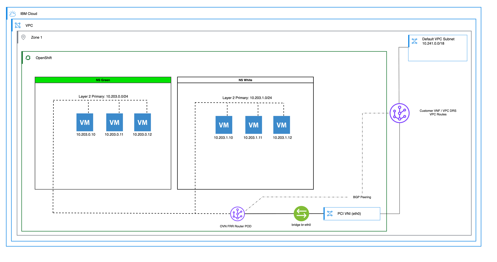

---

copyright:
  years: 2026
lastupdated: "2026-06-29"
lasttested: "[{LAST_TESTED_DATE}]"

keywords: Red Hat OpenShift Virtualization, ROKS, VPC, Layer 2 Primary, CUDN, UDN, OVN, BGP, FRR, Layer 2 primary network OpenShift, CUDN OpenShift virtualization, User-Defined Network tutorial, OVN-Kubernetes Layer 2, BGP routing OpenShift, three-tier application OpenShift, VPC routing OpenShift, namespace networking, FRR BGP configuration, ClusterUserDefinedNetwork, three-tier application tutorial, FRR configuration, VPC static routes

subcollection: virtualization-solutions

content-type: tutorial
services: OpenShift Virtualization
account-plan: paid
completion-time: 60m

---

{{site.data.keyword.attribute-definition-list}}

# Layer 2 primary User-Defined Network (UDN) examples for Red Hat OpenShift Virtualization
{: #layer-2-primary-udn-examples-for-red-hat-openshift-virtualization}
{: toc-content-type="tutorial"}
{: toc-services="OpenShift Virtualization"}
{: toc-completion-time="60m"}

## Overview
{: #layer2-primary-overview}

Create a three-tier application that uses CUDN layer 2 primary networks on OpenShift Virtualization with BGP route advertisement and {{site.data.keyword.vpc_short}} static routing.
{: shortdesc}

This tutorial shows you how to create an example three-tier application by using Cluster-User-Defined Network (CUDN) layer 2 primary networks and namespaces on {{site.data.keyword.redhat_openshift_full}} Kubernetes Service on {{site.data.keyword.containerlong_notm}}. The example demonstrates how to attach virtual servers that run on {{site.data.keyword.redhat_openshift_notm}} Virtualization to layer 2 primary networks. The tutorial also shows how Border Gateway Protocol (BGP) advertises pod subnets back into {{site.data.keyword.vpc_short}} by using static {{site.data.keyword.vpc_short}} routes. For more information about network types, see [Open Virtual Network (OVN) networking in Red Hat OpenShift for vSphere administrators](/docs/virtualization-solutions?topic=virtualization-solutions-virt-sol-network-options-overview).

The example deploys a three-tier application with two layer 2 primary networks, each in its own namespace. The `green` namespace hosts the web and database tiers on one layer 2 network, and the `white` namespace hosts the application tier on a separate layer 2 network. BGP route advertisements from OVN-Kubernetes combined with static {{site.data.keyword.vpc_short}} routes that point the CUDN subnets to the worker node IP addresses provide routing between the cluster networks and the rest of {{site.data.keyword.vpc_short}}.

### Network, namespace, and virtual server details
{: #layer2-primary-network-details}

The following table summarizes the example network layout.

| CUDN         | Namespace | Role    | Subnet          | Virtual servers                       |
| ------------ | --------- | ------- | --------------- | ------------------------------------- |
| `green-net`  | `green`   | Primary | 10.203.0.0/24   | `factory-web00`, `factory-web01`, `factory-db00`, `factory-db01` |
| `white-net`  | `white`   | Primary | 10.203.1.0/24   | `factory-app00`, `factory-app01`      |
{: caption="Example layer 2 primary CUDN, namespace, and virtual server layout" caption-side="bottom"}

### Diagram of the final setup
{: #layer2-primary-diagram}

{: caption="Layer 2 primary three-tier application setup" caption-side="bottom"}

Each code block in this tutorial can be copied to a file and applied with `oc apply -f <file-name>.yml`. Some code blocks might cross page boundaries in PDF and Word formats, and some long lines might wrap in those formats.
{: tip}

## Reviewing network prerequisites
{: #layer2-primary-review-network-prerequisites}
{: step}

If you use {{site.data.keyword.redhat_openshift_notm}} Kubernetes Service, review [Red Hat OpenShift Kubernetes Service OVN UDN/CUDN network prerequisites](/docs/virtualization-solutions?topic=virtualization-solutions-udn-prerequisites) before you begin. {{site.data.keyword.redhat_openshift_notm}} Virtualization on {{site.data.keyword.vpc_short}} includes this configuration by default.

## Creating a BGP peering or placeholder
{: #layer2-primary-bgp}
{: step}

This example uses a placeholder BGP peer. You can peer this configuration with the {{site.data.keyword.vpc_short}} hosted firewall or router as needed. Save the following manifest to a file and apply it by running `oc apply -f step0-frr.yml`.

```yaml
# Placeholder Free Range Routing (FRR) configuration that enables the route advertisement
---
kind: FRRConfiguration
apiVersion: frrk8s.metallb.io/v1beta1
metadata:
  name: receive-all
  namespace: openshift-frr-k8s
spec:
  bgp:
    routers:
      - asn: 64512
        neighbors:
          - address: 172.22.0.1 # Choose an IP that is not in use.
            asn: 64512
            disableMP: true
            toReceive:
              allowed:
                mode: all
```
{: codeblock}

## Creating a namespace and CUDN Layer 2 primary network for the `green` tier
{: #layer2-primary-green-namespace}
{: step}

Layer 2 primary networks have specific requirements for their namespaces. The namespace requires an immutable label `k8s.ovn.org/primary-user-defined-network`. You cannot add this label after you create the namespace or remove it later. Namespaces with this label require a primary network to operate. Without a primary network in the namespace, the system cannot deploy pods and virtual servers. Primary networks always require Dynamic Host Configuration Protocol (DHCP) addressing. You cannot make static IP assignments; however, all leases persist and do not change for the life of the virtual server.

Create the `green` namespace and the `green-net` network. Save the following manifest to a file and apply it by running `oc apply -f step2.yml`.

```yaml
---
apiVersion: v1
kind: Namespace
metadata:
  name: green
  labels:
    k8s.ovn.org/primary-user-defined-network: ""

---
apiVersion: k8s.ovn.org/v1
kind: ClusterUserDefinedNetwork
metadata:
  name: green-net
  labels:
    advertise: "true"
spec:
  namespaceSelector:
    matchExpressions:
      - key: kubernetes.io/metadata.name
        operator: In
        values:
          - green
  network:
    topology: Layer2
    layer2:
      role: Primary
      subnets:
        - 10.203.0.0/24
      ipam:
        lifecycle: Persistent
```
{: codeblock}

## Creating another namespace and CUDN Layer 2 primary network for the `white` tier
{: #layer2-primary-white-namespace}
{: step}

Create the `white` namespace and the `white-net` network. Save the following manifest to a file and apply it by running `oc apply -f step3.yml`.

```yaml
---
apiVersion: v1
kind: Namespace
metadata:
  name: white
  labels:
    k8s.ovn.org/primary-user-defined-network: ""

---
apiVersion: k8s.ovn.org/v1
kind: ClusterUserDefinedNetwork
metadata:
  name: white-net
  labels:
    advertise: "true"
spec:
  namespaceSelector:
    matchExpressions:
      - key: kubernetes.io/metadata.name
        operator: In
        values:
          - white
  network:
    topology: Layer2
    layer2:
      role: Primary
      subnets:
        - 10.203.1.0/24
      ipam:
        lifecycle: Persistent
```
{: codeblock}

## Creating VPC routes for each Layer 2 primary network
{: #layer2-primary-vpc-routes}
{: step}

Create {{site.data.keyword.vpc_short}} routes that send traffic for each layer 2 primary network to the worker node egress IP address.

First, identify your {{site.data.keyword.vpc_short}} name and worker node IP addresses.

```sh
# List VPCs
ibmcloud is vpcs

# Get worker node IPs
ibmcloud ks workers --cluster <CLUSTER_ID>
```
{: pre}

Then, create the routing table and routes.

```sh
# Create a routing table
ibmcloud is vpc-routing-table-create <VPC_NAME> --name udn-l2-routes

# Create Equal-Cost Multi-Path (ECMP) routes (use the actual worker node IPs)
ibmcloud is vpc-routing-table-route-create <VPC_NAME> udn-l2-routes --name udn-route0 --action deliver --zone <ZONE> --destination 10.203.0.0/16 --priority 1 --next-hop <WORKER_IP_1>
ibmcloud is vpc-routing-table-route-create <VPC_NAME> udn-l2-routes --name udn-route1 --action deliver --zone <ZONE> --destination 10.203.0.0/16 --priority 1 --next-hop <WORKER_IP_2>
```
{: pre}

The following example uses concrete values.

```sh
ibmcloud is vpc-routing-table-create mountain-climber --name udn-l2-routes
ibmcloud is vpc-routing-table-route-create mountain-climber udn-l2-routes --name udn-route0 --action deliver --zone us-south-1 --destination 10.203.0.0/16 --priority 1 --next-hop 10.240.0.12
ibmcloud is vpc-routing-table-route-create mountain-climber udn-l2-routes --name udn-route1 --action deliver --zone us-south-1 --destination 10.203.0.0/16 --priority 1 --next-hop 10.240.0.10
```
{: pre}

Attach the routing table to every zone from which you need to use the route. For example, if you are in one zone and need to access the network from another zone, attach the route to the other zone as well.
{: note}

For example:

```sh
ibmcloud is vpc-routing-table-route-create mountain-climber udn-l2-routes --name udn-route2 --action deliver --zone us-south-2 --destination 10.203.0.0/16 --priority 1 --next-hop 10.240.0.10
ibmcloud is vpc-routing-table-route-create mountain-climber udn-l2-routes --name udn-route3 --action deliver --zone us-south-2 --destination 10.203.0.0/16 --priority 1 --next-hop 10.240.0.12
```
{: pre}

Attach the routing table to your subnet. Routes do not work without this step.
{: important}

```sh
# List subnets to find the subnet ID
ibmcloud is subnets

# Attach the routing table to the subnet where the worker nodes are located
ibmcloud is subnet-update <SUBNET_ID> --rt <ROUTING_TABLE_ID>
```
{: pre}

Add security group rules to allow Layer 2 CUDN traffic.
{: important}

```sh
# List security groups to find the cluster security group (usually named kube-<CLUSTER_ID>)
ibmcloud is security-groups

# Add a rule to allow SSH (TCP port 22) access from the required source range
ibmcloud is security-group-rule-add <SECURITY_GROUP_ID> inbound tcp --port-min 22 --port-max 22 --remote <YOUR_SOURCE_CIDR>

# Add a rule to allow TCP traffic from the Layer 2 CUDN subnet range
ibmcloud is security-group-rule-add <SECURITY_GROUP_ID> inbound tcp --remote 10.203.0.0/16

# Add a rule to allow ICMP traffic (required for ping) from the Layer 2 CUDN subnet range
ibmcloud is security-group-rule-add <SECURITY_GROUP_ID> inbound icmp --remote 10.203.0.0/16
```
{: pre}

Keep the following considerations in mind:

- For ease of configuration, this example sends the entire `10.203.0.0/16` supernet to the worker nodes.
- This configuration uses static routing. If a worker node such as `10.240.0.10` fails or hangs, the system can no longer access its route. The two routes are ECMP, but they are not redundant. Dynamic redundancy requires {{site.data.keyword.vpc_short}} Dynamic Routing Service (DRS) or a router in the {{site.data.keyword.vpc_short}} that can use BGP.
- Without the subnet attachment and the security group rules, connectivity between layer 2 networks fails.
- Without the SSH inbound rule, you cannot connect to the virtual servers by using SSH during the testing steps.

## Adding virtual servers to the namespaces
{: #layer2-primary-add-vms}
{: step}

The following manifests create the example three-tier application: four virtual servers in the `green` namespace on the `green-net` network, and two virtual servers in the `white` namespace on the `white-net` network.

Update each manifest with a new password and `ssh_authorized_keys` value. The system allows logins by SSH public key only.
{: important}

Apply each manifest by running `oc apply -f <file-name>.yml`. Use the following links to jump directly to each manifest.

- [Virtual server `factory-web00` in the `green` namespace](/docs/virtualization-solutions?topic=virtualization-solutions-layer-2-primary-udn-examples-for-red-hat-openshift-virtualization#layer2-primary-vm-factory-web00)
- [Virtual server `factory-web01` in the `green` namespace](/docs/virtualization-solutions?topic=virtualization-solutions-layer-2-primary-udn-examples-for-red-hat-openshift-virtualization#layer2-primary-vm-factory-web01)
- [Virtual server `factory-db00` in the `green` namespace](/docs/virtualization-solutions?topic=virtualization-solutions-layer-2-primary-udn-examples-for-red-hat-openshift-virtualization#layer2-primary-vm-factory-db00)
- [Virtual server `factory-db01` in the `green` namespace](/docs/virtualization-solutions?topic=virtualization-solutions-layer-2-primary-udn-examples-for-red-hat-openshift-virtualization#layer2-primary-vm-factory-db01)
- [Virtual server `factory-app00` in the `white` namespace](/docs/virtualization-solutions?topic=virtualization-solutions-layer-2-primary-udn-examples-for-red-hat-openshift-virtualization#layer2-primary-vm-factory-app00)
- [Virtual server `factory-app01` in the `white` namespace](/docs/virtualization-solutions?topic=virtualization-solutions-layer-2-primary-udn-examples-for-red-hat-openshift-virtualization#layer2-primary-vm-factory-app01)

### Virtual server `factory-web00` in the `green` namespace
{: #layer2-primary-vm-factory-web00}

```yaml
# Bare YAML to stand up a Red Hat OpenShift on IBM Cloud virtual server
---
apiVersion: kubevirt.io/v1
kind: VirtualMachine
metadata:
  name: "factory-web00"
  namespace: "green"
  annotations:
    description: "example vm factory-web00"
  labels:
    app: "factory-web00-green-server"
    kubevirt.io/dynamic-credentials-support: 'true'
    vm.kubevirt.io/template: "centos-stream9-server-small"
    vm.kubevirt.io/template.namespace: openshift
    vm.kubevirt.io/template.revision: '1'
    vm.kubevirt.io/template.version: v0.34.0
spec:
  dataVolumeTemplates:
    - apiVersion: cdi.kubevirt.io/v1beta1
      kind: DataVolume
      metadata:
        creationTimestamp: null
        name: "factory-web00-green-server"
      spec:
        sourceRef:
          kind: DataSource
          name: "centos-stream9"
          namespace: openshift-virtualization-os-images
        storage:
          resources:
            requests:
              storage: 30Gi
  runStrategy: RerunOnFailure
  template:
    metadata:
      annotations:
        vm.kubevirt.io/flavor: "small"
        vm.kubevirt.io/os: "centos-stream9"
        vm.kubevirt.io/workload: "server"
      labels:
        kubevirt.io/domain: example
        kubevirt.io/size: "small"
    spec:
      domain:
        cpu:
          cores: 1
          sockets: 1
          threads: 1
        devices:
          disks:
            - disk:
                bus: virtio
              name: rootdisk
            - disk:
                bus: virtio
              name: cloudinitdisk
          interfaces:
            - binding:
                name: l2bridge
              name: default
              model: virtio
          networkInterfaceMultiqueue: true
          rng: {}
        memory:
          guest: "2Gi"
      hostname: "factory-web00"
      networks:
        - name: default
          pod: {}
      terminationGracePeriodSeconds: 180
      volumes:
        - dataVolume:
            name: "factory-web00-green-server"
          name: rootdisk
        - cloudInitNoCloud:
            userData: |-
              #cloud-config
              user: admin
              password: "aRandomPassword9292"
              ssh_authorized_keys:
                 - "ssh-ed25519 AAAA....BBBB....CCCCC.....DDDD put-your-key-here@example.local"
              chpasswd: { expire: False }
              runcmd:
                - [ dnf, install, -y, epel-release ]
                - [ dnf, install, -y, iperf3, nc, darkhttpd ]
          name: cloudinitdisk
```
{: codeblock}

### Virtual server `factory-web01` in the `green` namespace
{: #layer2-primary-vm-factory-web01}

```yaml
---
apiVersion: kubevirt.io/v1
kind: VirtualMachine
metadata:
  name: "factory-web01"
  namespace: "green"
  annotations:
    description: "example vm factory-web01"
  labels:
    app: "factory-web01-green-server"
    kubevirt.io/dynamic-credentials-support: 'true'
    vm.kubevirt.io/template: "centos-stream9-server-small"
    vm.kubevirt.io/template.namespace: openshift
    vm.kubevirt.io/template.revision: '1'
    vm.kubevirt.io/template.version: v0.34.0
spec:
  dataVolumeTemplates:
    - apiVersion: cdi.kubevirt.io/v1beta1
      kind: DataVolume
      metadata:
        creationTimestamp: null
        name: "factory-web01-green-server"
      spec:
        sourceRef:
          kind: DataSource
          name: "centos-stream9"
          namespace: openshift-virtualization-os-images
        storage:
          resources:
            requests:
              storage: 30Gi
  runStrategy: RerunOnFailure
  template:
    metadata:
      annotations:
        vm.kubevirt.io/flavor: "small"
        vm.kubevirt.io/os: "centos-stream9"
        vm.kubevirt.io/workload: "server"
      labels:
        kubevirt.io/domain: example
        kubevirt.io/size: "small"
    spec:
      domain:
        cpu:
          cores: 1
          sockets: 1
          threads: 1
        devices:
          disks:
            - disk:
                bus: virtio
              name: rootdisk
            - disk:
                bus: virtio
              name: cloudinitdisk
          interfaces:
            - binding:
                name: l2bridge
              name: default
              model: virtio
          networkInterfaceMultiqueue: true
          rng: {}
        memory:
          guest: "2Gi"
      hostname: "factory-web01"
      networks:
        - name: default
          pod: {}
      terminationGracePeriodSeconds: 180
      volumes:
        - dataVolume:
            name: "factory-web01-green-server"
          name: rootdisk
        - cloudInitNoCloud:
            userData: |-
              #cloud-config
              user: admin
              password: "aRandomPassword9292"
              ssh_authorized_keys:
                 - "ssh-ed25519 AAAA....BBBB....CCCCC.....DDDD put-your-key-here@example.local"
              chpasswd: { expire: False }
              runcmd:
                - [ dnf, install, -y, epel-release ]
                - [ dnf, install, -y, iperf3, nc, darkhttpd ]
          name: cloudinitdisk
```
{: codeblock}

### Virtual server `factory-db00` in the `green` namespace
{: #layer2-primary-vm-factory-db00}

```yaml
---
apiVersion: kubevirt.io/v1
kind: VirtualMachine
metadata:
  name: "factory-db00"
  namespace: "green"
  annotations:
    description: "example vm factory-db00"
  labels:
    app: "factory-db00-green-server"
    kubevirt.io/dynamic-credentials-support: 'true'
    vm.kubevirt.io/template: "centos-stream9-server-small"
    vm.kubevirt.io/template.namespace: openshift
    vm.kubevirt.io/template.revision: '1'
    vm.kubevirt.io/template.version: v0.34.0
spec:
  dataVolumeTemplates:
    - apiVersion: cdi.kubevirt.io/v1beta1
      kind: DataVolume
      metadata:
        creationTimestamp: null
        name: "factory-db00-green-server"
      spec:
        sourceRef:
          kind: DataSource
          name: "centos-stream9"
          namespace: openshift-virtualization-os-images
        storage:
          resources:
            requests:
              storage: 30Gi
  runStrategy: RerunOnFailure
  template:
    metadata:
      annotations:
        vm.kubevirt.io/flavor: "small"
        vm.kubevirt.io/os: "centos-stream9"
        vm.kubevirt.io/workload: "server"
      labels:
        kubevirt.io/domain: example
        kubevirt.io/size: "small"
    spec:
      domain:
        cpu:
          cores: 1
          sockets: 1
          threads: 1
        devices:
          disks:
            - disk:
                bus: virtio
              name: rootdisk
            - disk:
                bus: virtio
              name: cloudinitdisk
          interfaces:
            - binding:
                name: l2bridge
              name: default
              model: virtio
          networkInterfaceMultiqueue: true
          rng: {}
        memory:
          guest: "2Gi"
      hostname: "factory-db00"
      networks:
        - name: default
          pod: {}
      terminationGracePeriodSeconds: 180
      volumes:
        - dataVolume:
            name: "factory-db00-green-server"
          name: rootdisk
        - cloudInitNoCloud:
            userData: |-
              #cloud-config
              user: admin
              password: "aRandomPassword9292"
              ssh_authorized_keys:
                 - "ssh-ed25519 AAAA....BBBB....CCCCC.....DDDD put-your-key-here@example.local"
              chpasswd: { expire: False }
              runcmd:
                - [ dnf, install, -y, epel-release ]
                - [ dnf, install, -y, iperf3, nc, darkhttpd ]
          name: cloudinitdisk
```
{: codeblock}

### Virtual server `factory-db01` in the `green` namespace
{: #layer2-primary-vm-factory-db01}

```yaml
---
apiVersion: kubevirt.io/v1
kind: VirtualMachine
metadata:
  name: "factory-db01"
  namespace: "green"
  annotations:
    description: "example vm factory-db01"
  labels:
    app: "factory-db01-green-server"
    kubevirt.io/dynamic-credentials-support: 'true'
    vm.kubevirt.io/template: "centos-stream9-server-small"
    vm.kubevirt.io/template.namespace: openshift
    vm.kubevirt.io/template.revision: '1'
    vm.kubevirt.io/template.version: v0.34.0
spec:
  dataVolumeTemplates:
    - apiVersion: cdi.kubevirt.io/v1beta1
      kind: DataVolume
      metadata:
        creationTimestamp: null
        name: "factory-db01-green-server"
      spec:
        sourceRef:
          kind: DataSource
          name: "centos-stream9"
          namespace: openshift-virtualization-os-images
        storage:
          resources:
            requests:
              storage: 30Gi
  runStrategy: RerunOnFailure
  template:
    metadata:
      annotations:
        vm.kubevirt.io/flavor: "small"
        vm.kubevirt.io/os: "centos-stream9"
        vm.kubevirt.io/workload: "server"
      labels:
        kubevirt.io/domain: example
        kubevirt.io/size: "small"
    spec:
      domain:
        cpu:
          cores: 1
          sockets: 1
          threads: 1
        devices:
          disks:
            - disk:
                bus: virtio
              name: rootdisk
            - disk:
                bus: virtio
              name: cloudinitdisk
          interfaces:
            - binding:
                name: l2bridge
              name: default
              model: virtio
          networkInterfaceMultiqueue: true
          rng: {}
        memory:
          guest: "2Gi"
      hostname: "factory-db01"
      networks:
        - name: default
          pod: {}
      terminationGracePeriodSeconds: 180
      volumes:
        - dataVolume:
            name: "factory-db01-green-server"
          name: rootdisk
        - cloudInitNoCloud:
            userData: |-
              #cloud-config
              user: admin
              password: "aRandomPassword9292"
              ssh_authorized_keys:
                 - "ssh-ed25519 AAAA....BBBB....CCCCC.....DDDD put-your-key-here@example.local"
              chpasswd: { expire: False }
              runcmd:
                - [ dnf, install, -y, epel-release ]
                - [ dnf, install, -y, iperf3, nc, darkhttpd ]
          name: cloudinitdisk
```
{: codeblock}

### Virtual server `factory-app00` in the `white` namespace
{: #layer2-primary-vm-factory-app00}

```yaml
---
apiVersion: kubevirt.io/v1
kind: VirtualMachine
metadata:
  name: "factory-app00"
  namespace: "white"
  annotations:
    description: "example vm factory-app00"
  labels:
    app: "factory-app00-white-server"
    kubevirt.io/dynamic-credentials-support: 'true'
    vm.kubevirt.io/template: "centos-stream9-server-small"
    vm.kubevirt.io/template.namespace: openshift
    vm.kubevirt.io/template.revision: '1'
    vm.kubevirt.io/template.version: v0.34.0
spec:
  dataVolumeTemplates:
    - apiVersion: cdi.kubevirt.io/v1beta1
      kind: DataVolume
      metadata:
        creationTimestamp: null
        name: "factory-app00-white-server"
      spec:
        sourceRef:
          kind: DataSource
          name: "centos-stream9"
          namespace: openshift-virtualization-os-images
        storage:
          resources:
            requests:
              storage: 30Gi
  runStrategy: RerunOnFailure
  template:
    metadata:
      annotations:
        vm.kubevirt.io/flavor: "small"
        vm.kubevirt.io/os: "centos-stream9"
        vm.kubevirt.io/workload: "server"
      labels:
        kubevirt.io/domain: example
        kubevirt.io/size: "small"
    spec:
      domain:
        cpu:
          cores: 1
          sockets: 1
          threads: 1
        devices:
          disks:
            - disk:
                bus: virtio
              name: rootdisk
            - disk:
                bus: virtio
              name: cloudinitdisk
          interfaces:
            - binding:
                name: l2bridge
              name: default
              model: virtio
          networkInterfaceMultiqueue: true
          rng: {}
        memory:
          guest: "2Gi"
      hostname: "factory-app00"
      networks:
        - name: default
          pod: {}
      terminationGracePeriodSeconds: 180
      volumes:
        - dataVolume:
            name: "factory-app00-white-server"
          name: rootdisk
        - cloudInitNoCloud:
            userData: |-
              #cloud-config
              user: admin
              password: "aRandomPassword9292"
              ssh_authorized_keys:
                 - "ssh-ed25519 AAAA....BBBB....CCCCC.....DDDD put-your-key-here@example.local"
              chpasswd: { expire: False }
              runcmd:
                - [ dnf, install, -y, epel-release ]
                - [ dnf, install, -y, iperf3, nc, darkhttpd ]
          name: cloudinitdisk
```
{: codeblock}

### Virtual server `factory-app01` in the `white` namespace
{: #layer2-primary-vm-factory-app01}

```yaml
---
apiVersion: kubevirt.io/v1
kind: VirtualMachine
metadata:
  name: "factory-app01"
  namespace: "white"
  annotations:
    description: "example vm factory-app01"
  labels:
    app: "factory-app01-white-server"
    kubevirt.io/dynamic-credentials-support: 'true'
    vm.kubevirt.io/template: "centos-stream9-server-small"
    vm.kubevirt.io/template.namespace: openshift
    vm.kubevirt.io/template.revision: '1'
    vm.kubevirt.io/template.version: v0.34.0
spec:
  dataVolumeTemplates:
    - apiVersion: cdi.kubevirt.io/v1beta1
      kind: DataVolume
      metadata:
        creationTimestamp: null
        name: "factory-app01-white-server"
      spec:
        sourceRef:
          kind: DataSource
          name: "centos-stream9"
          namespace: openshift-virtualization-os-images
        storage:
          resources:
            requests:
              storage: 30Gi
  runStrategy: RerunOnFailure
  template:
    metadata:
      annotations:
        vm.kubevirt.io/flavor: "small"
        vm.kubevirt.io/os: "centos-stream9"
        vm.kubevirt.io/workload: "server"
      labels:
        kubevirt.io/domain: example
        kubevirt.io/size: "small"
    spec:
      domain:
        cpu:
          cores: 1
          sockets: 1
          threads: 1
        devices:
          disks:
            - disk:
                bus: virtio
              name: rootdisk
            - disk:
                bus: virtio
              name: cloudinitdisk
          interfaces:
            - binding:
                name: l2bridge
              name: default
              model: virtio
          networkInterfaceMultiqueue: true
          rng: {}
        memory:
          guest: "2Gi"
      hostname: "factory-app01"
      networks:
        - name: default
          pod: {}
      terminationGracePeriodSeconds: 180
      volumes:
        - dataVolume:
            name: "factory-app01-white-server"
          name: rootdisk
        - cloudInitNoCloud:
            userData: |-
              #cloud-config
              user: admin
              password: "aRandomPassword9292"
              ssh_authorized_keys:
                 - "ssh-ed25519 AAAA....BBBB....CCCCC.....DDDD put-your-key-here@example.local"
              chpasswd: { expire: False }
              runcmd:
                - [ dnf, install, -y, epel-release ]
                - [ dnf, install, -y, iperf3, nc, darkhttpd ]
          name: cloudinitdisk
```
{: codeblock}

## Testing the network setup
{: #layer2-primary-test}
{: step}

From a Linux jumphost in the same {{site.data.keyword.vpc_short}} as the cluster, run the following tests.

List the virtual servers.

```sh
$ oc get vms -n green
NAME            AGE    STATUS    READY
factory-web00   4h2m   Running   True
factory-web01   4h6m   Running   True
```
{: pre}

Next, get the IP addresses for each virtual server.

```sh
$ oc get vmi -n green
NAME            AGE    PHASE     IP            NODENAME                                               READY
factory-web00   24h    Running   10.203.0.5    test-d77u31s20hu1mbcloaag-magicfactor-pool0-0000037c   True
factory-web01   4h7m   Running   10.203.0.12   test-d77u31s20hu1mbcloaag-magicfactor-pool0-000001e7   True
```
{: pre}

Use SSH to connect to each virtual server by using the public key that you specified in the virtual server setup.

You must configure an SSH forwarding agent or use a new key on the jumphost. Do not copy your private key around.
{: important}

```sh
$ ssh admin@10.203.0.5
```
{: pre}

From another terminal session:

```sh
$ ssh admin@10.203.0.12
```
{: pre}

### Tests
{: #layer2-primary-tests}

Run the following tests to verify the network setup. All tests must work as expected.

1. Start a simple HTTP server on each virtual server.

   - From `factory-web00`, run `darkhttpd /usr/share/doc/bash --daemon`.
   - From `factory-web01`, run `darkhttpd /usr/share/doc/bash --daemon`.

2. From `factory-web00`, run `curl -v http://10.203.0.12:8080`.

3. From `factory-web01`, run `curl -v http://10.203.0.5:8080`.

4. From the jump virtual server, run `nc -v 10.203.0.5 8080`.

5. From `factory-web00`, start an iperf3 server: `iperf3 -s -p 9090`.

6. From `factory-web01`, connect to the iperf3 server in the green namespace: `iperf3 -c 10.203.0.5 -p 9090`.

7. Ping from `factory-app00` to `factory-web01` and vice versa.

### Applying a network policy and rerun the tests
{: #layer2-primary-network-policy}

Next, apply a network policy that allows only TCP port 8080. Save the following manifest to a file named `my-policy.yml` and apply it by running `oc apply -f my-policy.yml`.

```yaml
---
kind: NetworkPolicy
apiVersion: networking.k8s.io/v1
metadata:
  name: allow-8080-tcp
  namespace: green
spec:
  podSelector: {}
  ingress:
    # Konnectivity to reach the in-cluster service for the webhook
    - ports:
        - protocol: TCP
          port: 8080
  egress:
    # Virtual machine template validator to reach the in-cluster Kubernetes API
    - ports:
        - protocol: TCP
          port: 8080
  policyTypes:
    - Ingress
    - Egress
```
{: codeblock}

Rerun the preceding tests using VM's web console since the policy strictly only allows TCP 8080 traffic and SSH will not work. Test 6 no longer completes successfully, and ping no longer works.

Remove the policy by running `oc delete -f my-policy.yml` to restore connectivity. The tests work again.
