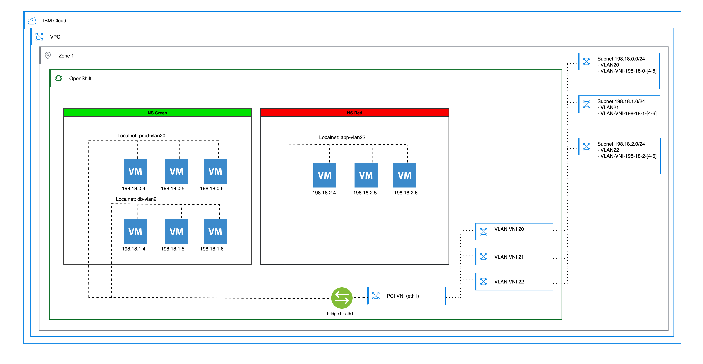

---

copyright:
  years: 2026
lastupdated: "2026-06-12"

keywords: Red Hat OpenShift Virtualization, ROKS, VPC, Localnet, CUDN, UDN, VLAN, VNI, OVN

subcollection: virtualization-solutions

content-type: tutorial
services: OpenShift Virtualization
account-plan: paid
completion-time: 60m

---

{{site.data.keyword.attribute-definition-list}}

# Localnet UDN examples for Red Hat OpenShift Virtualization
{: #localnet-udn-examples}
{: toc-content-type="tutorial"}
{: toc-services="OpenShift Virtualization"}
{: toc-completion-time="60m"}

This tutorial shows how to create an example three-tier application by using Virtual Private Cloud (VPC) subnets, Cluster User-Defined Networks (CUDNs), localnets, and namespaces on {{site.data.keyword.openshiftlong_notm}} on {{site.data.keyword.cloud_notm}}. The example demonstrates how to attach virtual servers that run on {{site.data.keyword.redhat_openshift_notm}} Virtualization directly to VPC subnets by using Virtual Local Area Network (VLAN)-backed localnet networks. For more information about network types, see [Open Virtual Network (OVN) networking in {{site.data.keyword.redhat_openshift_notm}} for vSphere&reg; administrators](/docs/virtualization-solutions?topic=virtualization-solutions-virt-sol-network-options-overview).
{: shortdesc}

## Overview
{: #localnet-overview}

The example deploys a three-tier application with separate network segments for web, database, and application tiers. Each tier uses a dedicated VPC subnet and a localnet CUDN with a unique VLAN ID. The web and database tiers are placed in one namespace (`green`), while the application tier is placed in a separate namespace (`red`) to demonstrate namespace-based isolation.

### Network, namespace, and virtual server details
{: #localnet-network-details}

The following table summarizes the example network layout.

| Localnet CUDN | Namespace | VLAN ID | VPC subnet    | Virtual servers              |
| ------------- | --------- | ------- | --------------| -----------------------------|
| `vlan20-prod` | `green`   | 20      | 198.18.0.0/24 | `plant-web00`, `plant-web01` |
| `vlan21-db`   | `green`   | 21      | 198.18.1.0/24 | `plant-db00`, `plant-db01`   |
| `vlan22-app`  | `red`     | 22      | 198.18.2.0/24 | `plant-app00`, `plant-app01` |
{: caption="Example Localnet CUDN, namespace, and virtual server layout" caption-side="bottom"}

### Diagram of the final setup
{: #localnet-diagram}

{: caption="Localnet three-tier application setup" caption-side="bottom"}

Each code block in the guide can be copied to a file and applied with `oc apply -f <file-name>.yml`. Some code blocks might cross page boundaries in PDF and Word formats, and some long lines might wrap in those formats.
{: tip}

The guide uses `ic` as a shorthand for `ibmcloud` in {{site.data.keyword.cloud_notm}} CLI commands. Define `alias ic=ibmcloud` in your shell, or substitute `ibmcloud` for `ic` in the commands that follow.
{: note}

## Before you begin
{: #localnet-before-you-begin}

Make sure that you have the following items in place:

- An {{site.data.keyword.cloud_notm}} account with permission to manage VPC and {{site.data.keyword.redhat_openshift_notm}} resources.
- The {{site.data.keyword.cloud_notm}} CLI is installed.
- The `container-service` and `vpc-infrastructure` plug-ins installed.

The `container-service` plug-in provides the `ic ks` commands that the guide uses to attach VLAN virtual network interfaces (VNIs) to the cluster. The `vpc-infrastructure` plug-in provides the `ic is` commands that the guide uses to create VPC subnets, virtual network interfaces, and other infrastructure.

If you need to install the required CLI plug-ins, use the following commands.

```sh
ibmcloud plugin install container-service
ibmcloud plugin install vpc-infrastructure
```
{: codeblock}


## Step 0: Review network prerequisites
{: #localnet-review-network-prerequisites}

If you are using {{site.data.keyword.openshiftlong_notm}}, review [{{site.data.keyword.openshiftlong_notm}} OVN UDN/CUDN network prerequisites](/docs/virtualization-solutions?topic=virtualization-solutions-udn-prerequisites) before you begin. {{site.data.keyword.redhat_openshift_notm}} Virtualization Service includes these prerequisites by default.


## Step 1: Create a namespace and CUDN Localnet secondary network for the green tier
{: #localnet-step-1-green-namespace}

Localnet networks can coexist with `Layer 2` primary networks, `Layer 2` secondary networks, and other localnets in a namespace. Each localnet requires a `VLAN ID`. Currently, you can use only one subnet per VLAN.

The VLAN does not create a `Layer 2` domain between workers. The VLAN is used inside each worker node, not inside the VPC.
{: note}

Create the `green` namespace and the `vlan20-prod` and `vlan21-db` networks. Apply the manifest with `oc apply -f step1.yml`.

```yaml
---
apiVersion: v1
kind: Namespace
metadata:
  name: green
---
apiVersion: k8s.ovn.org/v1
kind: ClusterUserDefinedNetwork
metadata:
  name: "vlan20-prod"
spec:
  namespaceSelector:
    matchExpressions:
    - key: kubernetes.io/metadata.name
      operator: In
      values:
      - "green"
  network:
    topology: Localnet
    localnet:
      role: "Secondary"
      physicalNetworkName: "vpc-vlans"
      ipam:
        mode: Disabled
      vlan:
        mode: Access
        access:
          id: 20
---
apiVersion: k8s.ovn.org/v1
kind: ClusterUserDefinedNetwork
metadata:
  name: "vlan21-db"
spec:
  namespaceSelector:
    matchExpressions:
    - key: kubernetes.io/metadata.name
      operator: In
      values:
      - "green"
  network:
    topology: Localnet
    localnet:
      role: "Secondary"
      physicalNetworkName: "vpc-vlans"
      ipam:
        mode: Disabled
      vlan:
        mode: Access
        access:
          id: 21
```
{: codeblock}

Keep the following considerations in mind:

- The subnet is not defined in the `Localnet` configuration.
- Do not use `VLAN 1`.
- Use VLANs in the range 2 - 500. VLANs 501 - 4094 are currently restricted.

## Step 2: Create another namespace and CUDN Localnet secondary network for the red tier
{: #localnet-step-2-red-namespace}

Create the `red` namespace and the `vlan22-app` network. Apply the manifest with `oc apply -f step2.yml`.

```yaml
---
apiVersion: v1
kind: Namespace
metadata:
  name: red
---
apiVersion: k8s.ovn.org/v1
kind: ClusterUserDefinedNetwork
metadata:
  name: "vlan22-app"
spec:
  namespaceSelector:
    matchExpressions:
    - key: kubernetes.io/metadata.name
      operator: In
      values:
      - "red"
  network:
    topology: Localnet
    localnet:
      role: "Secondary"
      physicalNetworkName: "vpc-vlans"
      ipam:
        mode: Disabled
      vlan:
        mode: Access
        access:
          id: 22
```
{: codeblock}

## Step 3: Create the VLAN VNIs in your VPC account
{: #localnet-step-3-vlan-vni}

This step creates the `IP` reservation for each subnet and assigns a `MAC address` to each virtual network interface (`VNI`).

Keep the following considerations in mind:

- The `VLAN ID` is not attached in this step.
- You must look up the security group to use in this step. Run `ic is sgs` to list available security groups.
- You can run this step in bulk.
- 256 VNIs per host is the cap. Keep usage less than 85% to allow for failover and migrations from other hosts.

```sh
ic is virtual-network-interface-create --name zone1-web00 --allow-ip-spoofing false --auto-delete false --protocol-state-filtering-mode disabled --enable-infrastructure-nat true --subnet zone1-vm-prod --vpc my-vpc --rip-address 198.18.0.20 --rip-auto-delete true --rip-name zone1-web00 --sgs handclap-roundworm-clique-eccentric --resource-group-name Default

ic is virtual-network-interface-create --name zone1-db00 --allow-ip-spoofing false --auto-delete false --protocol-state-filtering-mode disabled --enable-infrastructure-nat true --subnet zone1-vm-db --vpc my-vpc --rip-address 198.18.1.20 --rip-auto-delete true --rip-name zone1-db00 --sgs handclap-roundworm-clique-eccentric --resource-group-name Default

ic is virtual-network-interface-create --name zone1-app00 --allow-ip-spoofing false --auto-delete false --protocol-state-filtering-mode disabled --enable-infrastructure-nat true --subnet zone1-vm-app --vpc my-vpc --rip-address 198.18.2.20 --rip-auto-delete true --rip-name zone1-app00 --sgs handclap-roundworm-clique-eccentric --resource-group-name Default
```
{: pre}

## Step 4: Attach the VLAN VNI to the cluster
{: #localnet-step-4-attach-vni}

Get the ID for each VNI that you created in the previous step, and then use the {{site.data.keyword.cloud_notm}} `container-service` plug-in to attach the VNI to the cluster. You need the cluster ID, which you can obtain by running `ic ks cluster ls`.

Keep the following considerations in mind:

- If a worker is over its VNI quota, the attached operation fails.
- VNIs can be attached to the cluster (also known as `floating`) or to a particular worker.

Look up the VNI IDs.

```sh
ic is vni zone1-web00 | awk '$1 ~ /^ID/ {print $NF}'
ic is vni zone1-db00 | awk '$1 ~ /^ID/ {print $NF}'
ic is vni zone1-app00 | awk '$1 ~ /^ID/ {print $NF}'
```
{: pre}

Attach each VNI to the cluster with its matching VLAN ID. Replace the **cluster ID** and **VNI IDs** with the values from your environment.

```sh
ic ks vni attach baremetal -c <CLUSTER_ID> --vni <VNI_ID_web00> --vlan 20
ic ks vni attach baremetal -c <CLUSTER_ID> --vni <VNI_ID_db00>  --vlan 21
ic ks vni attach baremetal -c <CLUSTER_ID> --vni <VNI_ID_app00> --vlan 22
```
{: pre}

## Step 5: Add virtual servers to the namespaces
{: #localnet-step-5-add-vms}

The following manifest is a bare `YAML` example for creating one virtual server. You can update this manifest for each namespace and network. You need the `MAC address` for each `VNI` that you created. Run `ic is vnis` to list them, and update the `macAddress` field in the template so that `DHCP` works correctly.

Use the following commands to find the `MAC address` for each `VNI`.

```sh
ic is vni zone1-web00 | awk '/^Mac Address/ {print $NF}'
ic is vni zone1-db00  | awk '/^Mac Address/ {print $NF}'
ic is vni zone1-app00 | awk '/^Mac Address/ {print $NF}'
```
{: pre}

Example output for each `VNI`. Your values differ:

```text
02:00:01:00:98:A0
02:00:02:00:98:A5
02:00:02:00:98:AA
```
{: screen}

Keep the following considerations in mind before you apply the manifests:

- Update the **password** in each manifest.
- You need a real SSH public key in the `ssh_authorized_keys` field to log in.
- You cannot use SSH with the password.
- Replace every `macAddress` value with the **MAC address** of the matching VNI that you looked up in the previous commands. The `macAddress` must match the VNI so that `DHCP` assigns the expected IP address.

Apply each of the following manifests with `oc apply -f <file-name>.yml`. Use the following links to jump directly to each manifest.

- [Virtual server `plant-web00` in the `green` namespace on `vlan20-prod`](/docs/virtualization-solutions?topic=virtualization-solutions-localnet-udn-examples#localnet-vm-plant-web00)
- [Virtual server `plant-db00` in the `green` namespace on `vlan21-db`](/docs/virtualization-solutions?topic=virtualization-solutions-localnet-udn-examples#localnet-vm-plant-db00)
- [Virtual server `plant-app00` in the `red` namespace on `vlan22-app`](/docs/virtualization-solutions?topic=virtualization-solutions-localnet-udn-examples#localnet-vm-plant-app00)

### Virtual server `plant-web00` in the `green` namespace on `vlan20-prod`
{: #localnet-vm-plant-web00}

```yaml
# Bare YAML to stand up a Red Hat OpenShift on IBM Cloud virtual machine
---
apiVersion: kubevirt.io/v1
kind: VirtualMachine
metadata:
  name: "plant-web00"
  namespace: "green"
  annotations:
    description: "example vm plant-web00"
  labels:
    app: "plant-web00-green-server"
    kubevirt.io/dynamic-credentials-support: 'true'
    vm.kubevirt.io/template: "centos-stream9-server-small"
    vm.kubevirt.io/template.namespace: openshift
    vm.kubevirt.io/template.revision: '1'
    vm.kubevirt.io/template.version: v0.34.0
spec:
  dataVolumeTemplates:
    - apiVersion: cdi.kubevirt.io/v1beta1
      kind: DataVolume
      metadata:
        creationTimestamp: null
        name: "plant-web00-green-server"
      spec:
        sourceRef:
          kind: DataSource
          name: "centos-stream9"
          namespace: openshift-virtualization-os-images
        storage:
          resources:
            requests:
              storage: 30Gi
  runStrategy: RerunOnFailure
  template:
    metadata:
      annotations:
        vm.kubevirt.io/flavor: "small"
        vm.kubevirt.io/os: "centos-stream9"
        vm.kubevirt.io/workload: "server"
      labels:
        kubevirt.io/domain: example
        kubevirt.io/size: "small"
    spec:
      domain:
        cpu:
          cores: 1
          sockets: 1
          threads: 1
        devices:
          disks:
            - disk:
                bus: virtio
              name: rootdisk
            - disk:
                bus: virtio
              name: cloudinitdisk
          interfaces:
            - model: virtio
              name: default
              state: up
              bridge: {}
              macAddress: 02:00:01:00:98:A0 # <- replace with the MAC of VNI zone1-web00
          networkInterfaceMultiqueue: true
          rng: {}
        memory:
          guest: "2Gi"
      hostname: "plant-web00"
      networks:
        - name: default
          multus:
            networkName: vlan20-prod
      terminationGracePeriodSeconds: 180
      volumes:
        - dataVolume:
            name: "plant-web00-green-server"
          name: rootdisk
        - cloudInitNoCloud:
            userData: |-
              #cloud-config
              user: admin
              password: "aRandomPassword9292"
              ssh_authorized_keys:
                 - "ssh-ed25519 AAAA....BBBB....CCCCC.....DDDD put-your-key-here@example.local"
              chpasswd: { expire: False }
              runcmd:
                - [ dnf, install, -y, epel-release ]
                - [ dnf, install, -y, iperf3, nmap-ncat, darkhttpd ]
          name: cloudinitdisk
```
{: codeblock}

### Virtual server `plant-db00` in the `green` namespace on `vlan21-db`
{: #localnet-vm-plant-db00}

```yaml
---
apiVersion: kubevirt.io/v1
kind: VirtualMachine
metadata:
  name: "plant-db00"
  namespace: "green"
  annotations:
    description: "example vm plant-db00"
  labels:
    app: "plant-db00-green-server"
    kubevirt.io/dynamic-credentials-support: 'true'
    vm.kubevirt.io/template: "centos-stream9-server-small"
    vm.kubevirt.io/template.namespace: openshift
    vm.kubevirt.io/template.revision: '1'
    vm.kubevirt.io/template.version: v0.34.0
spec:
  dataVolumeTemplates:
    - apiVersion: cdi.kubevirt.io/v1beta1
      kind: DataVolume
      metadata:
        creationTimestamp: null
        name: "plant-db00-green-server"
      spec:
        sourceRef:
          kind: DataSource
          name: "centos-stream9"
          namespace: openshift-virtualization-os-images
        storage:
          resources:
            requests:
              storage: 30Gi
  runStrategy: RerunOnFailure
  template:
    metadata:
      annotations:
        vm.kubevirt.io/flavor: "small"
        vm.kubevirt.io/os: "centos-stream9"
        vm.kubevirt.io/workload: "server"
      labels:
        kubevirt.io/domain: example
        kubevirt.io/size: "small"
    spec:
      domain:
        cpu:
          cores: 1
          sockets: 1
          threads: 1
        devices:
          disks:
            - disk:
                bus: virtio
              name: rootdisk
            - disk:
                bus: virtio
              name: cloudinitdisk
          interfaces:
            - model: virtio
              name: default
              state: up
              bridge: {}
              macAddress: 02:00:01:00:98:A5 # <- replace with the MAC of VNI zone1-db00
          networkInterfaceMultiqueue: true
          rng: {}
        memory:
          guest: "2Gi"
      hostname: "plant-db00"
      networks:
        - name: default
          multus:
            networkName: vlan21-db
      terminationGracePeriodSeconds: 180
      volumes:
        - dataVolume:
            name: "plant-db00-green-server"
          name: rootdisk
        - cloudInitNoCloud:
            userData: |-
              #cloud-config
              user: admin
              password: "aRandomPassword9292"
              ssh_authorized_keys:
                 - "ssh-ed25519 AAAA....BBBB....CCCCC.....DDDD put-your-key-here@example.local"
              chpasswd: { expire: False }
              runcmd:
                - [ dnf, install, -y, epel-release ]
                - [ dnf, install, -y, iperf3, nmap-ncat, darkhttpd ]
          name: cloudinitdisk
```
{: codeblock}

### Virtual server `plant-app00` in the `red` namespace on `vlan22-app`
{: #localnet-vm-plant-app00}

```yaml
---
apiVersion: kubevirt.io/v1
kind: VirtualMachine
metadata:
  name: "plant-app00"
  namespace: "red"
  annotations:
    description: "example vm plant-app00"
  labels:
    app: "plant-app00-red-server"
    kubevirt.io/dynamic-credentials-support: 'true'
    vm.kubevirt.io/template: "centos-stream9-server-small"
    vm.kubevirt.io/template.namespace: openshift
    vm.kubevirt.io/template.revision: '1'
    vm.kubevirt.io/template.version: v0.34.0
spec:
  dataVolumeTemplates:
    - apiVersion: cdi.kubevirt.io/v1beta1
      kind: DataVolume
      metadata:
        creationTimestamp: null
        name: "plant-app00-red-server"
      spec:
        sourceRef:
          kind: DataSource
          name: "centos-stream9"
          namespace: openshift-virtualization-os-images
        storage:
          resources:
            requests:
              storage: 30Gi
  runStrategy: RerunOnFailure
  template:
    metadata:
      annotations:
        vm.kubevirt.io/flavor: "small"
        vm.kubevirt.io/os: "centos-stream9"
        vm.kubevirt.io/workload: "server"
      labels:
        kubevirt.io/domain: example
        kubevirt.io/size: "small"
    spec:
      domain:
        cpu:
          cores: 1
          sockets: 1
          threads: 1
        devices:
          disks:
            - disk:
                bus: virtio
              name: rootdisk
            - disk:
                bus: virtio
              name: cloudinitdisk
          interfaces:
            - model: virtio
              name: default
              state: up
              bridge: {}
              macAddress: 02:00:01:00:98:AA # <- replace with the MAC of VNI zone1-app00
          networkInterfaceMultiqueue: true
          rng: {}
        memory:
          guest: "2Gi"
      hostname: "plant-app00"
      networks:
        - name: default
          multus:
            networkName: vlan22-app
      terminationGracePeriodSeconds: 180
      volumes:
        - dataVolume:
            name: "plant-app00-red-server"
          name: rootdisk
        - cloudInitNoCloud:
            userData: |-
              #cloud-config
              user: admin
              password: "aRandomPassword9292"
              ssh_authorized_keys:
                 - "ssh-ed25519 AAAA....BBBB....CCCCC.....DDDD put-your-key-here@example.local"
              chpasswd: { expire: False }
              runcmd:
                - [ dnf, install, -y, epel-release ]
                - [ dnf, install, -y, iperf3, nmap-ncat, darkhttpd ]
          name: cloudinitdisk
```
{: codeblock}

## Step 6: Test the network setup
{: #localnet-step-6-test}

{{site.data.keyword.IBM_notm}} recommends that you use a Linux&reg; jump host in the same VPC as the cluster for these tests. From the jump host, use SSH to connect to each virtual server with the public key that you specified in the virtual server setup.

Configure SSH agent forwarding, or use a new key that is hosted on the jump host. Do not copy your private key between systems.
{: important}

From one terminal session, use SSH to connect to the web tier virtual server:

```sh
ssh admin@198.18.0.20
```
{: pre}

From another terminal session, use SSH to connect to the database tier virtual server:

```sh
ssh admin@198.18.1.20
```
{: pre}

From another terminal session, use SSH to connect to the application tier virtual server:

```sh
ssh admin@198.18.2.20
```
{: pre}

### Tests
{: #localnet-tests}

Run the following tests to verify the network setup.

1. Start a simple HTTP server on each virtual server.

   - From `198.18.0.20`, run `darkhttpd /usr/share/doc/bash --daemon`.
   - From `198.18.1.20`, run `darkhttpd /usr/share/doc/bash --daemon`.
   - From `198.18.2.20`, run `darkhttpd /usr/share/doc/bash --daemon`.

2. From `198.18.0.20`, run `curl -v http://198.18.1.20:8080`.

3. From `198.18.1.20`, run `curl -v http://198.18.0.20:8080`.

4. From the jump virtual server, run `curl -v http://198.18.2.20:8080`.

5. From `198.18.1.20`, start an `iperf3` server: `iperf3 -s -p 9090`.

6. From `198.18.0.20`, connect to the `iperf3` server in the `green` namespace: `iperf3 -c 198.18.1.20 -p 9090`.

7. Ping from `198.18.1.20` to `198.18.0.20` and vice versa.

8. Rerun the preceding tasks by using `198.18.2.20` and the jump virtual server's IP address.
