---

copyright:
  years: 2025, 2026
lastupdated: "2026-10-09"

keywords: OpenShift Virtualization observability IBM Cloud, RHACM monitoring IBM Cloud, LokiStack logging OpenShift IBM Cloud, Prometheus metrics OpenShift Virtualization, Grafana dashboards OpenShift IBM Cloud, IBM Cloud Logs OpenShift integration, multi-cluster observability IBM Cloud, Thanos Querier OpenShift IBM Cloud, OpenShift observability design IBM Cloud, alerting configuration OpenShift Virtualization IBM Cloud

subcollection: virtualization-solutions

---

{{site.data.keyword.attribute-definition-list}}

# {{site.data.keyword.redhat_openshift_notm}} Virtualization observability on {{site.data.keyword.cloud_notm}}
{: #observability-design}

Design observability for {{site.data.keyword.redhat_openshift_notm}} Virtualization on {{site.data.keyword.cloud_notm}} by configuring RHACM, LokiStack, Prometheus alerts, and {{site.data.keyword.cloud_notm}} Logs.
{: shortdesc}

## {{site.data.keyword.redhat_openshift_notm}} Virtualization
{: #openshift-virt-observ}

{{site.data.keyword.redhat_openshift_notm}} Virtualization integrates virtual machine workloads into Kubernetes clusters, enabling centralized monitoring, alerting, and logging across hybrid multi-cluster environments.

### General Introduction
{: #openshift-virt-observ-intro}

Red Hat Advanced Cluster Management (RHACM) provides the ability to manage and control multiple clusters under a single OpenShift instance. This allows for such capabilities as remote clustering, workloads across nodes and regions, disaster recovery and more. Each managed cluster reports back to the designated hub cluster. Often this means the hub cluster contains the control-plane nodes while the managed clusters are all composed of worker nodes. A Klusterlet is installed on each managed cluster and is used to control the communication to the hub cluster. The term local cluster is used for a hub cluster that is also a managed cluster.

RHACM is installed through a separate operator on a {{site.data.keyword.redhat_openshift_notm}} instance. Installing RHACM does require licensing and a subscription agreement. After installation, a number of multi-cluster features appear with some additional configuration to further expand the capabilities.

By default, {{site.data.keyword.redhat_openshift_notm}} provides a number of observability options. Without additional operators, some basic alerting, monitoring, and logging are available. OpenShift provides a Prometheus-based platform that initially focuses on critical functionality of the cluster but can be expanded with customization. Some examples of the components that are created to handle observability:

- Cluster Monitoring Operator (CMO) - overall manager of the observability components
- Prometheus - monitors data received from CMO and creates a database engine for metrics
- Metrics Server - collects metrics and sets up application programming interface (API) service for Thanos
- Thanos Querier - provides interface for querying metrics collected
- Alertmanager - receives alerts from Prometheus and can send externally


These are automatically deployed under the `openshift-monitoring` namespace during OpenShift deployment. The dashboards and configuration of these are available under the **Observe** section in the **Administration** view.

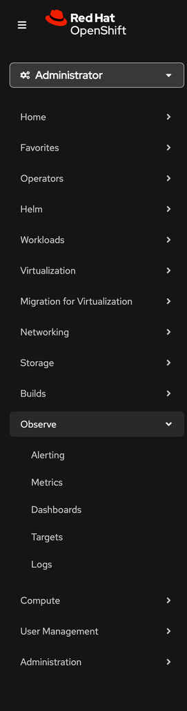{: caption="OpenShift console Observe menu" caption-side="bottom"}

Alerting will display the current alerts, alerting rules, and the viewing/addition of any alert silencing rules. The Metrics page allows for the user to run PromQL queries and receive metrics data and graphs. Dashboards will display metric graphs for a preset list that can be selected from multiple dropdowns and different time periods. Targets is the defined list of endpoints that are called by the Metrics Server to receive data from different components. The Logs section will only appear after installing and configuring OpenShift Logging (see further below in this guide). For more info on the design and components see https://docs.redhat.com/en/documentation/openshift_container_platform/4.20/html/monitoring/about-openshift-container-platform-monitoring#monitoring-stack-architecture

RHACM adds additional observability functionality focused on the support of multiple host clusters. This largely expands existing Prometheus, Thanos, and Alertmanager infrastructure but with a few new pieces:

- Multicluster observability operator - manager of the monitoring and metrics gathering of managed clusters
- Grafana - new customizable dashboard for metrics including additional node and virtual machine metrics
- Observability add-on controller - new API server that handles the managed clusters
- Thanos Compactor - allows for long-term saving of metrics data

The observability feature of RHACM must be enabled after the RHACM operator has been installed as it is not enabled by default. A heavy focus of this guide is assuming RHACM observability is enabled, especially with regard to metrics and dashboards. For further information on RHACM Observability architecture see https://docs.redhat.com/en/documentation/red_hat_advanced_cluster_management_for_kubernetes/2.14/html-single/observability/index#observing-environments-intro

Additionally to have a centralized logging dashboard, the OpenShift Logging operator must be installed. This will also add support for log forwarding to external sources such as {{site.data.keyword.cloud_notm}} Logs. For additional information on the layout of OpenShift Logging see the Logging section of this guide and https://docs.redhat.com/en/documentation/openshift_container_platform/4.20/html/logging/logging-6-2

### Installing
{: #openshift-virt-observ-installing}

#### To setup RHACM Observability
{: #openshift-virt-RHACM-observabilitu}

To install the RHACM operator and enable its observability capabilities, perform the following steps:

1. Log in to your OpenShift instance.
2. Under Ecosystem at **Software Catalog**
3. Pick the a namespace
4. In the search look for Advanced Cluster Management for Kubernetes
5. Select install if not already installed
6. Once installed, pull it up under Ecosystem at **Installed Operators**
7. Under MultiClusterHub tab, click Create MultiClusterHub
8. Give it an appropriate name and click Create
9. Go to Storage at **StorageClasses**
10. Make sure a StorageClass is set to default for deploying the infrastructure. For example, if using ODF, make sure the "ocs-storagecluster-ceph-rdb-virtualization" class is set to the default. If it is not, click the 3 dots on the StorageClass desired and choose "Set as default"
11. Follow the steps described in https://docs.redhat.com/en/documentation/red_hat_advanced_cluster_management_for_kubernetes/2.14/html-single/observability/index#enabling-observability to enable the Observability modules of RHACM

If configuring Thanos with {{site.data.keyword.cos_full}}, the `thanos-object-storage.yaml` file will resemble the following:

```yaml
apiVersion: v1
kind: Secret
metadata:
  name: thanos-object-storage
  namespace: open-cluster-management-observability
type: Opaque
stringData:
  thanos.yaml: |
    type: s3
    config:
      bucket: <bucket-name>
      endpoint: s3.us-east.cloud-object-storage.appdomain.cloud
      insecure: true
      access_key: XXXX
      secret_key: XXXX
```

Service credentials should be created HMAC keys in the {{site.data.keyword.cos_full_notm}} instance. The values for access_key and secret_key will be the HMAC ones provided.

### Setup and Configuration
{: #openshift-virt-observ-setup-config}

#### Alerting
{: #openshift-virt-observ-setup-config-alerting}

#### Overview
{: #observability-design-overview}

Default System alerts are managed by OpenShift's built-in monitoring stack and cover platform-level concerns:\
Scope: Single cluster infrastructure monitoring\
Namespace: openshift-monitoring on each managed cluster\
Components:
- Cluster Monitoring Operator
- Prometheus Operator
- Prometheus (for cluster metrics)
- AlertManager (for cluster alerts)

\
If default system alerts cannot cover your business scenario, you can setup custom alerts, which can be managed by RHACM's observability stack and support multi-cluster scenarios:\
Scope: Multi-cluster application and custom resource monitoring\
Namespace: open-cluster-management-observability on the hub cluster\
Components:
- Thanos Query (global metrics view)
- Thanos Ruler (centralized alert evaluation)
- AlertManager (multi-cluster alerting)


#### Creating System Alerts
{: #observability-design-system-alerts}

For system alerts (handled by the `openshift-monitoring` namespace), complete the following steps to create alerting. Alerting supports integration with PagerDuty, Slack, and Email.

1. Log in to your OpenShift instance.
2. Under Administration at **Cluster Settings88** at **Alertmanager**
3. Either configure one of the existing Receivers listed at the bottom table or click Create Receiever
4. Give an appropriate name
5. Under Receiver type select one from the dropdown
    1. If you select PagerDuty, you need a routing key and URL.
    2. If you select Email, you need an SMTP server.
    3. If you select Slack, you need the webhook URL and channel name (can be a username for direct messages, without the @ symbol).
6. For routing labels, select based on which alerts you want to send a notification for.
    1. For example, `severity = critical` sends all critical alerts, and `severity = warning` sends all warning alerts.
    2. You can leave this field blank to have all alerts send out a notificiation

You can click "Alerting rules" tab, which will show you the existing default alerting rules to cover the system alerts.  Take alerting rules for ceph storage cluster as an example, as the following shows, which means there should be alert triggered if the storage usage is higher than 75%.

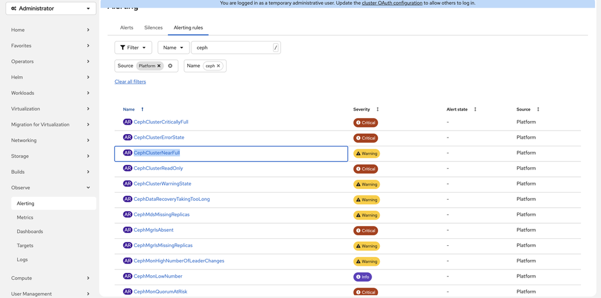{: caption="Configured alerting rules in OpenShift" caption-side="bottom"}
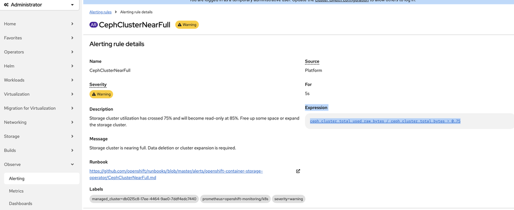{: caption="Alerting rule details view" caption-side="bottom"}

#### Creating Custom Alerts
{: #observability-design-custom-alerts}

For custom alerting (handled by the `open-cluster-management-observability` namespace):\
When default alerting rules do not cover a required scenario, you must create custom alerting rules. The following example creates a Slack alert when a virtual machine in the **default** namespace is not in a running state. This scenario is not covered by default alerting rules and requires a custom rule in RHACM. Complete the following steps:

1. Verify whether the Prometheus metric `kubevirt_vm_info` exists. Log in to the `observability-thanos-query` pod in the `open-cluster-management-observability` namespace, and run the following curl command to confirm the metric exists: `curl -s 'http://localhost:9090/api/v1/query' --data-urlencode 'query=kubevirt_vm_info'`.

```bash
$ curl -s 'http://localhost:9090/api/v1/query' --data-urlencode 'query=kubevirt_vm_info'

{"status":"success","data":{"resultType":"vector","result":[{"metric":{"__name__":"kubevirt_vm_info","cluster":"local-cluster","clusterID":"110b2032-b6b9-455a-abd5-9949482b61df","container":"virt-controller","endpoint":"metrics","flavor":"small","instance":"10.129.0.198:8443","job":"kubevirt-prometheus-metrics","machine_type":"pc-q35-rhel9.6.0","name":"centos-stream9-white-mink-62","namespace":"acm-test","os":"centos-stream9","pod":"virt-controller-7744b59dd8-dk7tw","receive":"true","service":"kubevirt-prometheus-metrics","status":"running","status_group":"running","tenant_id":"2c1cf409-966c-4c2d-bd57-f24c4c5a9393","workload":"server"},"value":[1762574206.765,"1"]},{"metric":{"__name__":"kubevirt_vm_info","cluster":"local-cluster","clusterID":"110b2032-b6b9-455a-abd5-9949482b61df","container":"virt-controller","endpoint":"metrics","instance":"10.129.0.198:8443","instance_type":"u1.medium","job":"kubevirt-prometheus-metrics","machine_type":"pc-q35-rhel9.6.0","name":"rhel-10-rose-damselfly-10","namespace":"acm-test","pod":"virt-controller-7744b59dd8-dk7tw","preference":"rhel.10","receive":"true","service":"kubevirt-prometheus-metrics","status":"running","status_group":"running","tenant_id":"2c1cf409-966c-4c2d-bd57-f24c4c5a9393"},"value":[1762574206.765,"1"]}],"analysis":{}}}
```

2. Create a configmap yml file,  related to the custom alerting rule. Assume the configmap name is "thanos-ruler-custom-rules.yaml". The content can be as following.

```bash
apiVersion: v1
kind: ConfigMap
metadata:
  name: thanos-ruler-custom-rules
  # need to ensure namespace is "open-cluster-management-observability"
  namespace: open-cluster-management-observability
  labels:
    # need this label to ensure custom alert rules are automatically mounted into Thanos Ruler pods
    thanos-ruler-rule: "true"
data:
  # name has to be custom_rules.yaml, custom alert rules are automatically mounted into Thanos Ruler pods successfully
  custom_rules.yaml: |
    groups:
    - name: VirtualMachineAlerts
      interval: 30s
      rules:
      - alert: VirtualMachineNotRunning
        expr: kubevirt_vm_info{status!="running"} > 0
        for: 2m
        annotations:
          summary: "VM {{ $labels.name }} is Not in running status on {{ $labels.cluster }}"
          description: "VM {{ $labels.name }} in namespace {{ $labels.namespace }} is not running."
        labels:
          severity: critical
          alert_type: vm_not_running
```

The essence is to leverage the existing Prometheus metrics "kubevirt_vm_info" and PromQL  kubevirt_vm_info{status!="running"} > 0, which can fire an alert if detect any virtual machines are not in the Running status.

Attention a:  To ensure the custom alert rules are automatically mounted into Thanos Ruler pods successfully, it need to meet the following 2 conditions:

- Ensure the configmap is labeled with: thanos-ruler-rule: "true"
- Ensure the "key" is set to "custom_rules.yaml"

Attention b: alert_type: vm_not_running has to match with the secret which gonna be created soon.

3.  Apply the configmap by running "oc -n open-cluster-management-observability apply -f thanos-ruler-custom-rules.yaml". Then validate the output "/etc/thanos/rules/thanos-ruler-custom-rules from thanos-ruler-custom-rules", which means the custom rule has been mounted to the pod  "observability-thanos-rule".

`% oc describe pod observability-thanos-rule-0`

Mounts:

      /etc/thanos/config/thanos-ruler-config from thanos-ruler-config (ro)

      /etc/thanos/configmaps/alertmanager-ca-bundle from alertmanager-ca-bundle (rw)

      /etc/thanos/rules/thanos-ruler-custom-rules from thanos-ruler-custom-rules (rw)

      /etc/thanos/rules/thanos-ruler-default-rules from thanos-ruler-default-rules (rw)

      /var/run/secrets/kubernetes.io/serviceaccount from kube-api-access-c55nd (ro)

      /var/thanos/rule from data (rw)

4. Create a secret yaml file named as alertmanager-config.yaml, which configures receiver, and  slack webhook url, slack channel, etc.

Attention: ensure the alert_type is consistent with the one defined in the configmap which will be created later.

```yaml
apiVersion: v1
kind: Secret
metadata:
  name: alertmanager-config
  # namespace has to be open-cluster-management-observability
  namespace: open-cluster-management-observability
type: Opaque
stringData:
  alertmanager.yaml: |
    global:
      resolve_timeout: 5m
      # your slack webhook url
      slack_api_url: 'https://hooks.slack.com/services/\<replace_with_your_webhook\>'

    route:
      receiver: 'default-receiver'
      group_by: ['alertname', 'cluster', 'namespace', 'name']
      group_wait: 10s
      group_interval: 5m
      repeat_interval: 12h

      # Specific sub-route for VM not running alerts
      routes:
        - match:
            # ensure the alert_type is consistent with the one defined in configmap
            alert_type: vm_not_running
          receiver: 'slack-vm-not-running'
          group_wait: 5s
          repeat_interval: 10m

    receivers:
      # default receiver (no-op)
      - name: 'default-receiver'

      # Slack receiver for VM not running alerts
      - name: 'slack-vm-not-running'
        slack_configs:
          # slack channel name, do NOT miss "#" before you type the channel name
          - channel: '#openshift-virt-observability-alerts'   # <-- adjust to your Slack channel
            title: '🚨 VM NOT RUNNING ALERT'
            text: |
              *Alert:* {{ .CommonLabels.alertname }}
              *VM Name:* {{ .CommonLabels.name }}
              *Namespace:* {{ .CommonLabels.namespace }}
              *Cluster:* {{ .CommonLabels.cluster }}
              *Severity:* {{ .CommonLabels.severity | toUpper }}
              *Status:* {{ .Status | toUpper }}

              {{ range .Alerts }}
              *Description:* {{ .Annotations.description }}
              {{ end }}
            send_resolved: true
            color: '{{ if eq .Status "firing" }}danger{{ else }}good{{ end }}'
            actions:
              - type: button
                text: 'View in Console'
                url: 'https://console-openshift-console.apps.{{ .CommonLabels.cluster }}/k8s/ns/{{ .CommonLabels.namespace }}/virtualmachines/{{ .CommonLabels.name }}'
```

5. Apply the secret by running: oc -n open-cluster-management-observability apply -f alertmanager-config.yaml

6. Stop a virtual machine by running:  virtctl stop `<vm-name>`, and wait for the vm stopped
7. Check slack channel, and see if there could be corresponding alert like following generated

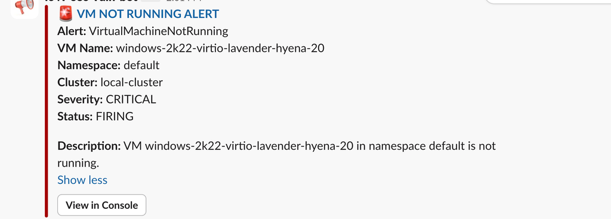{: caption="Slack channel alert notification" caption-side="bottom"}

You can verify the generated alert through alert manager console too. To open the alert manager console, you can run: oc -n open-cluster-management-observability port-forward pod/observability-alertmanager-0 9093:9093, then access http://localhost:9093/#/alerts, to check if the alert is generated there. An example is as following, which shows "slack-vm-not-running" alert is generated.

8. Start a virtual machine by running:  virtctl start `<vm-name>`, and wait for the vm started.

Once vm get started back, check the slack channel which will tip the alert is resolved, as following example shows.
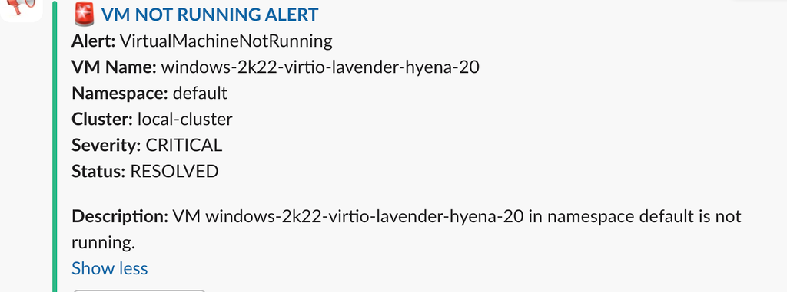{: caption="Slack alert resolution notification" caption-side="bottom"}

##### Reference links:
{: #observability-design-ref-links}

- Configure alert manager in RHACM: https://docs.redhat.com/en/documentation/red_hat_advanced_cluster_management_for_kubernetes/2.14/html/observability/observing-environments-intro#configuring-alertmanager

- How to create a custom rules: https://docs.redhat.com/en/documentation/red_hat_advanced_cluster_management_for_kubernetes/2.14/html/observability/observing-environments-intro#creating-custom-rules

- Kubevirt related prometheus metrics: https://kubevirt.io/monitoring/metrics.html


### Metrics and Dashboards
{: #openshift-virt-observ-setup-config-metrics-dashboards}

#### Additional monitoring features
{: #observability-design-min-features}


RHACM can be used to monitor essential metrics like CPU, memory, network, storage usage for a VM, pod, cluster node, or an entire cluster. Most of the same metrics can be monitored with the base observability included in OpenShift, but RHACM allows the user to monitor these metrics across multiple managed clusters.

RHACM adds preconfigured Grafana dashboards designed to monitor VM specific metrics. For instance, within the "ACM / OpenShift Virtualization" dashboards folder, the "Executive dashboards / Single Virtual Machine View" dashboard displays CPU Usage, Memory Usage, Network Usage (Transmit/Receive, Packets Dropped), Storage Usage (IOPS/Traffic), and Filesystem Usage for an individual VM.

For a brief assessment of the metrics displayed in every preconfigured dashboard provided through RHACM as well as the base OpenShift observability, refer to this chart:

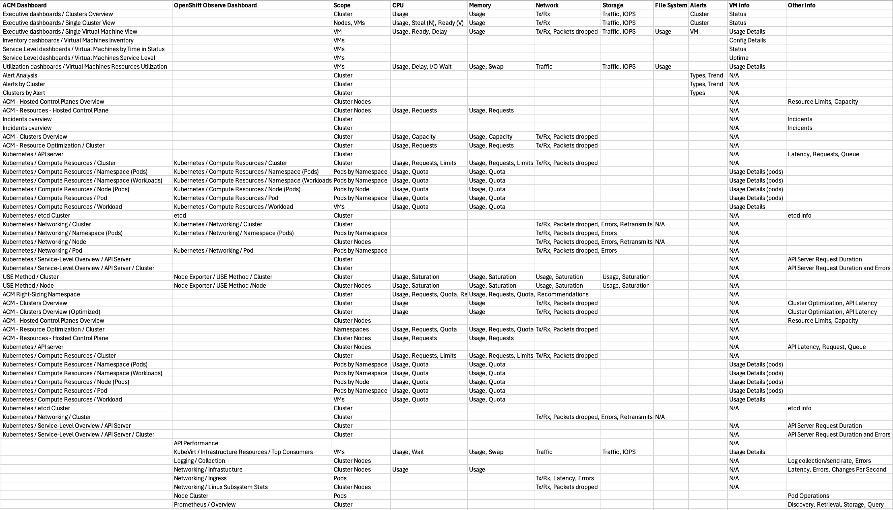{: caption="Dashboard metrics comparison" caption-side="bottom"}

#### Adding/Customizing Dashboards
{: #observability-design-custom-dashboards}


New dashboards can not be added with the default grafana instance, but new dashboards can be created and customized by first creating a grafana-dev instance. This can be done by following the instructions outlined in the [RHACM Observability Documentation](https://docs.redhat.com/en/documentation/red_hat_advanced_cluster_management_for_kubernetes/2.14/html-single/observability/index#using-grafana-dashboards) for setting up the grafana dev instance using the scripts found in https://github.com/open-cluster-management/multicluster-observability-operator.

If you do not have access to the `kube:admin` user (which applies to {{site.data.keyword.redhat_openshift_notm}} on {{site.data.keyword.cloud_notm}}), create a dashboard through a series of terminal commands instead. In the terminal after running the `./setup-grafana-dev.sh --deploy` command in the preceding instructions, run the following:

1. Set the environment variable used in the upcoming commands to the observability namespace:

   ```bash
   export OBS_NS=open-cluster-management-observability
   ```
   {: pre}

2. Run the following to create a JSON definition for the ConfigMap:

   ```bash
   cat <<'EOF' > full-dashboard.json
   {
     "id": null,
     "uid": "60EDAD96-69C2-4047-88AC-541C29BB74BA",
     "title": "VM Metrics Dashboard",
     "tags": ["control-plane", "cluster-metrics"],
     "timezone": "browser",
     "schemaVersion": 30,
     "version": 1,
     "panels": [
       {
         "type": "graph",
         "title": "Top 50 API Server Latency",
         "targets": [{"expr": "apiserver_request_latency_seconds_bucket"}]
       },
       {
         "type": "graph",
         "title": "etcd Latency",
         "targets": [{"expr": "etcd_disk_wal_fsync_duration_seconds_bucket"}]
       },
       {
         "type": "graph",
         "title": "Node CPU Usage",
         "targets": [{"expr": "node_cpu_seconds_total"}]
       },
       {
         "type": "graph",
         "title": "Node Memory Usage",
         "targets": [{"expr": "node_memory_MemAvailable_bytes"}]
       }
     ]
   }
   EOF
   ```
   {: pre}

3. Create the ConfigMap object using the YAML definition:

   ```bash
   cat <<EOF > full-dashboard.yaml
   apiVersion: v1
   kind: ConfigMap
   metadata:
     name: full-dashboard
     namespace: $OBS_NS
     labels:
       grafana-custom-dashboard: "true"
     annotations:
       observability.open-cluster-management.io/dashboard-folder: Custom
   data:
     full-dashboard.json: |-
   $(sed 's/^/    /' full-dashboard.json)
   EOF
   ```
   {: pre}

4. Apply the new ConfigMap:

   ```bash
   oc apply -f full-dashboard.yaml
   ```
   {: pre}

After applying the ConfigMap, there should be a new customer Grafana dashboard created that can be further modified.

New dashboards can be created using PromQL queries from a wide selection of [KubeVirt Components Metrics](https://kubevirt.io/monitoring/metrics.html) and other [Kubernetes Metrics](https://kubernetes.io/docs/reference/instrumentation/metrics/).

Custom metrics can be exported from either [Platform](https://docs.redhat.com/en/documentation/red_hat_advanced_cluster_management_for_kubernetes/2.14/html-single/observability/index#adding-platform-metrics) or [User Workload](https://docs.redhat.com/en/documentation/red_hat_advanced_cluster_management_for_kubernetes/2.14/html-single/observability/index#adding-user-workload-metrics) sources as described in the [Advanced Observability Configuration](https://docs.redhat.com/en/documentation/red_hat_advanced_cluster_management_for_kubernetes/2.14/html-single/observability/index#adv-config-obs) section. A list of available platform or user workload metrics targets can be viewed by navigating to the Observe at **Targets page** and filtering the Source by Platform or User, respectively.

If you do not have access to the kube:admin user (as in the case for {{site.data.keyword.redhat_openshift_notm}} on {{site.data.keyword.cloud_notm}}), it might be necessary to run the following commands to create a set of custom metrics. The following are some example ConfigMaps that can be created:

For some basic metrics on Node Memory and API Server:

1. Create a ConfigMap YAML file:

   ```bash
   cat <<EOF > observability-platform-metrics.yaml
   apiVersion: v1
   kind: ConfigMap
   metadata:
     name: observability-metrics-custom-allowlist
     namespace: open-cluster-management-observability
   data:
     metrics_list.yaml: |
       names:
         - node_memory_MemTotal_bytes
         - node_memory_MemAvailable_bytes
         - kubelet_runtime_operations_duration_seconds
       recording_rules:
         - record: apiserver_request_duration_seconds:histogram_quantile_90
           expr: histogram_quantile(0.90,sum(rate(apiserver_request_duration_seconds_bucket{job="apiserver", verb!="WATCH"}[5m])) by (verb,le))
         - record: etcd_disk_wal_fsync_duration_seconds:histogram_quantile_90
           expr: histogram_quantile(0.90,sum(rate(etcd_disk_wal_fsync_duration_seconds_bucket[5m])) by (instance,le))
   EOF
   ```
   {: pre}

2. Apply the newly created ConfigMap:

   ```bash
   oc apply -f observability-platform-metrics.yaml
   ```
   {: pre}

For some user workload metrics:

1. Create a ConfigMap YAML file:

   ```bash
   cat <<EOF > observability-uwl-metrics.yaml
   apiVersion: v1
   kind: ConfigMap
   metadata:
     name: observability-metrics-custom-allowlist
     namespace: open-cluster-management-observability
   data:
     uwl_metrics_list.yaml: |
       names:
         - node_memory_MemTotal_bytes
         - node_memory_MemAvailable_bytes
   EOF
   ```
   {: pre}

2. Apply the newly created ConfigMap:

   ```bash
   oc apply -f observability-uwl-metrics.yaml
   ```
   {: pre}

#### RightSizing Recommendation Dashboard
{: #observability-design-dashboards-rightsize}


RHACM also provides a dashboard showing recommendations for optimizing CPU and Memory allocations based on resource usage, if the [Right-Sizing](https://docs.redhat.com/en/documentation/red_hat_advanced_cluster_management_for_kubernetes/2.14/html-single/observability/index#optimize-work-right-size) feature is enabled in the MultiClusterObservability custom resource on the hub cluster.

#### Viewing Metrics and Dashboards
{: #observability-design-metric}

To view the observability metrics and dashboards included in the base install of OpenShift:

1. From the left panel of the OpenShift console, select Observability.
2. Select Metrics to generate a graph visualization from a PromQL query.
3. Select Dashboards and choose from a number of pre-configured dashboards in the Dashboard drop down list.

To view the observability metrics and dashboards with RHACM installed:

1. From the OpenShift console, select All Clusters from the drop down menu at the top.
    1. 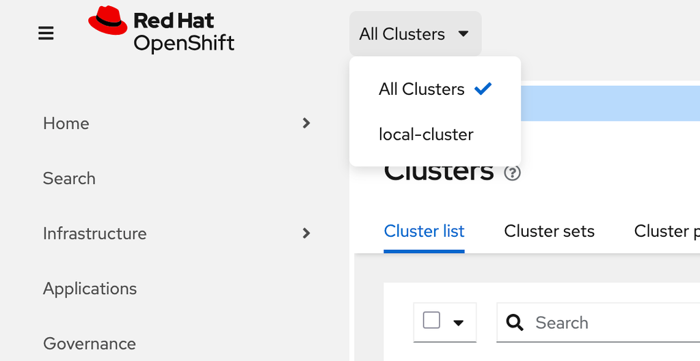{: caption="All Clusters navigation menu" caption-side="bottom"}
2. From the Clusters page, select the Grafana link on the right.
    1. 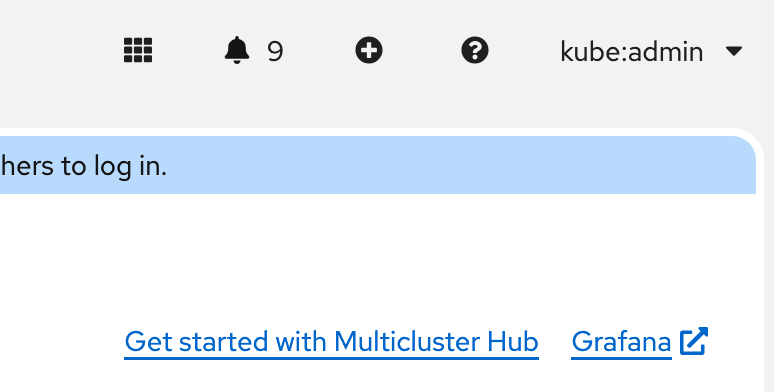{: caption="Grafana dashboard link" caption-side="bottom"}
3. This will bring up the grafana dashboards page with a list of pre-configured dashboards that come with the RHACM installation.

### Logging - Overview
{: #openshift-virt-observ-setup-config-logging}

#### General introduction
{: #observability-design-intro}

Two logging options are provided – LokiStack and {{site.data.keyword.cloud_notm}} Logs – because each serves different needs. LokiStack offers in-cluster, customizable log collection and retention, while {{site.data.keyword.cloud_notm}} Logs provides a managed, cloud-native, ease-of-use logging experience. You can choose one or use both depending on resources, scale, and visibility needs. The following sections outline the requirements for each option and detail the capabilities that are included so you can decide which solution, or combination, fits your environment best.

Things to note:

- {{site.data.keyword.cloud_notm}} Logs supports easy integration when the {{site.data.keyword.redhat_openshift_full}} Kubernetes Service instance is managed.
- LokiStack logging works for both managed and RYO configurations and provides native, in-console integration within the OpenShift environment.
- OpenShift RHACM is a tool for centrally managing multiple OpenShift clusters, but LokiStack itself functions as an in-cluster log aggregation system within a single OpenShift cluster.
- It is not required to have OpenShift Advanced Cluster Management (RHACM) installed to use LokiStack for logging.

### Logging - First Option ({{site.data.keyword.cloud_notm}} Logs - preferred)
{: #observability-design-cloud-logging}

NOTE:
- This simple quick integration config is ONLY available for managed {{site.data.keyword.redhat_openshift_notm}} Kubernetes Service clusters
- The bare-metal/RYO configuration of {{site.data.keyword.redhat_openshift_notm}} Kubernetes Service does not have the support for this option and requires a custom approach

#### Installation and configuration
{: #observability-design-install}

To provision {{site.data.keyword.cloud_notm}} Logs and connect it to your OpenShift cluster, perform the following steps:

1. Create {{site.data.keyword.cloud_notm}} Logs instance
    1. ref: [Provision instance](/docs/cloud-logs?topic=cloud-logs-instance-provision&interface=ui)
    2. This can be done through UI and CLI
2. Create a Storage Data Bucket
    1. ref: [Configure Bucket](/docs/cloud-logs?topic=cloud-logs-configure-data-bucket)
    2. This is required if you want long term data retention or search. the standard Cloud Logs instance has 7 days minimum and 90 days maximum priority log retention
3. Enable logging with {{site.data.keyword.redhat_openshift_notm}} Kubernetes Service cluster
    1. ref: [Connect ICL with {{site.data.keyword.redhat_openshift_notm}} Kubernetes Service](/docs/openshift?topic=openshift-logging)

#### Logging Rollback/Deletion - {{site.data.keyword.cloud_notm}} Logs
{: #observability-design-logging}

To remove the {{site.data.keyword.cloud_notm}} Logs integration and delete associated resources, perform the following steps:

1. Delete the Cloud Logs instance
    1. ref: [Delete ICL instance](/docs/cloud-logs?topic=cloud-logs-instance-remove&interface=ui)
2. Delete the Storage Data Bucket
    1. ref: [Delete Bucket](/docs/cloud-object-storage?topic=cloud-object-storage-compatibility-api-bucket-operations#compatibility-api-delete-bucket)

#### Logging UI - {{site.data.keyword.cloud_notm}} Logs
{: #observability-design-logging-ui}

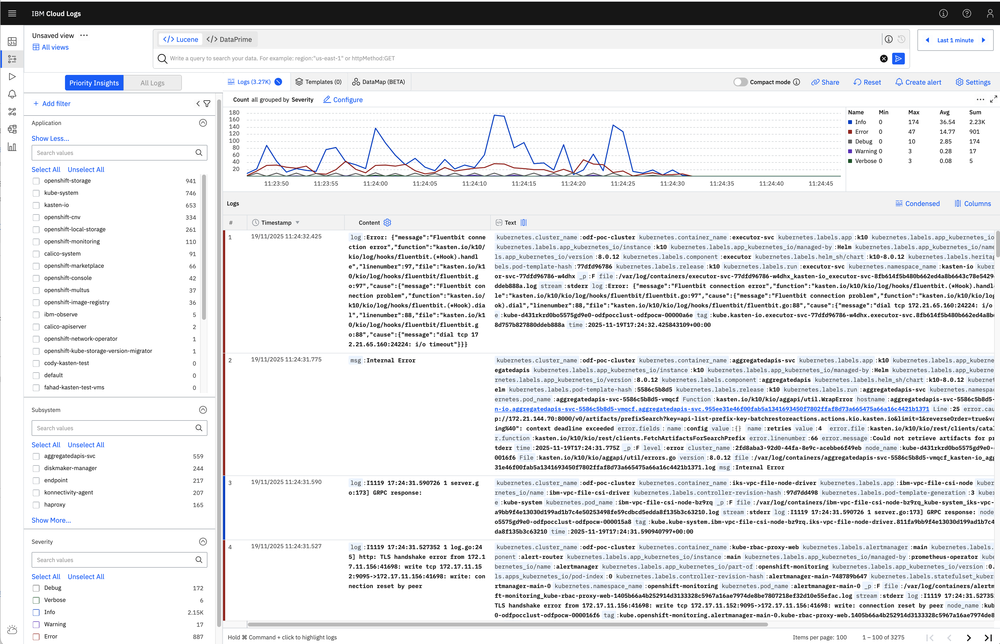{: caption="IBM Cloud Logs web interface" caption-side="bottom"}

#### Comparison with VMware Aria Logs  (vRealize Log Insight vs {{site.data.keyword.cloud_notm}} Logs)
{: #observability-design-aria-logs-ui}

| Category          | VMware vRealize Log Insight (vRLog)             | {{site.data.keyword.cloud_notm}} Logs                                                        |
| -----------       | -----------                                     | -----------                                                           |
| Platform Focus    | VMware/vSphere environments                     | IBM Cloud–managed ({{site.data.keyword.redhat_openshift_notm}} Kubernetes Service, VPC, cloud services)                         |
| Architecture      | Appliance-based, vertically scaling             | Fully managed, cloud-native logging pipeline                          |
| Log Collectors    | vRLI Agent, syslog                              | Fluent Bit / Fluentd / HTTP ingestion endpoint                        |
| Supported Sources | ESXi, vCenter, NSX, VCF, Linux/Windows hosts    | {{site.data.keyword.redhat_openshift_notm}} Kubernetes Service logs, {{site.data.keyword.cloud_notm}} services, syslog, custom app logs via API/HTTP   |
| Storage           | Local disk / NFS/VSAN                           | {{site.data.keyword.cloud_notm}} Object Storage (managed, scalable)                          |
| Scalability       | Scale by adding appliances                      | Cloud-scale; auto-managed capacity                                    |
| Multi-Tenancy     | Limited                                         | Multi-tenant by design based on {{site.data.keyword.cloud_notm}} IAM                         |
| Alerting          | Built-in, GUI-driven                            | Built-in alerting and notifications in {{site.data.keyword.cloud_notm}}                      |
| Retention         | Local disk based; limited unless scaled         | Scalable retention policies managed in cloud                          |
| Dashboards        | Prebuilt content packs for VMware               | {{site.data.keyword.cloud_notm}} Observability dashboards                                    |
| UI / Log Viewer   | vRLI web UI; Centralized viewing                | {{site.data.keyword.cloud_notm}} Logs UI                                                     |
| Query Language    | LIQL (VMware proprietary)                       | Lucene/Elastic-style search operators                                 |
| Operational Model | Manual upgrade/maintenance                      | Fully managed by {{site.data.keyword.cloud_notm}}                                            |
{: caption="Aria Logs table"}


### Logging - Second Option (LokiStack)
{: #observability-design-loki-stack}

#### Component Overview
{: #observability-design-loki-overview}

Operator: LokiOperator (LokiStack)\
version: 6.3.1\
provider: Red Hat\
notes: Forwards logs to the logging supported combination of Loki and web proxy with OpenShift Container Platform authentication integration. LokiStack's proxy uses OpenShift Container Platform authentication to enforce multi-tenancy\
documentation: [Loki Sizing](https://docs.redhat.com/en/documentation/red_hat_openshift_logging/6.3/html-single/configuring_logging/index#loki-sizing_configuring-the-log-store)

Operator: {{site.data.keyword.redhat_openshift_notm}} Logging (ClusterLogForwarder (CLF))\
version: 6.3.1\
provider: Red Hat\
notes: The ClusterLogForwarder (CLF) enables flexible forwarding of log data to various destinations by allowing users to select log messages from multiple sources, process them through pipelines, and send them to one or more outputs. It supports inputs for selecting logs, outputs for forwarding to external systems, filters for transforming or dropping log messages, and pipelines that link inputs, filters, and outputs into a complete log-forwarding workflow.\
documentation: [Configuring Log Forwarder](https://docs.redhat.com/en/documentation/red_hat_openshift_logging/6.4/html/configuring_logging/configuring-log-forwarding)

Operator: Cluster Observability Operator (COO)\
version: 1.3.0\
provider: Red Hat\
notes: The Cluster Observability Operator (COO) is an optional OpenShift component that lets administrators deploy custom, highly configurable monitoring stacks, providing deeper namespace-level observability than the default system. It can manage Prometheus for high-availability metrics and remote-write support, Thanos Querier for centralized cross-cluster querying, Alertmanager for flexible alerting, UI plugins for enhanced monitoring/logging/tracing interfaces, and Incident Detection to group related alerts into incidents and help identify root causes.\
document: [COO Function](https://docs.redhat.com/en/documentation/red_hat_openshift_cluster_observability_operator/1-latest/html-single/about_red_hat_openshift_cluster_observability_operator/index)

#### Centralized Logging Architecture
{: #observability-design-central-logging}

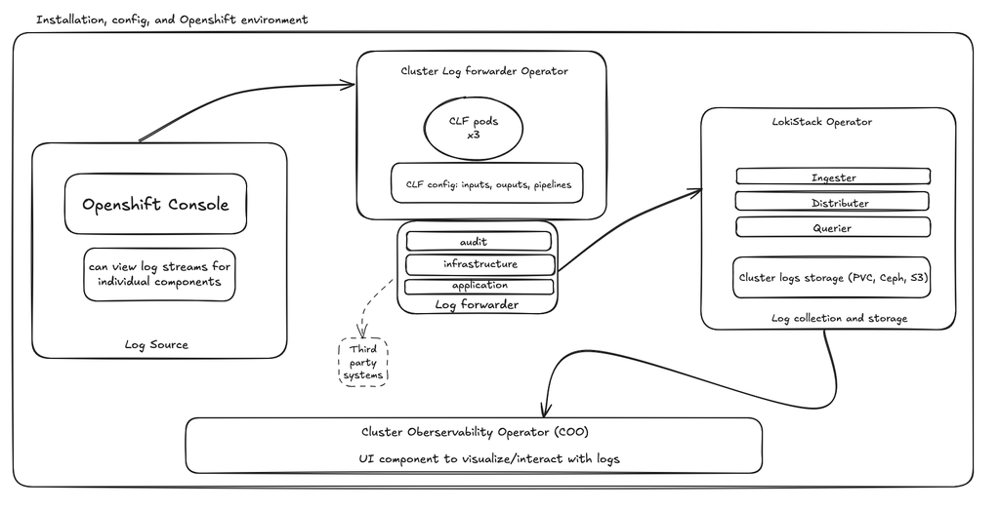{: caption="Centralized logging architecture with LokiStack" caption-side="bottom"}

#### Installation and configuration (Short with Refs)
{: #observability-design-central-logging-conf}

To quickly configure centralized in-cluster logging using OpenShift Logging and LokiStack, perform the following steps:

1. Install the LokiOperator, {{site.data.keyword.redhat_openshift_notm}} Logging Operator, and Cluster Observability Operator (COO) from the software catalog.
    1. ref: [How to Install Operators](https://www.ibm.com/docs/en/cloud-paks/cp-integration/16.1.0?topic=io-installing-operators-by-using-red-hat-openshift-console)
2. Create and configure service account as required by Cluster Logging
    1. ref: [Service account settings](https://docs.redhat.com/en/documentation/red_hat_openshift_logging/6.3/html-single/configuring_logging/index#setting-up-log-collection_configuring-log-forwarding)
3. Create a LokiStack instance
    1. ref:  [Create LokiStack](https://docs.redhat.com/en/documentation/red_hat_openshift_logging/6.3/html-single/configuring_logging/index#logging-create-loki-cr-console_configuring-the-log-store)
4. Create the UI for centralized logging
    1. ref: [UI creation](https://docs.redhat.com/en/documentation/red_hat_openshift_cluster_observability_operator/1-latest/html-single/ui_plugins_for_red_hat_openshift_cluster_observability_operator/index#coo-logging-ui-plugin-install_logging-ui-plugin)
5. Create the ClusterLogForwarder (CLF) instance
    1. ref: [Creating a Log Forwarder](https://docs.redhat.com/en/documentation/red_hat_openshift_logging/6.3/html-single/configuring_logging/index#logging-create-clf_configuring-log-forwarding)

#### Installation and configuration (Detailed, custom)
{: #observability-design-detailed}

To deploy a custom LokiStack logging configuration with detailed service accounts and resource specifications, perform the following steps:

1. Install the LokiOperator, {{site.data.keyword.redhat_openshift_notm}} Logging Operator, and Cluster Observability Operator (COO) from the software catalog.
    1. ref: [How to Install Operators](https://www.ibm.com/docs/en/cloud-paks/cp-integration/16.1.0?topic=io-installing-operators-by-using-red-hat-openshift-console)
2. Create and configure service account as required by Cluster Logging
    1. ref: [Service account settings](https://docs.redhat.com/en/documentation/red_hat_openshift_logging/6.3/html-single/configuring_logging/index#setting-up-log-collection_configuring-log-forwarding)
    2. Commands to configure service account:

```bash
oc create sa loki-collector-sa -n openshift-logging

oc adm policy add-cluster-role-to-user logging-collector-logs-writer -z loki-collector-sa  -n openshift-logging

oc adm policy add-cluster-role-to-user collect-application-logs -z loki-collector-sa -n openshift-logging

oc adm policy add-cluster-role-to-user collect-audit-logs -z loki-collector-sa -n openshift-logging

oc adm policy add-cluster-role-to-user collect-infrastructure-logs -z loki-collector-sa -n openshift-logging
```
- These will provide the account that is created to have the correct permissions to the various types of logs

3. Create a LokiStack custom res using yaml input
    1. ref:  [Create LokiStack](https://docs.redhat.com/en/documentation/red_hat_openshift_logging/6.3/html-single/configuring_logging/index#logging-create-loki-cr-console_configuring-the-log-store)
    2. Custom yaml provides the best example for a working instance with optimizations in place:

```yaml
apiVersion: loki.grafana.com/v1
kind: LokiStack
metadata:
  name: logging-loki
  namespace: openshift-logging
spec:
  managementState: Managed
  size: 1x.medium

  storage:
    schemas:
      - effectiveDate: "2024-11-11"
        version: v13
    secret:
      name: logging-loki-secret
      type: s3
  storageClassName: ocs-storagecluster-ceph-rbd
  tenants:
    mode: openshift-logging
  template:
    compactor:
      replicas: 1
      resources:
        limits:
          cpu: "1"
          memory: "2Gi"
        requests:
          cpu: "250m"
          memory: "1Gi"

    distributor:
      replicas: 1

    gateway:
      replicas: 1

    indexGateway:
      replicas: 1

    ingester:
      replicas: 2

    querier:
      replicas: 2

    queryFrontend:
      replicas: 2

    ruler:
      replicas: 1
  lokiConfig:
    query_range:
      align_queries_with_step: true
      max_retries: 5
      parallelise_shardable_queries: true
      cache_results: true
      results_cache:
        cache_validity: 10m
        background_writeback: true

    frontend_worker:
      frontend_address: query-frontend-http.logging-loki.svc.cluster.local:9095
      grpc_client_config:
        max_send_msg_size: 104857600
        max_recv_msg_size: 104857600

    querier:
      query_ingesters_within: 12h
      engine:
        timeout: 5m
        max_look_back_period: 672h

    compactor:
      retention_enabled: true
      retention_delete_delay: 2h
      retention_delete_worker_count: 150
      working_directory: /var/loki/compactor
      compaction_window: 24h
      retention_stream:
        default: 30d
```

- Once PVC storage is created it can be easily increased but that's not the same for decreasing. To decrease, you must redeploy instance with a new set of minimums in order to achieve that.
    - Storage can also be a s3 bucket.
- Even if using local Ceph/PVC, a functioning S3 secret is required.

4. Create the UI for centralized logging
    1. ref: [UI creation](https://docs.redhat.com/en/documentation/red_hat_openshift_cluster_observability_operator/1-latest/html-single/ui_plugins_for_red_hat_openshift_cluster_observability_operator/index#coo-logging-ui-plugin-install_logging-ui-plugin)
    2. Custom yaml used to create the UI from the previously installed COO:

```yaml
apiVersion: observability.openshift.io/v1alpha1
kind: UIPlugin
metadata:
  name: logging
spec:
  type: Logging
  logging:
    lokiStack:
      name: logging-loki
    timeout: 30s
    schema: otel
```
5. Create the Log forwarding custom resource (CR) using yaml method
    1. ref: [Creating a Log Forwarder](https://docs.redhat.com/en/documentation/red_hat_openshift_logging/6.3/html-single/configuring_logging/index#logging-create-clf_configuring-log-forwarding)
    2. This example of a running log fowarder for lokistack:

```yaml
apiVersion: observability.openshift.io/v1
kind: ClusterLogForwarder
metadata:
  name: loki-forwarder
  namespace: openshift-logging
spec:
  collector:
    resources:
      requests:
        cpu: 500m
        memory: 4Gi
      limits:
        cpu: 6
        memory: 6Gi
  serviceAccount:
    name: loki-collector-sa
  outputs:
    - name: forward-to-lokistack
      type: lokiStack
      lokiStack:
        authentication:
          token:
            from: serviceAccount
        target:
          name: logging-loki
          namespace: openshift-logging
        tuning:
          deliveryMode: AtLeastOnce
          compression: none
          maxWrite: 10Mi
          minRetryDuration: 2
          maxRetryDuration: 30
  pipelines:
    - name: default-pipeline
      inputRefs:
        - application
        - infrastructure
        - audit
      outputRefs:
        - forward-to-lokistack
```
- Resource minimums should be set prior to deployment to prevent a failing collector on each Node
- There is only 1 collector daemonset per Node

#### Important Notes
{: #observability-design-notes}

Loki Sizing:

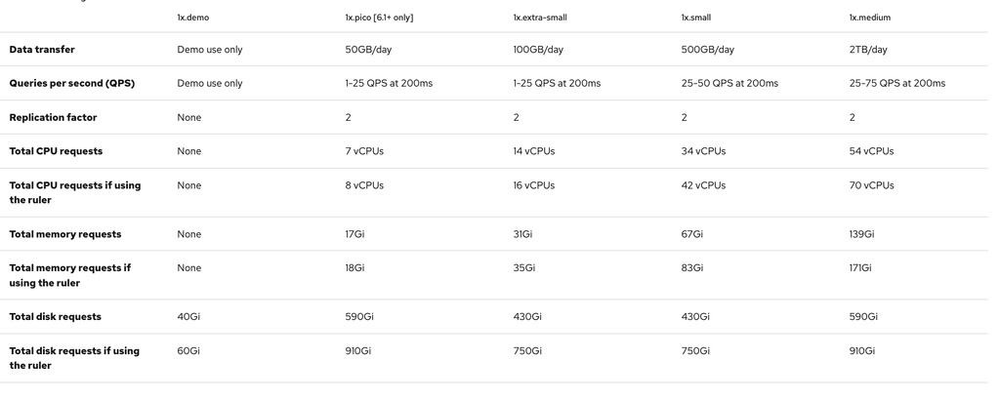{: caption="LokiStack deployment resource sizing requirements" caption-side="bottom"}

ref: [Loki sizing document](https://docs.redhat.com/en/documentation/red_hat_openshift_logging/6.3/html-single/configuring_logging/index#loki-sizing_configuring-the-log-store)

- On deploy these are the general resource maximums that you are allowed per-sizing
- Once the disks sizing are set, you cannot decrease them. you can only increase. must delete your deployment and redeploy stack with new minimum requests.
    - This destroys logs unless backed up externally
- Ceph PVC is not required, can use external or other S3 storage config

Log forwarder collector
- Forwarding is hardware intensive and memory will need to be sized to align with scale of environment

Supported third party log forwarding solutions:
- azureMonitor
    - Forwards logs to Azure Monitor.
- cloudwatch
    - Forwards logs to AWS CloudWatch.
- elasticsearch
    - Forwards logs to an external Elasticsearch instance.
- googleCloudLogging
    - Forwards logs to Google Cloud Logging.
- http
    - Forwards logs to a generic HTTP endpoint.
- kafka
    - Forwards logs to a Kafka broker.
- otlp
    - Forwards logs using the OpenTelemetry Protocol.
- splunk
    - Forwards logs to Splunk.
- syslog
    - Forwards logs to an external syslog server.

ref: [Log Forwarding Outputs](https://docs.redhat.com/en/documentation/red_hat_openshift_logging/6.3/html-single/configuring_logging/index#clf-outputs_configuring-log-forwarding)

#### Logging UI - LokiStack
{: #observability-design-loki5}

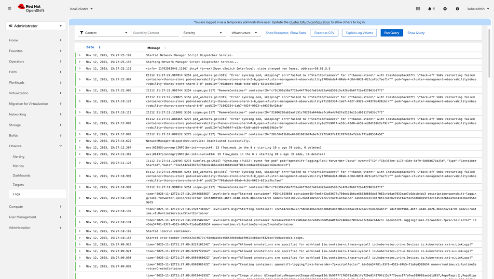{: caption="LokiStack log viewer in OpenShift console" caption-side="bottom"}

#### Comparison with VMware Aria Logs  (vRealize Log Insight vs LokiStack)
{: #observability-design-loki-6}

| Category          | VMware vRealize Log Insight (vRLog)             | OpenShift LokiStack Logging                                                 |
| -----------       | -----------                                     | -----------                                                                 |
| Platform Focus    | VMware/vSphere environments                     | Kubernetes/OpenShift-native                                                 |
| Architecture      | Appliance-based, vertically scaling             | Distributed microservices on OpenShift                                      |
| Log Collectors    | vRLI Agent, syslog                              | Vector collectors (DaemonSet)                                               |
| Supported Sources | ESXi, vCenter, NSX, VCF, Linux/Windows hosts    | All Kubernetes/OpenShift pods, nodes, containers; generic syslog            |
| Storage           | Local disk / NFS/VSAN                           | Ceph, PVC, Object storage (S3), etc                                         |
| Scalability       | Scale by adding appliances                      | Horizontally scalable (ingesters, queriers, distributors)                   |
| Multi-Tenancy     | Limited                                         | Namespace isolation built-in                                                |
| Retention         | Local disk based; limited unless scaled         | Object-storage based; long retention, low cost                              |
| Dashboards        | Prebuilt content packs for VMware               | Custom dashboards (Grafana)                                                 |
| UI / Log Viewer   | vRLI web UI; Centralized viewing                | OpenShift Console integrated logging UI (through COO); Centralized viewing  |
| Query Language    | LIQL (VMware proprietary)                       | LogQL (Prometheus-style)                                                    |
{: caption="Comparison between VMware Aria Logs and OpenShift LokiStack Logging" caption-side="bottom"}

#### Logging Rollback/Deletion - LokiStack
{: #observability-design-loki-7}

To uninstall LokiStack and remove in-cluster logging components, perform the following steps:

1. Navigate to each operator and delete each of the created instances. This will delete all associated components used to run the services pods.
    1. Ref: [Uninstalling Logging](https://docs.redhat.com/en/documentation/red_hat_openshift_logging/6.4/html/uninstalling_logging/uninstalling-logging)

### Deletion
{: #openshift-virt-observ-deletion}

While not advised after adding additional managed clusters, you can uninstall RHACM. Uninstalling requires detaching the managed clusters, deleting some custom resources, and then deleting the operator. For more information, see the [Red Hat RHACM uninstall documentation](https://docs.redhat.com/en/documentation/red_hat_advanced_cluster_management_for_kubernetes/2.14/html/install/installing#uninstalling){: external}.

Deleting OpenShift Logging requires cleanup of custom resources, some PVCs, Loki, Elasticsearch, and uninstalling the operator. For more information, see the [OpenShift Logging uninstall documentation](https://docs.redhat.com/en/documentation/openshift_container_platform/4.16/html/logging/cluster-logging-uninstall){: external}.

### Troubleshooting
{: #openshift-virt-observ-troubleshooting}

If hitting an issue with Observability during setup and configuration:

1. Log in to your OpenShift instance
2. Under Administration at **CustomResourceDefinitions**
3. Search for MultiClusterObservability
4. Select the only definition that shows
5. In the Instances tab, look for observability
6. Delete that instance and all pods under the open-cluster-management-observability namespace will automatically delete
7. In your terminal rerun "oc apply -f multiclusterobservability_cr.yaml" to re-create that instance, targeting the same yaml used to create the MultiClusterObservability object originally
8. All pods should re-deploy

### Comparisons to other observability offerings
{: #openshift-virt-observ-compare}

#### Aria Suite
{: #observability-design-aria}

Openshift is able to replicate the functionality of the VMware Aria Suite though the base install and a few additional operators. For Aria Log Insight, OpenShift Logging will be necessary while much of the functionality of Aria Operations is available at the start. RHACM Observability adds further features to make it more in line with the larger Aria Operations components.

| Feature | VMware | OpenShift |
| ----------- | ----------- | ----------- |
| Logging | Aria Log Insight | OpenShift Logging/LokiStack |
| Queries/Analytics | Custom filtering | PrompQL |
| Operations Alerting | Aria/VCF Operations | Alertmanager |
| Log Alerting | Aria Log Insight | LokiStack ruler/LogQL |
| Metrics | Aria/VCF Operations | Base (additional cluster metrics provided after RHACM install) |
| Dashboards | Aria/VCF Operations | Base (Grafana after RHACM observability install) |
{: caption="Comparison between VMware Aria Suite and OpenShift observability features" caption-side="bottom"}

#### {{site.data.keyword.cloud_notm}} Monitoring/Sysdig
{: #observability-design-mon}

##### Summary
{: #observability-design-mon-summary}

{{site.data.keyword.cloud_notm}} Monitor utilizes Sysdig for metrics gathering. Sysdig in turn uses Prometheus to gather data, so it works as an extension of what is already provided by the OpenShift base install. In order for {{site.data.keyword.cloud_notm}} Monitor to receive the metrics, Sysdig must be setup and configured in the environment. Installation is done through a daemonset that adds a number of pods in a specified namespace. From there the configuration can be set to target an {{site.data.keyword.cloud_notm}} Monitor instance.

The {{site.data.keyword.cloud_notm}} Monitor instance provides a number of features such as:

- Customizable metrics dashboards
- Alerting from the OpenShift cluster and customizable alerts
- PrompQL queries
- Advisories based on current issues found in the cluster
- Time captures of metrics

Many of these features are already available with the OpenShift base observability and RHACM observability. The main benefit of {{site.data.keyword.cloud_notm}} Monitoring is the additional support for other {{site.data.keyword.cloud_notm}} infrastructure, such as VPC virtual server instances, which makes it a single source of observability for all {{site.data.keyword.cloud_notm}} resources in an account. The metrics dashboard provided is also an IBM-created UI rather than Grafana.

##### Installation Instructions
{: #observability-design-install}

For more information, see [Manual installation process for Sysdig on OpenShift](https://docs.sysdig.com/en/administration/onprem-manual-installation-openshift/){: external} and [Adding an OpenShift cluster to {{site.data.keyword.cloud_notm}} Monitoring](/docs/monitoring?topic=monitoring-openshift_cluster).

##### Agent-based virtual server installation instructions
{: #observability-design-install-agent}

To install the monitoring agent on Linux virtual server instances, go to **Monitoring Sources** in your {{site.data.keyword.cloud_notm}} Monitoring instance details in the {{site.data.keyword.cloud_notm}} console, and click the **Linux** tab. For more information, see [Monitoring an Ubuntu Linux VPC server instance](/docs/monitoring?topic=monitoring-ubuntu).

To install the monitoring agent on Windows virtual server instances, install the exporter that sends metrics to {{site.data.keyword.cloud_notm}} Monitoring. For more information, see [Sysdig Windows integration](https://docs.sysdig.com/en/docs/sysdig-monitor/integrations/integration-library/windows/){: external} and [Monitoring a Windows VPC instance](/docs/monitoring?topic=monitoring-windows).

When installing the Windows agent:

Get the Prometheus Remote Write ingestion endpoints from here: https://cloud.ibm.com/docs/monitoring?topic=monitoring-endpoints#prometheus_remote_write_endpoints

To get the Sysdig monitor api token:

1. Log in to your {{site.data.keyword.cloud_notm}} Monitoring instance.
2. Access the Dashboard
3. At the bottom left click on the user icon with the user initials
4. In the popup, select SysDig API Tokens underneath the Secrets Management section
    1. 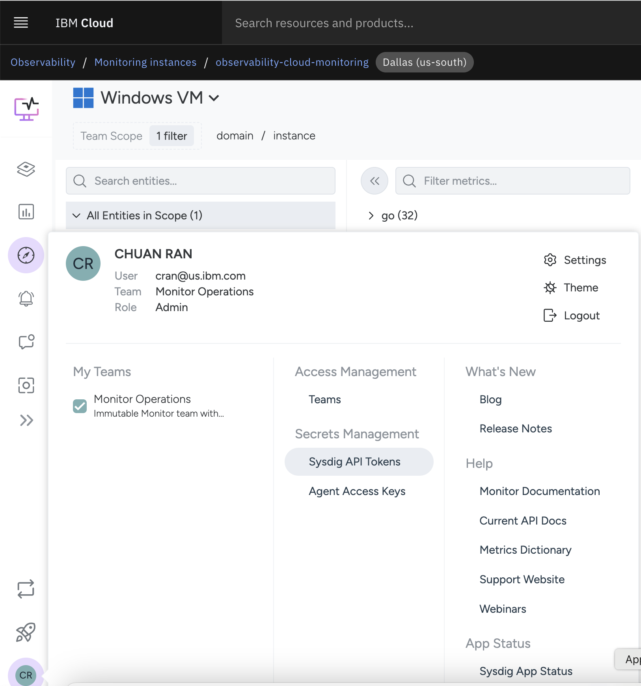{: caption="Sysdig API token setting" caption-side="bottom"}
5. Scroll down in the new page to find the token and select copy

## OpenShift Virtualization Observability Recommendations
{: #virt-observ-recommendations}

Choose the optimal observability tooling for your OpenShift Virtualization deployment based on cluster architecture, cross-cluster scope, and cost considerations.

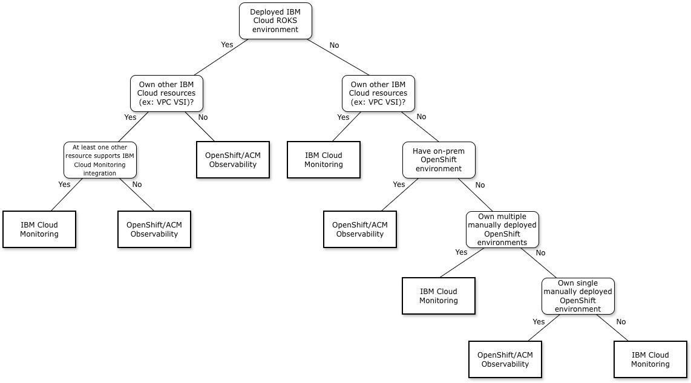{: caption="Observability solution selection flowchart" caption-side="bottom"}

{{site.data.keyword.cloud_notm}} Monitoring is the recommended solution for overall observability in {{site.data.keyword.redhat_openshift_notm}} Virtualization because it scales across multiple clusters and {{site.data.keyword.cloud_notm}} resources. If you are managing a single OpenShift cluster or working primarily within the Red Hat ecosystem, OpenShift and Red Hat Advanced Cluster Management observability tools meet most monitoring requirements.

Both price and storage costs require additional consideration, as RHACM requires a license and either local storage or object storage space. {{site.data.keyword.cloud_notm}} Monitoring is charged based on usage, so you can generate cost estimates in advance.

Because both solutions use Prometheus-based data gathering, the decision comes down to other use cases and costs. Functionality for OpenShift Virtualization is equivalent between the two offerings.

## {{site.data.keyword.cloud_notm}} VPC
{: #vpc-observability}

{{site.data.keyword.cloud_notm}} VPC supports integration with {{site.data.keyword.cloud_notm}} Observability services to provide visibility into the VPC environment.

### {{site.data.keyword.cloud_notm}} Monitoring
{: #vpc-observability-monitoring}

{{site.data.keyword.cloud_notm}} VPC provides basic monitoring for virtual server instances in the {{site.data.keyword.cloud_notm}} console, including historical compute, networking, storage, and memory usage. Additional monitoring capabilities are available through {{site.data.keyword.cloud_notm}} Monitoring integration, such as defining alerts and designing custom dashboards. This integration requires installing a monitoring agent on each virtual server instance. For an example installation on an Ubuntu virtual server instance, see [Monitoring an Ubuntu Linux VPC server instance](/docs/monitoring?topic=monitoring-ubuntu#ubuntu_step3). For additional instructions, see [Agent-based virtual server installation instructions](#observability-design-install-agent).

Beyond VSIs, {{site.data.keyword.cloud_notm}} Monitoring supports monitoring overall VPC resource consumption and other VPC services. See [Getting started with {{site.data.keyword.cloud_notm}} Monitoring](/docs/monitoring?topic=monitoring-getting-started) for instructions to integrate {{site.data.keyword.cloud_notm}} VPC with {{site.data.keyword.cloud_notm}} Monitoring. See [{{site.data.keyword.cloud_notm}} VPC monitoring dashboards](/docs/vpc?topic=vpc-ibm-monitoring) for the list of available dashboards and additional details for each.

### {{site.data.keyword.cloud_notm}} Logs
{: #vpc-observability-logs}

{{site.data.keyword.cloud_notm}} VPC supports integration with {{site.data.keyword.cloud_notm}} Logs. Platform events generated by {{site.data.keyword.cloud_notm}} VPC can be routed to an {{site.data.keyword.cloud_notm}} Logs instance using {{site.data.keyword.cloud_notm}} Logs Routing. For more information such as the type of platform logs generated, see [Logging for VPC](/docs/vpc?topic=vpc-logging). Activity tracking events can be routed to an {{site.data.keyword.cloud_notm}} Logs instance using {{site.data.keyword.cloud_notm}} Activity Tracker Events Routing. For more information such as the type of activity tracker events generated, see [Activity tracking events for {{site.data.keyword.cloud_notm}} VPC](/docs/vpc?topic=vpc-at_events).

To setup log forwarding to {{site.data.keyword.cloud_notm}} Logs, steps are provided for [Linux](/docs/cloud-logs?topic=cloud-logs-agent-linux) and [Windows](/docs/cloud-logs?topic=cloud-logs-agent-windows). After initial setup, further configuration can be done to the agent to support the following:

- Collect and route Rsyslog messages from a Syslog server
- Collect and forward logs from Windows Event Log
- Parse and group multiline logs into a single log record
- Forward additional log metadata as part of the log forwarding
- Including/excluding specific files in the data that gets forwarded
