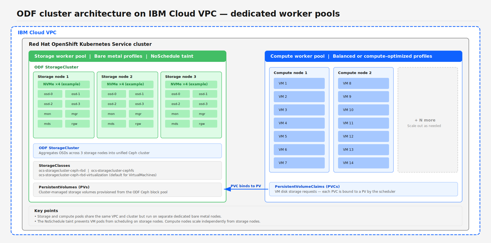
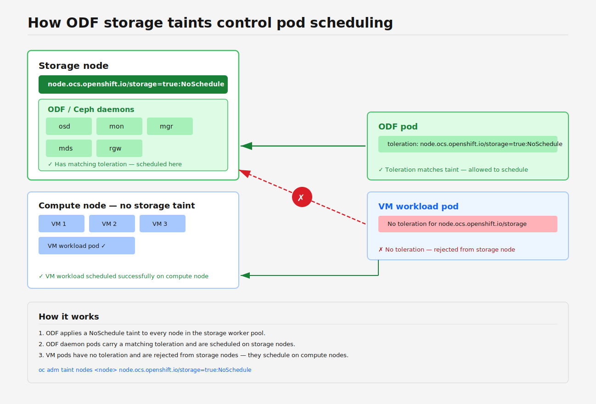

---

copyright:
  years: 2026
lastupdated: "2026-07-21"


keywords: OpenShift Data Foundation ODF, Ceph storage virtual machines, ODF storage classes configuration, VM live migration storage, replicated pools erasure coding, RBD block storage VMs, ODF capacity planning, snapshot backup VMs, bare metal NVMe storage, vSAN migration ODF


subcollection: virtualization-solutions

content-type: tutorial
services: OpenShift Virtualization, VMware
account-plan: paid
completion-time: 60m

---

# Using Red Hat OpenShift Data Foundation (ODF) for virtual machine workloads
{{site.data.keyword.attribute-definition-list}}
{: #odf-for-vm-workloads}
{: toc-content-type="tutorial"}
{: toc-services="OpenShift Virtualization, VMware"}
{: toc-completion-time="60m"}


Configure Red Hat OpenShift Data Foundation (ODF) as the storage backend for VM workloads on IBM Cloud OpenShift Virtualization.
{: shortdesc}

{{site.data.keyword.redhat_openshift_full}} Data Foundation (ODF) is the validated and supported storage solution for {{site.data.keyword.redhat_openshift_notm}} Virtualization on {{site.data.keyword.cloud}} {{site.data.keyword.redhat_openshift_notm}} Kubernetes Service. Use ODF as the storage backend for {{site.data.keyword.redhat_openshift_notm}} Virtualization.

## Key benefits
{: #key-benefits}

- High performance for virtual machines: Optimized block storage for virtual machine boot and data disks reduces latency and delivers high input/output operations per second (IOPS).
- Built for {{site.data.keyword.redhat_openshift_notm}} Virtualization: Native integration with {{site.data.keyword.redhat_openshift_notm}} and KubeVirt supports snapshots, cloning, live migration, backup and restore, and integration with the Containerized Data Importer (CDI).
- High resilience and availability: Distributed storage with data replication across worker nodes provides automatic recovery from disk or node failures.
- Optimized for {{site.data.keyword.redhat_openshift_notm}} Kubernetes Service bare metal infrastructure: Aggregates local NVMe and SSD disks into a shared storage pool, which eliminates reliance on external network storage.
- Fully supported and lifecycle-managed: Installed and upgraded through {{site.data.keyword.redhat_openshift_notm}} operators with integrated monitoring and alerting. Jointly validated and supported by {{site.data.keyword.IBM}} and Red Hat&reg;.
- Unified storage for virtual servers and containers: ODF provides consistent storage across these workloads on a single platform.

## What is ODF?
{: #what-is-odf}

ODF is a software-defined storage solution that is built for {{site.data.keyword.redhat_openshift_notm}}. ODF is based on Ceph&reg; and is fully integrated and lifecycle-managed through {{site.data.keyword.redhat_openshift_notm}} operators. Ceph is an open source distributed storage system that turns commodity servers into a highly scalable and fault-tolerant storage cluster.

ODF provides four types of storage from the same platform:

- Block storage (RADOS Block Device (RBD)) – for virtual machine workload disks
- File storage (CephFS) – for shared file systems
- Object storage (RGW and S3-compatible) – for object workloads
- Network File System (NFS) (CephFS-backed) – NFS exports for traditional or external clients

In ODF, NFS is backed by CephFS and exposed through a Ceph NFS Ganesha gateway. The gateway is managed through a CephNFS custom resource in Rook. NFS is not a distinct storage backend; it provides access to CephFS over the NFS protocol. The primary use case is to provide NFS access to clients outside the {{site.data.keyword.redhat_openshift_notm}} cluster, or to workloads that require NFS. NFS is not used for virtual machine workload disks because virtual servers use block storage (RBD).

On IBM {{site.data.keyword.redhat_openshift_notm}} Kubernetes Service, ODF typically uses local disks on worker nodes to create a high-performance and resilient storage cluster inside {{site.data.keyword.redhat_openshift_notm}}.

## Understanding data protection
{: #understanding-data-protection}

Before you plan and deploy your ODF cluster, understand how ODF protects your data. The data protection strategy that you choose affects storage capacity, performance characteristics, fault tolerance, and the minimum number of nodes required.

A single ODF cluster can run multiple Ceph pools simultaneously, each with a different data protection policy. Each pool is exposed to workloads through its own StorageClass. When you create a virtual machine workload, select the StorageClass for each disk. For example, a virtual machine workload might use a replica-3 StorageClass for its root disk and a different StorageClass that is backed by a replica-2 pool for a less critical data disk. This model is not a cluster-wide, all-or-nothing choice.

For VMware&reg; teams, this model is similar to vSAN storage policies. In vSAN, you assign a storage policy (for example, RAID-1 FTT=1, RAID-5) per virtual machine workload or per VMDK. In ODF, you assign a StorageClass that maps to a Ceph pool per PVC. The concept is the same but different workloads on the same cluster can have different protection levels.

ODF supports the following data protection strategies for Ceph block pools:

### Replicated pools (default)
{: #replicated-pools}

The default ODF configuration uses 3-way replication. Every piece of data is stored as three copies across different nodes and protects against up to two simultaneous disk or node failures. The default pool type is `replica-3`.

- Advantages: Straightforward architecture, fast reads, fast recovery, and predictable latency.
- Storage overhead: 3x raw storage per byte of usable data.

What happens when copies are lost (`replica-3`):

| Copies that remain | Ceph state | I/O behavior | Risk |
| ---------------- | ---------- | ------------- | ---- |
| 3 of 3 | `active+clean` | Normal operation. Reads are served from any copy. | None. |
| 2 of 3 | `active+degraded` | I/O continues normally. Ceph immediately begins rereplicating the missing copy to another OSD to restore 3 copies. | Minimal. Data is still durable on 2 independent OSDs. Recovery occurs automatically. |
| 1 of 3 | `active+degraded` or `peered` (depending on `min_size`) | With the ODF default `min_size=2`, Ceph blocks all I/O to affected Placement Groups when only 1 copy remains. Prevents extra writes that can become inconsistent. Virtual servers with data on those PGs experience I/O hang. | High. Only 1 copy of the data remains on a single remaining OSD. If it also fails before the recovery completes, the data is permanently lost. |
| 0 of 3 | `incomplete` | I/O is blocked. No copies exist. | Data loss. The data is permanently unrecoverable. |
{: caption="rep3 failure progression and I/O behaviour"}

The `min_size` parameter controls the minimum number of copies that must be available before Ceph allows I/O. ODF sets `min_size=2` for replica-3 pools by default, which is enforced through `requireSafeReplicaSize: true`. When two or three copies are available, reads and writes proceed normally. When only one copy is available, Ceph blocks I/O to maintain data consistency.

Blocking I/O when fewer than two copies are available is a deliberate safety mechanism that prioritizes data integrity over availability.

The window between losing the second copy and completing replication is the most dangerous. During this time, a third failure causes permanent data loss. Capacity planning is important because Ceph replication speed depends on available cluster bandwidth and free space. An overloaded or nearly full cluster takes longer to replicate, which extends the vulnerability window.

For `replica-2` pools, the progression is more aggressive. If 1 copy is lost, only 1 copy remains. With `min_size=2` (default), I/O is immediately blocked on affected PGs until the missing OSD returns or a new copy is replicated. With `min_size=1`, I/O continues on the single remaining copy, but a second failure results in permanent data loss.

The {{site.data.keyword.redhat_openshift_notm}} Kubernetes Service ODF add-on automatically creates only `replica-3` pools with `ocs-storagecluster-cephblockpool`. `replica-2` pools are not created by the add-on. You must manually create a custom CephBlockPool with `replicated.size: 2` and a corresponding StorageClass. For more information, see [Creating a custom StorageClass for virtualization](#creating-a-custom-storageclass-for-virtualization).

Because `replica-2` offers less fault tolerance than `replica-3`, evaluate whether the storage savings justify the increased risk for your workload.
{: important}

{{site.data.keyword.IBM_notm}} recommends `replica-3` (3-way replication) for all production virtualization workloads to help ensure availability and data durability.

### Erasure-coded pools
{: #erasure-coded-pools}

For environments where storage capacity efficiency is a priority, ODF also supports erasure-coded (EC) pools. EC splits data into *k* data chunks and *m* parity chunks, which reduces raw storage usage compared to replication while still providing fault tolerance.

Support status: In ODF 4.21, erasure coding is a technology preview feature. Technology preview features are not supported for production use and are not covered by Red Hat Customer Portal case management. Erasure coding for RBD and CephFS was first introduced as a developer preview in ODF 4.20. Before ODF 4.20, only RGW (object storage) EC was available as a developer preview (from ODF 4.16). Although the underlying Ceph storage engine supports EC overwrites for RBD since the Luminous release (2017), the ODF operator and its managed deployment model do not yet certify EC pools for production block storage workloads. Use replicated pools (`replica-2` or `replica-3`) for all production VM storage. Evaluate EC pools only for nonproduction environments where the technology preview limitations are acceptable.
{: important}

All available pool types and their characteristics are listed in the following table.

| Pool type | Configuration | Storage overhead | Fault tolerance | Minimum hosts required |
| --------- | ------ | ------------ | --------------- | ------------------ |
| replica-3 (default) | 3 copies | 3.0x | Survives 2 failures | 3 |
| replica-2 | 2 copies | 2.0x | Survives 1 failure | 2 |
| rep1 (nonresilient) | 1 copy | 1.0x | None. Data loss on any failure | 3 |
| ec-2-1 | k=2, m=1 | 1.5x | Survives 1 failure | 3 |
| ec-3-1 | k=3, m=1 | 1.33x | Survives 1 failure | 4 |
| ec-2-2 | k=2, m=2 | 2.0x | Survives 2 failures | 4 |
| ec-4-2 | k=4, m=2 | 1.5x | Survives 2 failures | 6 |
{: caption="Ceph pool types and their characteristics"}
{: summary="This table lists all available Ceph pool types. Each row describes one pool type and shows its configuration, storage overhead factor, fault tolerance level, and minimum number of hosts required."}

Key considerations for erasure coding include:

- EC pools have higher write latency than replicated pools because of parity computation and the need to write more chunks per operation.
- EC pools deliver competitive sequential read throughput, but might show reduced random write IOPS.
- The number of failure domains must be at least *k*+*m*. On a 3-node cluster, only `replica-2`, `replica-3`, and `ec-2-1` are possible.
- For a 6-node cluster, all pool types that are listed in the preceding table are available.

### Single replica pool (nonresilient for dev and test only)
{: #single-replica-pool}

Starting with ODF add-on version 4.14, {{site.data.keyword.redhat_openshift_notm}} Kubernetes Service supports a single replica (rep1) pool through the `addSingleReplicaPool` parameter. This parameter creates a Ceph nonresilient block pool with no data replication; each block of data is stored once.

To enable the single replica pool when you deploy ODF, use the following command:

```bash
ibmcloud oc cluster addon enable openshift-data-foundation -c <cluster_name> \
  --version <version> \
  --param "addSingleReplicaPool=true"
```

The command creates an extra StorageClass:

- `ocs-storagecluster-ceph-non-resilient-rbd`: Single replica block storage with `WaitForFirstConsumer` volume binding.

The standard `replica-3` pool (`ocs-storagecluster-cephblockpool`) is still created with it. The nonresilient pool is a separate, opt-in option.

A single replica pool has the following use cases:

- Development and test environments, where data durability is not critical and storage cost savings are prioritized.
- Applications with built-in replication. These applications manage their own data redundancy at the application layer and maintain multiple copies across nodes, which makes storage-level replication redundant.

The single replica pool provides zero fault tolerance. A single OSD or node failure results in permanent, unrecoverable data loss for all data on that OSD. No second copy is available for recovery. {{site.data.keyword.cloud_notm}} documentation explicitly warns that this option increases the risk of data loss, data corruption, and potential system instability. For more information, see [Ceph documentation](https://docs.ceph.com/en/latest/architecture/#scalability-and-high-availability){: external}.
{: warning}

Limitations:

- Block storage only: A single replica does not support file storage.
- Requires extra disks: At least one extra usable NVMe disk per node is required beyond what the replica-3 pool uses. Without this extra disk, the replica-1 OSDs do not start and the storage cluster remains in a progressing state.
- One pool per failure domain: ODF creates one nonresilient CephBlockPool per failure domain, with volumes that are bound by using `WaitForFirstConsumer` to validate data locality.
- Not recommended for virtual machine workload root disks: If the OSD that hosts a root disk fails, the virtual machine workload is permanently lost. Use the nonresilient pool for only disposable data disks in dev or test virtual machine workloads.

For production virtualization workloads, always use `replica-3` (or at minimum `replica-2`) pools.

### VMware vSAN migration comparison
{: #vsan-migration-comparison}

For teams that are migrating from VMware vSAN&trade;, these Ceph pool types map to familiar vSAN storage policies:

| Ceph pool | Closest vSAN equivalent | Storage overhead | Fault tolerance | Notes |
| --------- | ----------------------- | -------- | --------------- | ----- |
| replica-2 | RAID-1, FTT=1 | 2x | 1 failure | Both store 2 copies. |
| replica-3 | RAID-1, FTT=2 | 3x | 2 failures | Both store 3 copies. |
| ec-2-1 | No direct equivalent | 1.5x | 1 failure | Single-parity like RAID-5, but uses a 2+1 layout. Higher usage than vSAN RAID-5. |
| ec-3-1 | RAID-5, FTT=1 (3+1) | 1.33x | 1 failure | Both use 3 data + 1 parity chunks. |
| ec-2-2 | No direct equivalent | 2x | 2 failures | Dual-parity like RAID-6, but uses a 2+2 layout. More usage than vSAN RAID-6. |
| ec-4-2 | RAID-6, FTT=2 (4+2) | 1.5x | 2 failures | Both use 4 data + 2 parity chunks. |
{: caption="Ceph pool types mapped to VMware vSAN equivalents"}
{: summary="This table maps Ceph pool types to their closest VMware vSAN storage policy equivalents. Each row identifies a Ceph pool, its vSAN equivalent, the storage overhead, the fault tolerance level, and notes on the comparison."}

Key differences from vSAN:

- Smaller host minimums: Ceph separates its cluster quorum from data placement. A `replica-3` pool needs only three hosts because each host stores one full copy. vSAN RAID-1 FTT=2 needs five hosts.
- `replica-2` matches standard vSAN RAID-1: Most vSAN deployments use FTT=1, which stores two copies. Ceph `replica-2` is the direct equivalent.
- `ec-3-1` matches vSAN RAID-5: Both use a 3+1 layout and achieve 1.33x usage, the most space-efficient option for single-failure tolerance.
- `ec-4-2` matches vSAN RAID-6: Both use a 4+2 layout and achieve 1.5x usage with dual-failure tolerance.
- `ec-2-1` and `ec-2-2` have no direct vSAN equivalent: These smaller Ceph EC configurations use fewer data chunks, which results in higher usage per byte but requires fewer hosts. They trade storage efficiency for a smaller host count requirement.

## Planning your ODF cluster
{: #planning-your-odf-cluster}

Plan the cluster sizing and topology for your ODF deployment based on your chosen data protection option.

### Planning capacity
{: #planning-capacity}

When you plan your ODF cluster, account for the raw storage overhead of your chosen data protection policy. The usable capacity is less than the total raw NVMe capacity.

The usable capacity formula is `Usable capacity = Total raw NVMe capacity / Replication or EC overhead factor`.

See the following example of calculations for a 3-node cluster with 8 x 3.2 TB NVMe drives per node (76.8 TB raw total):

| Data protection | Usage factor | Usable capacity | Storage efficiency |
| --------------- | --------------- | --------------- | ------------------ |
| replica-3 (default) | 3.0x | 25.6 TB | 33% |
| replica-2 | 2.0x | 38.4 TB | 50% |
| ec-2-1 | 1.5x | 51.2 TB | 67% |
| rep1 (nonresilient) | 1.0x | 76.8 TB | 100% |
{: caption="Usable capacity by data protection type for a 3-node cluster"}
{: summary="This table shows usable storage capacity for a 3-node cluster with 76.8 TB of raw NVMe storage. Each row represents a data protection type and shows the usage overhead factor, the resulting usable capacity, and the storage efficiency percentage."}

Virtual machine workload capacity estimation: A typical virtual machine workload with a 30 GB root disk and a 100 GB data disk uses 130 GB of usable storage. With replica-3, that virtual machine workload requires 390 GB of raw storage. On the preceding 3-node cluster, you can provision approximately 196 virtual machine workloads of this size. In practice, keep Ceph usage less than 75% to maintain performance and support recovery operations.

Ceph performance degrades as cluster usage increases. The following thresholds apply:

Virtual machine workload capacity estimation: A typical virtual machine workload with a 30 GB root disk and a 100 GB data disk uses 130 GB of usable storage. With rep3, that virtual machine workload requires 390 GB of raw storage. On the preceding 3-node cluster, you can provision approximately 196 virtual machine workloads of this size. In practice, keep Ceph usage less than 75% to maintain performance and support recovery operations.

- At 75% OSD usage, ODF fires the `CephOSDNearFull` Prometheus alert.
- At 85%, Ceph sets the native `nearfull` OSD flag (`mon_osd_nearfull_ratio`) and ODF fires the `CephOSDCriticallyFull` alert.
- At 90%, Ceph stops backfill and recovery operations to the affected OSD (`mon_osd_backfillfull_ratio`).
- At 95%, Ceph marks the OSD `full` (`mon_osd_full_ratio`), blocks all writes, and issues `HEALTH_ERR`.

Plan your capacity so that usage stays under 70% during normal operations, so that you allow headroom for data recovery and rebalancing during node maintenance or failures.

To check current cluster usage, run the following command:

```bash
oc exec -n openshift-storage $(oc get pods -n openshift-storage -l app=rook-ceph-tools -o name) -- ceph df
```
{: pre}

### Worker node count and rack topology
{: #number-of-worker-nodes}

{{site.data.keyword.redhat_openshift_notm}} Kubernetes Service deploys ODF by using a Ceph rack-aware topology by default. {{site.data.keyword.redhat_openshift_notm}} Kubernetes Service assigns worker nodes to racks in a pattern across three racks (`rack0`, `rack1`, `rack2`). For optimal availability, performance, and data safety, see the following tips.

- Use 3, 6, or 9 nodes for the ODF storage cluster.
- These counts keep the topology balanced. Each rack receives the same number of nodes.
- All nodes that participate in the ODF storage cluster must be bare metal. Mixing virtualized and bare-metal nodes within the same ODF cluster is not supported.

Adding nodes in counts that are not multiples of three creates a rack imbalance. With four nodes, `rack0` gets two nodes while `rack1` and `rack2` get one each. This distribution results in uneven OSD weight distribution across racks, which can lead to suboptimal data placement, uneven usage, and partially idle OSDs.

Always scale in multiples of 3 to maintain a balanced topology.
{: important}

#### Why 6 nodes are the practical minimum for production
{: #n-plus-two-sizing}

Although ODF requires a minimum of three nodes, a 3-node cluster has no headroom for planned maintenance. Consider what happens with `replica-3` on three nodes when one node is cordoned for a firmware update or {{site.data.keyword.redhat_openshift_notm}} upgrade:

- One node is in maintenance. Its OSDs are down, so Ceph marks those copies as unavailable. The cluster enters `active+degraded` and begins replicating to restore three copies across the two remaining nodes.
- If a second node fails during that maintenance window (disk failure, kernel panic, or power event), some placement groups are left with only one copy. With the default `min_size=2`, Ceph blocks I/O on those PGs. Virtual servers with data on affected placement groups experience an I/O hang.
- If both the maintenance node and the failed node remain down, any placement group with copies on those two nodes and a third OSD on the same node has zero copies, which causes permanent data loss.

To avoid this data loss, size your ODF cluster so that you can lose 2 nodes simultaneously and still maintain enough OSDs for all data to remain available.

| Nodes | Maintenance + Failure | Result |
| ----- | --------------------- | ------ |
| 3 (minimum) | 1 in maintenance + 1 failure = 1 remaining | I/O blocked (`min_size=2`). Risk of data loss. |
| 6 (recommended) | 1 in maintenance + 1 failure = 4 remaining | Ceph replicates to the 4 nodes. I/O continues. No data loss risk. |
| 9 | 1 in maintenance + 1 failure = 7 remaining | Ample capacity for replication. Minimal performance impact. |
{: caption="Impact of planned maintenance plus an unplanned failure by cluster size"}
{: summary="This table compares the impact of a simultaneous planned maintenance event and an unplanned node failure across three cluster sizes: 3 nodes, 6 nodes, and 9 nodes. Each row shows the number of nodes, the scenario, and the resulting cluster state."}

For production clusters that run `replica-3`, start with 6 nodes. This setup provides N+2 headroom with enough capacity for one node in planned maintenance and one unexpected failure without risking data availability or data loss. Use a 3-node cluster only for development, testing, or proofs of concept where downtime and data loss are acceptable.
{: tip}

You can verify rack assignments on your cluster by running the following command:

```bash
oc get nodes -l node-role.kubernetes.io/worker= \
  -o custom-columns='NAME:.metadata.name,RACK:.metadata.labels.topology\.kubernetes\.io/rack'
```
{: codeblock}

You have two deployment options.

- Option A – Use the entire worker pool
   * Specify only the worker pool name during ODF configuration.
   * Verify that the pool contains exactly 3, 6, or 9 bare metal nodes.

- Option B – Select specific nodes
   * If the pool has more nodes, or you want to reserve some nodes for compute-only workloads, select 3, 6, or 9 nodes to participate in ODF.

### ODF subscription plans
{: #odf-subscription-plans}

The ODF Advanced plan is recommended for {{site.data.keyword.redhat_openshift_notm}} Virtualization workloads. The Advanced plan provides the full feature set that is required for production virtualization, including disaster recovery, stretch clusters, external-mode deployment, advanced granular encryption, and multi-cluster support.

The Advanced plan includes BlueStore compression on block pools, thin provisioning, snapshots, and cloning.

ODF supports deduplication only for object storage through the Multicloud Object Gateway (MCG). Block storage does not support deduplication. Upstream Ceph deduplication for RBD remains experimental and is not certified for use in ODF.

For more information, see the [ODF Subscription Guide](https://access.redhat.com/articles/6932811){: external} and [ODF Essentials versus Advanced](/docs/openshift?topic=openshift-ocs-storage-prep&interface=cli#odf-essentials-vs-advanced).

## Set up ODF on Red Hat OpenShift Kubernetes Service
{: #set-up-odf-storage}

{{site.data.keyword.redhat_openshift_notm}} Virtualization on {{site.data.keyword.redhat_openshift_notm}} Kubernetes Service VPC clusters supports only bare metal worker nodes. Virtualized worker nodes are not supported for ODF storage clusters.

Help ensure that your {{site.data.keyword.redhat_openshift_notm}} Kubernetes Service cluster includes at least one worker pool that uses bare metal servers that are running on Red Hat CoreOS. {{site.data.keyword.redhat_openshift_notm}} version 4.17 or later is required for {{site.data.keyword.redhat_openshift_notm}} Virtualization. Supported bare metal options include `bx2d.metal.96x384`, `cx2d.metal.96x192`, and `mx2d.metal.96x768`.

Deploy the ODF storage cluster on these bare metal nodes to use local NVMe disks and deliver high-performance block storage to virtual machines.

For instructions on deploying ODF on a VPC-based {{site.data.keyword.redhat_openshift_notm}} Kubernetes Service cluster, see [Deploying {{site.data.keyword.redhat_openshift_notm}} Data Foundation on VPC clusters](/docs/openshift?topic=openshift-deploy-odf-vpc&interface=ui).

### Storage type
{: #storage-type}

- Select **Local storage**.
- Local storage uses the local NVMe instance storage available on bare metal worker nodes.

- NVMe drives provide reduced latency and high IOPS (input/output operations per second) performance that is required for virtual machine workload disks.

### ODF resource profile
{: #odf-resource-profile}

ODF provides three resource allocation profiles that control the CPU and memory that is reserved for Ceph daemons.

- Lean: Minimum resource allocation. The Lean profile is suitable for resource-constrained environments, testing, development, and proofs of concept. The Lean profile is not recommended for production virtualization workloads.
- Balanced: The default profile on {{site.data.keyword.redhat_openshift_notm}} Kubernetes Service. The Balanced profile provides a balance between resource consumption and performance for general-purpose workloads.
- Performance: Allocates more CPU and memory to Ceph daemons, which reduces the risk of daemon-side bottlenecks. Recommended for high-IOPS workloads, large numbers of virtual servers, and demanding applications. The Performance profile is the minimum recommended profile for bare metal deployments.

The resource requirements that are shown in the **{{site.data.keyword.redhat_openshift_notm}} web console** during ODF installation are dynamically computed based on the cluster OSD count. Clusters with more NVMe drives require proportionally more resources. The values are not fixed. Always verify the requirements displayed in the console for your specific cluster configuration.

The profile is selected during StorageSystem creation through the **Configure Performance** screen in the **{{site.data.keyword.redhat_openshift_notm}} web console**. Under-resourced Ceph daemons can become a bottleneck, which causes reduced IOPS or higher latency than the underlying storage hardware can deliver.

Match your bare metal server profiles to the resource requirements shown for your chosen profile: [{{site.data.keyword.cloud_notm}} VPC bare metal server profiles](/docs/vpc?topic=vpc-bare-metal-servers-profile).

Slight oversubscription of resources is often acceptable on a bare metal server. However, never provision significantly less than the displayed minimum requirements; doing so degrades ODF performance and stability.
{: important}

### Number of OSD disks per node
{: #osd-disks-per-node}

- Determine the number of local NVMe drives available on each bare metal server.
- Help ensure that the number of OSDs configured per node does not exceed the number of usable NVMe drives.
- The recommended pattern is one OSD per NVMe drive for optimal performance and failure isolation.
- The number of OSD disks typically matches the number of NVMe drives per bare metal node. The storage capacity calculation that is shown in the UI does not reflect the actual usable capacity for local storage configurations and can be disregarded.

### Default StorageClass for the cluster
{: #default-storageclass}

After ODF deploys, the following StorageClasses are typically created:

- `ocs-storagecluster-ceph-rbd`: Block storage
- `ocs-storagecluster-cephfs`: File storage
- `ocs-storagecluster-ceph-rgw`: Object storage

To allow workloads to automatically use high-performance ODF-backed persistent block storage without extra configuration, select **Use Ceph RADOS block device (RBD)** as the default storage class, or manually set **RBD** (`ocs-storagecluster-ceph-rbd`) as the default StorageClass for the cluster after the ODF add-on is installed.

1. Mark RBD as default:

   ```bash
   oc patch storageclass ocs-storagecluster-ceph-rbd -p '{"metadata": {"annotations":{"storageclass.kubernetes.io/is-default-class":"true"}}}'
   ```
   {: codeblock}

2. If needed, remove the default designation from the previous default StorageClass:

   ```bash
   oc patch storageclass <previous-default-name> -p '{"metadata": {"annotations":{"storageclass.kubernetes.io/is-default-class":"false"}}}'
   ```
   {: codeblock}

### ODF configuration checklist
{: #odf-configuration-checklist}

- The cluster contains at least one bare metal server pool
- {{site.data.keyword.redhat_openshift_notm}} version 4.17 or later
- The ODF add-on and operator are installed and running
- The bare metal servers have sufficient usable local NVMe drives
- The selected resource profile matches the node capacity
- ODF storage cluster uses 3, 6, or 9 nodes
- All ODF participating nodes are bare metal
- The RBD StorageClass is created and preferably set as the default
- The ODF cluster status is `Ready` (`oc get storagecluster -n openshift-storage`)
- Ceph health is `HEALTH_OK` (`oc -n openshift-storage rsh $(oc get pod -l app=rook-ceph-tools -o name) ceph status`)

## Running virtual servers on ODF
{: #running-vms-on-odf}

### Prerequisites: Install the Red Hat OpenShift Virtualization Operator
{: #prerequisites-for-odf}

Before you use {{site.data.keyword.redhat_openshift_notm}} Virtualization on {{site.data.keyword.cloud_notm}}, verify that the {{site.data.keyword.redhat_openshift_notm}} Virtualization Operator is installed in your {{site.data.keyword.redhat_openshift_notm}} Kubernetes Service cluster.

The {{site.data.keyword.redhat_openshift_notm}} Virtualization Operator enables Kubernetes-native virtual machine workload management. It also provides the required controllers, CRDs, and integrations with storage and networking components.

For more information, see [{{site.data.keyword.redhat_openshift_notm}} Virtualization on {{site.data.keyword.cloud_notm}}](https://developer.ibm.com/tutorials/openshift-virtualization-ibm-cloud/){: external}.

### Using ODF storage for virtual machine workloads
{: #using-odf-storage-for-vms}

{{site.data.keyword.redhat_openshift_notm}} Data Foundation (ODF) provides persistent, software-defined storage for virtualization workloads that run on {{site.data.keyword.redhat_openshift_notm}}. When you use ODF as the storage backend for virtual machines, select the correct StorageClass to help ensure performance, stability, and full feature compatibility.

Specify the appropriate StorageClass for the following situations:

- Creating virtual servers
- Importing or cloning virtual servers
- Migrating virtual servers to a {{site.data.keyword.redhat_openshift_notm}} Kubernetes Service cluster

### Default virtualization StorageClass
{: #default-virtualization-storageclass}

When the {{site.data.keyword.redhat_openshift_notm}} Virtualization Operator is installed and an ODF cluster is available, a StorageClass that is optimized for virtualization workloads is automatically created:

- `ocs-storagecluster-ceph-rbd-virtualization`

This StorageClass is:

- Tuned for disk I/O patterns such as random reads, writes, and sustained throughput
- Validated for virtualization lifecycle operations such as start, stop, live migration, and snapshots
- Fully supported and recommended for production {{site.data.keyword.redhat_openshift_notm}} Virtualization environments

For most use cases, use this StorageClass without modification.

### Live migration storage requirements
{: #live-migration-storage}

Live migration moves a running virtual machine workload from one worker node to another without downtime. For a successful live migration, the storage must be accessible from both the source and destination nodes simultaneously. Live migration requires the following configurations:

- `ReadWriteMany` access mode on virtual machine workload PVCs. Ceph RBD supports RWX in block mode, which is the default configuration for the ODF virtualization StorageClass.
- The `ocs-storagecluster-ceph-rbd-virtualization` StorageClass is pre-configured with `ReadWriteMany` support through RBD block mode. Virtual servers that use this StorageClass can live migrate without extra configuration.
- The generic `ocs-storagecluster-ceph-rbd` StorageClass uses the `ReadWriteOnce` access mode by default. Virtual servers that use RWO PVCs cannot perform live migration. The migration fails because the PVC cannot be mounted on the destination node while attached to the source.

If you create custom StorageClasses for virtual servers that need live migration, verify that the PVCs are created with `accessModes: [ReadWriteMany]` and `volumeMode: Block`.
{: tip}

Live migration also requires:

- Configuring the {{site.data.keyword.redhat_openshift_notm}} Virtualization Operator with a suitable migration policy
- Verifying sufficient CPU and memory are available on the destination node

### Virtualization-specific compared to generic RBD StorageClass
{: #storageclass-comparison}

Although virtual machines can use a generic Ceph RBD StorageClass, the virtualization-specific StorageClass optimizes for the unique I/O and lifecycle characteristics of virtual machine workload disks.

| Aspect | Virtualization-specific StorageClass | Generic RBD StorageClass |
| ------ | ------------------------------------ | ------------------------ |
| Workload optimization | Tuned for virtual machine workload disk access patterns | Optimized for containerized workloads |
| Kernel RBD mapping | Uses VM-friendly RBD-mapping options (for example, `krbd:rxbounce`) | Might use default-mapping options |
| Performance consistency | More predictable latency for guest OS I/O | Potentially more latency |
| Virtual machine workload lifecycle operations | Validated for the virtual machine workload start, stop, live migration, and snapshot workflows | Not explicitly validated for virtual machine workload operations |
| Supportability | Fully supported and recommended for {{site.data.keyword.redhat_openshift_notm}} Virtualization | Supported, but not recommended for VM disks |
| Day 2 operations | Reduced risk during upgrades and migrations | More risk of unexpected performance |
{: caption="Comparison of virtualization-specific and generic RBD StorageClass"}
{: summary="This table compares the virtualization-specific StorageClass and the generic RBD StorageClass across six aspects: workload optimization, kernel RBD mapping, performance consistency, lifecycle operations, supportability, and Day 2 operations. Each row identifies an aspect and shows the behavior of each StorageClass type."}

Generic RBD StorageClasses remain suitable for container workloads, but use the virtualization-specific StorageClass for production virtualization environments.

## Separate worker pools for compute and storage
{: #separate-compute-storage}

Colocating virtual machines and ODF storage nodes can lead to resource contention and performance degradation. For optimal stability, provision dedicated worker node pools exclusively for ODF workloads.

{: caption="ODF cluster architecture with dedicated storage and compute worker pools on IBM Cloud VPC" caption-side="bottom"}

The following diagram compares the hyperconverged topology, which causes resource contention, with the recommended dedicated pool topology.

![Side-by-side comparison of hyperconverged ODF deployment versus dedicated worker pool deployment](../../images/openshift/openshift-virtualization-odf-topology-comparison.svg "Two-panel diagram. Left panel shows a hyperconverged deployment labeled as not recommended. A resource bar shows an example node with 192 vCPU and 512 GB RAM split approximately 35 percent for ODF daemons and 65 percent for VM workloads, with an orange overlap zone indicating resource contention. Below the bar, three bare metal nodes each run both ODF Ceph daemons and VM workload pods side by side, with orange contention zones between the two workload types. A callout warns that ODF daemons and VM workloads compete for CPU and memory, and that I/O spikes can cause VM latency and reduced IOPS headroom. Right panel shows the recommended dedicated worker pools deployment. A green resource bar shows 100 percent of CPU and RAM available to ODF daemons on dedicated storage nodes. Below the bar, three storage nodes run only ODF daemons with a NoSchedule badge applied, and a separate compute worker pool runs only VM workload pods. A PVC-to-PV arrow connects the two pools. A callout confirms full resource isolation and that compute and storage pools scale independently."){: caption="Hyperconverged deployment (left) versus dedicated worker pool deployment (right)" caption-side="bottom"}

Use the following steps to implement separate worker pools for compute and storage on {{site.data.keyword.redhat_openshift_notm}} Kubernetes Service.

1. Plan your cluster architecture with dedicated worker pools. Create a storage worker pool that uses storage-optimized profiles for ODF. Then, create one or more compute worker pools that use balanced or compute-optimized profiles for application workloads.

2. Create a dedicated storage worker pool:

   * Create a new worker pool for storage nodes in {{site.data.keyword.cloud_notm}}.
   * Select a bare metal profile that is optimized for storage (local disks or high-I/O profiles).
   * Add the required number of worker nodes based on capacity and resiliency needs.

3. Apply taints to storage nodes:

   * When you install the ODF add-on on your {{site.data.keyword.redhat_openshift_notm}} Kubernetes Service cluster from {{site.data.keyword.cloud_notm}}, go to the **Capacity and Worker Nodes** section.
   * Specify the **Name** of the designated storage worker pool in the **Worker Pools** field.
   * Enable the **Taint Nodes** option.

    After the ODF add-on installation completes, the taint `node.ocs.openshift.io/storage=true:NoSchedule` is automatically applied to all nodes in the selected worker pool.

    If the **Taint Nodes** option was not selected during ODF installation, you can apply taints manually to the storage nodes afterward by using the `oc adm taint` command in {{site.data.keyword.redhat_openshift_notm}}.
    {: note}

    ```bash
    oc get node -l ibm-cloud.kubernetes.io/worker-pool-name=<your storage workerpool  name> -o=name  | \
    xargs -I {} oc adm taint nodes {} node.ocs.openshift.io/storage=true:NoSchedule
    ```
   {: pre}

    The following diagram shows how the taint controls pod scheduling at the node level.

    {: caption="How the ODF NoSchedule taint allows ODF daemon pods and rejects VM workload pods from storage nodes" caption-side="bottom"}

4. Specify the storage worker pool during ODF add-on installation. The installation automatically applies taints to prevent nonstorage pods or virtual machines from scheduled on storage nodes.

5. Verify that the node is successfully tainted:

   * Go to **Compute** > **Nodes** on {{site.data.keyword.redhat_openshift_notm}}.
   * Select the **Node** to verify the status, and then click the **YAML** tab.
   * In the **Specs** section, check the values of the following parameters:

      ```bash
      Taints:
        Key: node.ocs.openshift.io/storage
        Value: 'true'
        Effect: NoSchedule
      ```
    {: pre}

## Advanced configuration
{: #advanced-configuration}

Teams that need to go beyond the default ODF StorageClasses can create custom Ceph pools and custom StorageClasses with specific performance tuning, and can enable encryption.

### Creating a custom StorageClass for virtualization
{: #creating-a-custom-storageclass-for-virtualization}

In some scenarios, you might need a custom StorageClass to meet specific performance, resiliency, or capacity requirements.

To create a custom StorageClass, you must first create a custom CephBlockPool. When you create a custom pool, you must set `targetSizeRatio` on the pool. Without this setting, the Ceph placement group autoscaler assigns only one placement group to the pool. This assignment causes all I/O to bottleneck on a single OSD, which results in worse performance than the default pool.
{: important}

When you create a custom StorageClass for virtualization workloads, verify that the following parameters are configured correctly.

- Provisioner


    The StorageClass must use the Ceph RBD Container Storage Interface (CSI) provisioner-provided by ODF:

    ```text
    openshift-storage.rbd.csi.ceph.com
    ```

    This provisioner enables dynamic provisioning of Ceph RBD volumes that are backed by the ODF cluster.

- Storage pool

    Specify the CephBlockPool that backs the virtual machine workload disks. You can choose one of the following options:

    - Default block pool. The default 3-way replicated Ceph block pool created by ODF:

        ```text
        ocs-storagecluster-cephblockpool
        ```

    - Custom block pool. A user-defined CephBlockPool. The pool must include the following settings to avoid performance pitfalls:

        ```yaml
          apiVersion: ceph.rook.io/v1
          kind: CephBlockPool
          metadata:
          name: my-custom-pool
          namespace: openshift-storage
         spec:
           failureDomain: rack          # Red Hat OpenShift Kubernetes Service default — data copies spread across racks
           deviceClass: ssd             # Match OSD device class
           enableCrushUpdates: true     # Keep CRUSH rules current on topology changes
           enableRBDStats: true         # Enable per-volume I/O monitoring
           replicated:
            size: 3
            requireSafeReplicaSize: true
                targetSizeRatio: 0.1       # CRITICAL — prevents 1-PG bottleneck
            ```

      The `targetSizeRatio` instructs the placement group autoscaler to proportionally preallocate placement groups based on the expected capacity share. Without it, the pool receives 1 PG and all I/O is funneled through a single OSD.

- Image features

    The StorageClass must include RBD image features that are critical for workload performance:

    ```text
    imageFeatures: layering,deep-flatten,exclusive-lock,object-map,fast-diff
    ```

    The following table describes each image feature and its purpose.

    | Feature | Purpose |
    | ------- | ------- |
    | `exclusive-lock` | Enables writeback caching and single-writer optimizations. Without this feature, write IOPS can be up to 7x worse. |
    | `object-map` | Enables bitmap tracking of allocated objects for sparse images. |
    | `fast-diff` | Accelerates snapshot diff and DataVolume clone operations for faster boot times. |
    | `deep-flatten` | Makes clones fully independent after they are flattened. |
    | `layering` | Enables copy-on-write cloning that is required for DataVolume cloning. |
    {: caption="RBD image features and their purpose"}
    {: summary="This table lists the required RBD image features for a custom StorageClass. Each row identifies one feature and describes its purpose for virtual machine workload performance and operations."}

- Map options

    ```text
    mapOptions: krbd:rxbounce
    ```

    The `krbd:rxbounce` option fixes data corruption issues when you use the kernel RBD driver with Windows virtual servers. It forces the kernel to use a bounce buffer for received data to help ensure compatibility. Set this option on all workload StorageClasses.

- Complete custom StorageClass example

    ```yaml
    apiVersion: storage.k8s.io/v1
    kind: StorageClass
    metadata:
      name: my-custom-virt-sc
    provisioner: openshift-storage.rbd.csi.ceph.com
    parameters:
      clusterID: <your-cluster-id>
      pool: my-custom-pool
      imageFormat: "2"
      imageFeatures: layering,deep-flatten,exclusive-lock,object-map,fast-diff
      mapOptions: krbd:rxbounce
      csi.storage.k8s.io/provisioner-secret-name: rook-csi-rbd-provisioner
      csi.storage.k8s.io/provisioner-secret-namespace: openshift-storage
      csi.storage.k8s.io/controller-expand-secret-name: rook-csi-rbd-provisioner
      csi.storage.k8s.io/controller-expand-secret-namespace: openshift-storage
      csi.storage.k8s.io/node-stage-secret-name: rook-csi-rbd-node
      csi.storage.k8s.io/node-stage-secret-namespace: openshift-storage
      csi.storage.k8s.io/fstype: ext4
    reclaimPolicy: Delete
    allowVolumeExpansion: true
    volumeBindingMode: Immediate
    ```

    To find the `clusterID` for your cluster, run the following command:

    ```bash
    oc get sc ocs-storagecluster-ceph-rbd -o jsonpath='{.parameters.clusterID}'
    ```
    {: codeblock}

    For erasure-coded pools (Developer Preview only), see [Understanding data protection](#understanding-data-protection), add `dataPool` that points to the EC pool, and keep `pool` pointing to the default-replicated pool:

    ```yaml
    parameters:
      pool: ocs-storagecluster-cephblockpool   # Replicated pool for metadata
      dataPool: my-ec-pool                      # EC pool for data blocks
    ```
    {: codeblock}

### Compression
{: #compression}

ODF supports BlueStore inline compression on Ceph block pools, which can reduce the raw storage that is used by the disks. ODF applies compression transparently at the OSD layer, so the virtual machine workload and its guest OS are unaware that data is compressed.

#### How it works
{: #how-compression-works}

When you enable compression on a pool, Ceph compresses each data chunk before writing it to disk. On read, Ceph transparently decompresses the chunk. The `compression_required_ratio` parameter sets a threshold: if a chunk does not compress to at least 87.5% of its original size, Ceph stores the data uncompressed to avoid wasting CPU cycles on negligible savings. ODF does not retroactively compress data that was written before compression was enabled; only new writes are affected.

#### Compression algorithms
{: #compression-algorithms}

| Algorithm | Typical space savings | Performance impact | Recommendation |
| --------- | --------------------- | ------------------ | -------------- |
| snappy | 16–23% | 12–38% IOPS reduction | Default. Best balance of speed and savings. |
| lz4 | Minimal–moderate | Smallest CPU cost | Use to minimize CPU usage. |
| zlib | Moderate | Moderate | Middle ground between snappy and zstd. |
| zstd | 36–50% | 21–66% IOPS reduction | Best compression ratio, but highest CPU cost. Not recommended for latency-sensitive workloads. |
{: caption="BlueStore compression algorithms compared"}
{: summary="This table compares the four BlueStore compression algorithms available in ODF. Each row describes one algorithm and shows its typical space savings, performance impact, and recommendation for use."}

#### Compression use cases
{: #compression-use-cases}

Compression is most effective on compressible data such as text, logs, decompressed application data, and OS file systems with free space. It provides little to no benefit for the following types of data:

- Data that is already compressed
- Data that is encrypted at the application layer
- Data generated by workloads that produce high-entropy output

On hyper-converged clusters where VMs and Ceph OSDs share nodes, compression adds CPU usage that competes with VM workloads. Monitor OSD CPU usage after you enable compression, and consider using the Performance resource profile to provide Ceph daemons with extra CPU headroom.
{: important}

#### Enabling compression on a custom CephBlockPool
{: #enabling-compression-custom-CephBlockPool}

To enable compression, set the `compression_mode` parameter in the `parameters` section for the pool:

```yaml
apiVersion: ceph.rook.io/v1
kind: CephBlockPool
metadata:
  name: compressed-block-pool
  namespace: openshift-storage
spec:
  failureDomain: rack
  deviceClass: ssd
  enableCrushUpdates: true
  enableRBDStats: true
  replicated:
    size: 3
    requireSafeReplicaSize: true
    targetSizeRatio: 0.1
  parameters:
    compression_mode: "aggressive"
```

The following are valid `compression_mode` values:

- `none`: Never compress (default).
- `passive`: Compress when the client hints that data is compressible.
- `aggressive`: Compress unless the client hints that the data is incompressible. Recommended when you enable compression.
- `force`: Always attempt compression regardless of hints.

To enable compression on the default pool through the **{{site.data.keyword.redhat_openshift_notm}} web console**, use the following steps.

1. Go to **Storage** > **Data Foundation** > **StorageSystems**.
2. Select your **StorageSystem** and click the **BlockPools** tab.
3. Click the **Action** menu for the pool, click **Edit Block Pool**, and enable the **Compression** checkbox.
4. After you enable compression, create a StorageClass that references the compressed pool.

For more information, see [Creating a custom StorageClass for virtualization](#creating-a-custom-storageclass-for-virtualization). Existing PVCs on the pool are not affected. Only new writes to the pool are compressed.

### Encryption
{: #odf-supported-encryption}

ODF supports data-at-rest encryption at multiple layers that you can enable independently.

- {{site.data.keyword.cloud_notm}} infrastructure encryption: {{site.data.keyword.cloud_notm}} manages full-disk encryption on physical NVMe drives.
- ODF cluster-wide encryption: dm-crypt encrypts all Ceph OSD disks at the device level. Enable through `encryption.clusterWide: true` on the storage cluster CR. Protects against physical disk theft.
- ODF per-volume encryption: LUKS2 encrypts individual RBD volumes, each with its own data encryption key. This provides tenant isolation and granular key management.

On {{site.data.keyword.redhat_openshift_notm}} Kubernetes Service, ODF integrates with {{site.data.keyword.IBM_notm}} Key Protect as the external key management service for both cluster-wide and per-volume encryption. When per-volume encryption is enabled, ODF automatically creates `-encrypted` StorageClass variants (for example, `ocs-storagecluster-ceph-rbd-encrypted`).

#### Limitation
{: #odf-encryption-limitation}

Consider the following limitation.

The Ceph CSI driver cannot create an encrypted volume from a snapshot of an unencrypted volume. This limitation directly affects virtual machine workload creation. {{site.data.keyword.redhat_openshift_notm}} Virtualization boots virtual machine workloads by cloning root disks from precached golden images that exist as unencrypted volumes. If you select the encrypted StorageClass for a root disk, the clone fails silently and the virtual machine workload remains stuck in `Provisioning`.

To overcome this limitation, use the nonencrypted StorageClass for your root disks (cluster-wide encryption still protects the data at the physical layer). For data disks that require per-volume encryption, add a second disk that uses the encrypted StorageClass. Alternatively, you can import the operating system image directly into an encrypted PVC by using `source: registry`, which bypasses the clone path, and create a reusable encrypted data source from a snapshot of that PVC.

For more information about configuring encryption with {{site.data.keyword.IBM_notm}} Key Protect, see [Understanding {{site.data.keyword.redhat_openshift_notm}} Data Foundation](/docs/openshift?topic=openshift-ocs-storage-prep).

### Change CPU and memory resources on OSD pods
{: #change-cpu-and-memory-resources-on-osd-pods}

High-I/O workloads require sufficient OSD pod resources to maintain storage performance. When the cluster experiences heavy traffic, increase the CPU and memory limits to prevent bottlenecks.

Use the following command to check the current CPU and memory limits for your OSD pods:

```bash
oc get pods -n openshift-storage -l app=rook-ceph-osd -o jsonpath='{range .items[*]}{.metadata.name}{"\n"}{range .spec.containers[*]}  Container: {.name}{"\n"}    Requests - CPU: {.resources.requests.cpu}, Memory: {.resources.requests.memory}{"\n"}    Limits   - CPU: {.resources.limits.cpu}, Memory: {.resources.limits.memory}{"\n"}{end}{"\n"}{end}'
```
{: pre}

You can change the CPU and memory limits for OSD pods by editing the `ocs-storagecluster` resource.

1. Run the following command to edit the storage cluster definition:

   ```bash
   oc edit storagecluster ocs-storagecluster -n openshift-storage
   ```
   {: pre}

2. Locate the `storageDeviceSets` section and add or modify the resource values:

   ```yaml
   storageDeviceSets:
     resources:
       limits:
         cpu: "4"                # Increase based on workload
         memory: "24Gi"          # Increase based on workload
       requests:
         cpu: "2"                # Requests must be less than or equal to limits
         memory: "24Gi"          # Requests must be less than or equal to limits
   ```
   {: codeblock}

Resource limits for other Rook-Ceph pods (such as `mon`, `mgr`, and `rgw`) can also be modified within the `ocs-storagecluster` configuration. Help ensure that you update the correct sections to avoid making unintended changes to your OSD pods. For a complete guide on modifying non-OSD pods, see [Red Hat Solution 6959127](https://access.redhat.com/solutions/6959127){: external}.

After the changes are saved, all OSD pods (`rook-ceph-osd-x-xxxxxxxxx-xxxxx`) restart automatically to apply the new configuration. Help ensure that all OSD pods have fully restarted before you perform any other cluster operations.

Run the following command to observe the rolling restart of the active OSD pods, excluding intermediate configuration and rotation pods:

   ```bash
   oc get pods -n openshift-storage | grep osd | grep -v prepare | grep -v rotation
   ```
   {: pre}

After the rolling restart completes, run the following command again to validate that the resource updates were successfully applied to the active OSD containers:
   ```bash
   oc get pods -n openshift-storage -l app=rook-ceph-osd -o jsonpath='{range .items[*]}{.metadata.name}{"\n"}{range .spec.containers[*]}  Container: {.name}{"\n"}    Requests - CPU: {.resources.requests.cpu}, Memory: {.resources.requests.memory}{"\n"}    Limits   - CPU: {.resources.limits.cpu}, Memory: {.resources.limits.memory}{"\n"}{end}{"\n"}{end}'
   ```
   {: pre}

Use the following command to check the actual CPU and memory usage of your OSD pods. This helps you determine whether you need to adjust their resource limits. If actual usage exceeds the current limits and you notice a performance drop, raise the CPU and memory limits.

   ```bash
   oc adm top pods -n openshift-storage -l app=rook-ceph-osd
   ```
   {: pre}

## Backup and data protection
{: #backup-and-cbt}

Backup and disaster recovery are critical for production virtualization environments. On {{site.data.keyword.redhat_openshift_notm}} Virtualization with ODF, backups rely on Ceph RBD VolumeSnapshots. Each backup creates a full point-in-time snapshot of the persistent volumes.

### Snapshot-based backup
{: #snapshot-based-backup}

ODF supports Kubernetes VolumeSnapshots for Ceph RBD volumes. To take a snapshot of a disk, use the following command:

```yaml
oc apply -f - <<EOF
apiVersion: snapshot.storage.k8s.io/v1
kind: VolumeSnapshot
metadata:
  name: my-vm-snapshot
spec:
  volumeSnapshotClassName: ocs-storagecluster-rbdplugin-snapclass
  source:
    persistentVolumeClaimName: my-vm-data-disk
EOF
```
{: codeblock}

VolumeSnapshots are copy-on-write and near-instant to create. You can use them to restore a virtual machine workload to a previous state or clone a disk. {{site.data.keyword.redhat_openshift_notm}} Virtualization also provides a built-in [VM snapshot and restores API](https://kubevirt.io/user-guide/storage/snapshot_restore_api/){: external} that captures the full virtual machine workload state including configuration and all disks, in a single operation.

### Quiescing virtual machine workloads for application-consistent snapshots
{: #quiescing-vms}

When you take a snapshot of a running virtual machine workload, help ensure that the data on disk is in a consistent state. Without quiescing, the snapshot captures whatever is on disk at that instant, including partially written transactions, dirty buffers, and in-flight I/O. This produces a *crash-consistent* snapshot, which might require application-level recovery on restore.

To achieve *application-consistent* snapshots, freeze the guest file system before the snapshot and thaw it afterward. {{site.data.keyword.redhat_openshift_notm}} Virtualization automates this process by using the QEMU guest agent.

The snapshot controller detects the QEMU guest agent. Before taking the snapshot, the controller issues a `guest-fsfreeze-freeze` command that halts all file system I/O. The VolumeSnapshot is taken while the file system is frozen. After the snapshot completes, a `guest-fsfreeze-thaw` command resumes I/O.

The snapshot status field indicates the achieved consistency level, as shown in the following table.

| Indication | Meaning |
| ---------- | ------- |
| GuestAgent | The guest agent successfully froze the file system. The snapshot is application-consistent. |
| NoGuestAgent | The guest agent was not installed or not ready. The snapshot is crash-consistent only. |
| QuiesceFailed | File system freeze was attempted, but failed. The snapshot might not be application-consistent. |
{: caption="VolumeSnapshot consistency indicators and their meanings"}

Install the QEMU guest agent in all production VMs. On Linux&reg; guests, use the following command:

```bash
# RHEL / CentOS / Fedora
sudo dnf install -y qemu-guest-agent
sudo systemctl enable --now qemu-guest-agent

# Ubuntu / Debian
sudo apt-get install -y qemu-guest-agent
sudo systemctl enable --now qemu-guest-agent
```
{: pre}

For Windows guests, install the VirtIO drivers package, which includes the QEMU guest agent service.

Custom freeze/thaw hooks for applications: For databases and other stateful applications that require extra quiescing beyond a file system freeze, place custom hook scripts inside the guest virtual machine workload at `/etc/qemu-ga/fsfreeze-hook.d/`. The guest agent automatically runs these scripts with a `freeze` argument before the file system is frozen and a `thaw` argument after the file system is thawed. Hook execution logs are written to `/var/log/qga-fsfreeze-hook.log`.

For example, the following PostgreSQL freeze hook can be placed at `/etc/qemu-ga/fsfreeze-hook.d/postgresql.sh`:

```bash
#!/bin/bash
case "$1" in
  freeze)
    sudo -u postgres psql -c "SELECT pg_backup_start('snapshot');" 2>/dev/null || true
    ;;
  thaw)
    sudo -u postgres psql -c "SELECT pg_backup_stop();" 2>/dev/null || true
    ;;
esac
```
{: codeblock}

VMware comparison: The PostgreSQL freeze hook is analogous to the VMware pre-freeze and post-thaw scripts that are used with VMware Tools for application-consistent snapshots. The QEMU guest agent serves the same role as VMware Tools for snapshot quiescing.

### Changed Block Tracking limitations
{: #cbt-limitations}

Changed Block Tracking (CBT) enables incremental backups by identifying only the blocks that changed since the last backup. VMware's VADP (vStorage APIs for Data Protection) uses this mechanism to provide efficient incremental backups.

CBT is not available for ODF and Ceph RBD on {{site.data.keyword.redhat_openshift_notm}} Virtualization. Backups rely on full snapshots, which might result in longer backup windows and higher storage usage.

CBT development is in progress at multiple levels:

| Layer | Status | Details |
| ----- | ------ | ------- |
| Kubernetes CSI CBT API | Alpha (Kubernetes 1.31) | Introduces a `SnapshotMetadata` CSI service to identify changed blocks between snapshots. Block volumes only. |
| KubeVirt incremental backup | In development | [VEP 25](https://github.com/kubevirt/enhancements/issues/25){: external} targets QEMU-level CBT for incremental VM backups. Alpha planned for KubeVirt 1.7. |
| Ceph RBD | Underlying capability exists | Ceph supports differential snapshots (`rbd diff`) natively, but the CSI CBT API integration is not implemented. |
{: caption="Changed Block Tracking (CBT) development status across the stack"}
{: summary="This table describes the development status of Changed Block Tracking (CBT) support across three layers of the stack: the Kubernetes CSI CBT API, KubeVirt incremental backup, and Ceph RBD. Each row identifies a layer and shows its current status and implementation details."}

Although Ceph RBD supports the underlying `rbd diff` capability to identify changed blocks between snapshots, the Kubernetes CSI Changed Block Tracking API does not yet expose this capability. Until the full stack is in place (CSI CBT API + Ceph CSI driver support + KubeVirt integration), incremental backups at the block level are not available.

### Backup solutions
{: #backup-solutions}

Several backup vendors provide solutions for {{site.data.keyword.redhat_openshift_notm}} Virtualization that work within the current snapshot-based model:

- Veeam&reg; Kasten: Kubernetes-native data protection with {{site.data.keyword.redhat_openshift_notm}} Virtualization support and incremental snapshot capabilities for ODF. For more information, see the [Veeam Kasten reference architecture](https://www.veeam.com/solution-briefs/veeam-kasten-and-red-hat-openshift-virtualization-reference-architecture_wp.pdf){: external}.
- Trilio for Kubernetes: Backup and recovery for {{site.data.keyword.redhat_openshift_notm}} Virtualization workloads with ODF integration. For more information, see [Trilio {{site.data.keyword.redhat_openshift_notm}} Virtualization support](https://trilio.io/openshift-virtualization/kubevirt/){: external}.
- Veritas NetBackup: Enterprise backup with {{site.data.keyword.redhat_openshift_notm}} Virtualization support. For more information, see [NetBackup - Comprehensive enterprise data protection](https://origin-www.veritas.com/en/aa/protection/netbackup){: external}.

### Recommendations for VMware migrations
{: #vmware-migration-recommendations}

If your current VMware environment relies on CBT-based incremental backups, consider the following recommendations:

- Plan for full-snapshot backups. Evaluate your backup windows and storage requirements based on full VolumeSnapshots rather than incremental backups.
- Evaluate Kubernetes-native backup tools. Veeam Kasten and Trilio are designed for Kubernetes and {{site.data.keyword.redhat_openshift_notm}} Virtualization, and both work within the current snapshot model.
- Use Ceph snapshot efficiency. Ceph RBD snapshots are copy-on-write and use storage only for changed blocks after the snapshot is taken, making ongoing snapshot storage more efficient than full copies.

## Day 2 operations
{: #day-2-operations}

After you deploy ODF on {{site.data.keyword.cloud_notm}} {{site.data.keyword.redhat_openshift_notm}} Kubernetes Service, focus on Day 2 operations. These operations include ongoing management, monitoring, and maintenance tasks that keep your storage infrastructure healthy, high-performing, and adaptable to changing workload demands. The following three critical aspects of Day 2 operations are covered:

- Monitoring
- Upgrading
- Expanding

### Monitor ODF and Ceph health
{: #monitoring-odf}

Regular monitoring of the ODF storage cluster is essential for maintaining availability and performance. The following commands and their expected outputs help you assess the cluster state.

#### Check overall Ceph health
{: #checking-ceph-health}

Use the following command to check overall ODF health:

```bash
TOOLS_POD=$(oc get pods -n openshift-storage -l app=rook-ceph-tools -o name)
oc exec -n openshift-storage ${TOOLS_POD} -- ceph status
```
{: pre}

The following example shows how to interpret the output:

```text
  cluster:
    id:     a1b2c3d4-...
    health: HEALTH_OK          ← What you want to see

  services:
    mon: 3 daemons             ← Should be 3 (quorum)
    mgr: 1 active              ← Manager daemon running
    osd: 24 osds: 24 up, 24 in ← All OSDs healthy (should match your NVMe count)

  data:
    pools:   4 pools, 353 pgs
    objects: 12.5k objects, 48 GiB
    usage:   152 GiB used, 69 TiB / 70 TiB avail   ← Cluster usage
```

The following table describes each Ceph health state and the recommended action.

| Status | Meaning | Action |
| ------ | ------- | ------ |
| `HEALTH_OK` | All components are working correctly, all data fully replicated. | None, normal operation. |
| `HEALTH_WARN` | Noncritical issue. The cluster is operational, but something needs attention. | Investigate with `ceph health detail`. Common causes: almost full OSDs, degraded PGs recovering, clock skew between MONs. |
| `HEALTH_ERR` | Critical issue. Data availability or durability might be at risk. | Investigate immediately. Common causes: OSDs down, PGs not recovering, cluster full. |
{: caption="Ceph health states and recommended actions"}
{: summary="This table describes the three Ceph health states. Each row identifies one status code and explains what it means and what action to take."}

To see detailed warnings, use the following command:

```bash
oc exec -n openshift-storage ${TOOLS_POD} -- ceph health detail
```
{: pre}

#### Check OSD status
{: #checking-osd-status}

OSDs are the storage daemons, with one daemon per NVMe drive. All OSDs must be in the `up` and `in` state. Use the following command to check the status.

```bash
oc exec -n openshift-storage ${TOOLS_POD} -- ceph osd tree
```
{: pre}

Verify the following information.

- All OSDs `up`: If an OSD shows `down`, the NVMe drive or its daemon has a problem.
- All OSDs `in`: An `out` OSD means that Ceph excluded it from data placement because it might be failing.
- Consistent weights: All OSDs on the same node must have identical weights.

#### Check cluster usage
{: #checking-cluster-usage}

Run the following command to check cluster usage.

```bash
oc exec -n openshift-storage ${TOOLS_POD} -- ceph df
```
{: pre}

Key columns in the output include:

- %RAW USED: Overall cluster usage. Keep it under 70% for optimal operation.
- MAX AVAIL per pool: The amount of additional data that can be written to the pool, accounting for replication.

#### Check pool statistics
{: #checking-pool-statistics}

Run the following command to check pool statistics.

```bash
oc exec -n openshift-storage ${TOOLS_POD} -- ceph osd pool stats
```
{: pre}

The output shows real-time I/O statistics per pool, which helps identify which pools are under load.

#### Monitor through the Red Hat OpenShift web console
{: #monitoring-web-console}

ODF integrates with the **{{site.data.keyword.redhat_openshift_notm}} web console** to provide the following information.

- **Storage** > **Data Foundation** dashboard shows health status, capacity, and performance metrics.
- **Observe** > **Alerting** shows automated alerts on Ceph health warnings (for example, `CephClusterNearFull`, `CephOSDDown`, `CephPGNotScrubbed`).
- **Observe** > **Metrics** for Prometheus-based queries on Ceph metrics (for example, `ceph_osd_op_r_latency`, `ceph_osd_op_w_latency`).

### Upgrading ODF on Red Hat OpenShift Kubernetes Service
{: #upgrading-odf}

The {{site.data.keyword.cloud_notm}} {{site.data.keyword.redhat_openshift_notm}} Data Foundation (ODF) add-on automatically applies z-stream updates within the same minor release. These updates are managed through {{site.data.keyword.cloud_notm}}.

However, major and minor version upgrades (for example, 4.18 to 4.19) are not automatic. Follow the manual upgrade procedure to help ensure data safety and cluster stability.

Updating ODF on a {{site.data.keyword.redhat_openshift_notm}} Kubernetes Service cluster consists of two main phases, both of which are required for a successful upgrade.

1. Upgrade or replace ODF worker nodes.

   - ODF relies on dedicated or labeled worker nodes to host storage components.
   - During a major or minor upgrade, these worker nodes must be upgraded or replaced to align with the target {{site.data.keyword.redhat_openshift_notm}} and ODF versions.
   - This process helps ensure that ODF pods (such as Ceph OSDs, MONs, and managers) are rescheduled correctly and continue functioning without data loss.
   - Help ensure adequate capacity and node health before you start this step to maintain storage availability.

2. Update the ODF add-on.

   - After the worker nodes are upgraded or replaced, update the ODF add-on.
   - This step upgrades the ODF operators, CSI drivers, and related components to the target version.
   - After the add-on update completes, the cluster automatically reconciles the ODF resources and applies the required changes.

   Perform post-upgrade validation to confirm:

   - ODF and Ceph cluster health
   - StorageClasses availability
   - Successful PVC read and write operations by applications

For more information, see [Updating ODF on VPC clusters](/docs/openshift?topic=openshift-openshift-storage-update-vpc).

### Expanding ODF storage on Red Hat OpenShift Kubernetes Service
{: #expanding-odf}

As your workloads grow and storage demands increase, scale your storage infrastructure. Expansion in ODF is a key Day 2 operation that enables you to increase storage capacity, improve performance, and maintain resilience without disrupting running applications.

In {{site.data.keyword.cloud_notm}} {{site.data.keyword.redhat_openshift_notm}} Kubernetes Service environments, expansion typically involves extending the storage worker pool. This operation is performed with minimal downtime, enabling seamless growth of your storage cluster.

1. Expand worker nodes by [adding worker nodes to VPC clusters](/docs/openshift?topic=openshift-add-workers-vpc). In production environments where the storage cluster is configured with worker nodes across 3 racks, add worker nodes in multiples of 3 to maintain replication balance, for example, 3, 6, or 9.

2. If ODF runs on all of the worker nodes in your cluster, new worker nodes are added to the ODF storage cluster topology automatically. If ODF runs on only a subset of worker nodes, specify the private `<workerNodes>` parameters in your OcsCluster custom resource. Add the names of the new worker nodes to your ODF deployment by editing the custom resource definition. Modify the OcsCluster custom resource as follows. First, find the `ocscluster` resource:

   ```bash
   oc get ocscluster
   ```

   Then, edit the `ocscluster` custom resource file and add the new worker nodes:

   ```bash
   oc edit ocscluster <ocs cluster name> -o yaml
   ```

   Save the `OcsCluster` custom resource file to reapply it to your cluster.

3. Increase the `numOfOsd` value in your `OcsCluster` custom resource to enable OCS to deploy ODF components on newly added worker nodes and provision additional OSDs in the storage cluster.

    The adjustment to `numOfOsd` depends on both the number of OSD disks per node and the number of nodes added. For example, if each node has eight NVMe disks that are dedicated to OSDs, adding three nodes increases `numOfOsd` by 8, while adding six nodes increases it by 16.
   {: note}

4. Verify the result by running the following command:

    ```bash
    oc exec -n openshift-storage ${TOOLS_POD} -- ceph osd tree
    ```
    {: pre}

5. Verify that the new worker nodes are added and evenly distributed across each rack bucket, along with the corresponding number of OSDs assigned to each node.

For more information, see [expanding ODF by adding worker nodes to your VPC cluster](/docs/openshift?topic=openshift-deploy-odf-vpc&interface=ui#odf-vpc-add-worker-nodes).

## Summary and best practices
{: #summary-and-best-practices}

- Use separate worker pools for ODF storage cluster and running virtual machines.
- Use `ocs-storagecluster-ceph-rbd-virtualization` for most {{site.data.keyword.redhat_openshift_notm}} Virtualization deployments.
- Create a custom StorageClass only when specific requirements exist.
- When creating custom CephBlockPools, always set `targetSizeRatio` (for example, `0.1`) and include all required `imageFeatures` (especially `exclusive-lock`) in the StorageClass.
- Erasure-coded pools for RBD are a Developer Preview feature (ODF 4.20+) and are not supported for production use. Use replicated pools (`replica-2` or `replica-3`) for all production VM storage.
- Always validate custom StorageClasses in a nonproduction environment before use.
- Avoid using generic RBD StorageClasses for VM disks in production environments.
- For encrypted VM storage, use the nonencrypted StorageClass for root disks and the encrypted variant for data disks.
- Plan capacity to stay under 70% cluster usage, and scale ODF nodes in multiples of 3.
- Install the QEMU guest agent in all production VMs for application-consistent snapshots.
- Monitor Ceph health regularly and investigate `HEALTH_WARN` promptly before issues escalate.
